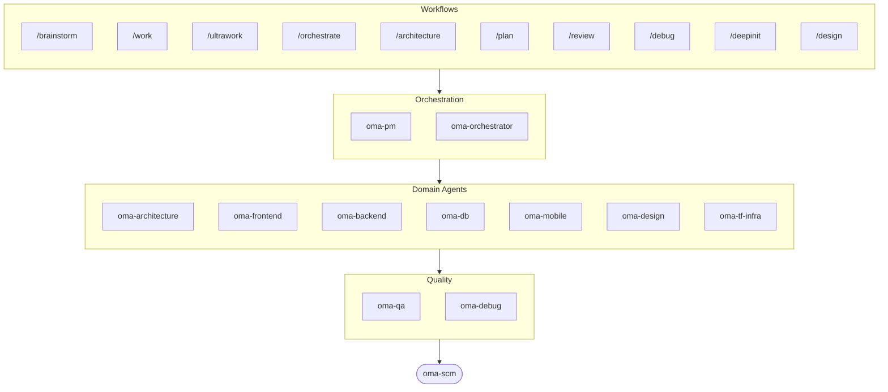

# oh-my-agent: Portable Multi-Agent Harness

[](https://www.npmjs.com/package/oh-my-agent) [](https://www.npmjs.com/package/oh-my-agent) [](https://github.com/first-fluke/oh-my-agent) [](https://github.com/first-fluke/oh-my-agent/blob/main/LICENSE) [](https://github.com/first-fluke/oh-my-agent/commits/main)

[한국어](./docs/README.ko.md) | [中文](./docs/README.zh.md) | [Português](./docs/README.pt.md) | [日本語](./docs/README.ja.md) | [Français](./docs/README.fr.md) | [Español](./docs/README.es.md) | [Nederlands](./docs/README.nl.md) | [Polski](./docs/README.pl.md) | [Русский](./docs/README.ru.md) | [Deutsch](./docs/README.de.md) | [Tiếng Việt](./docs/README.vi.md) | [ภาษาไทย](./docs/README.th.md)

Ever wished your AI assistant had coworkers? That's what oh-my-agent does.

Instead of one AI doing everything (and getting confused halfway through), oh-my-agent splits work across **specialized agents** — frontend, backend, architecture, QA, PM, DB, mobile, infra, debug, design, and more. Each one knows its domain deeply, has its own tools and checklists, and stays in its lane.

Works with all major AI IDEs: Antigravity, Claude Code, Cursor, Gemini CLI, Codex CLI, OpenCode, and more.

## Quick Start

```bash
# macOS / Linux — auto-installs bun, uv & serena if missing
curl -fsSL https://raw.githubusercontent.com/first-fluke/oh-my-agent/main/cli/install.sh | bash
```

```powershell
# Windows (PowerShell) — auto-installs bun, uv & serena if missing
irm https://raw.githubusercontent.com/first-fluke/oh-my-agent/main/cli/install.ps1 | iex
```

```bash
# Or manual (any OS, requires bun + uv + serena)
bunx oh-my-agent@latest
```

### Install via Agent Package Manager

<details>
<summary>Microsoft's <a href="https://github.com/microsoft/apm">Agent Package Manager</a> (APM) — skills-only distribution. Click to expand.</summary>

> Not to be confused with `oma-observability`'s APM (Application Performance Monitoring).

```bash
# All skills, deployed to every detected runtime
# (.claude, .cursor, .codex, .opencode, .github, .agents)
apm install first-fluke/oh-my-agent

# A single skill
apm install first-fluke/oh-my-agent/.agents/skills/oma-frontend
```

APM ships skills only. For workflows, rules, `oma-config.yaml`, keyword-detection hooks, and the `oma agent:spawn` CLI, use `bunx oh-my-agent@latest`. Pick one distribution per project to avoid drift.

</details>

Pick a preset and you're ready:

| Preset | What You Get |
|--------|-------------|
| **All** | **Every agent and skill** |
| Backend | architecture + backend + brainstorm + db + debug + dev-workflow + pm + qa + scm |
| Content | academic-writer + design + image + scm + translator + voice |
| DevOps | architecture + brainstorm + debug + dev-workflow + observability + pm + qa + scm + tf-infra |
| Frontend | architecture + brainstorm + debug + design + frontend + pm + qa + scm |
| Fullstack | architecture + backend + brainstorm + db + debug + design + dev-workflow + frontend + mobile + pm + qa + scm + tf-infra |
| Fullstack Mobile | architecture + backend + brainstorm + db + debug + design + dev-workflow + mobile + pm + qa + scm |
| Fullstack Web | architecture + backend + brainstorm + db + debug + design + dev-workflow + frontend + pm + qa + scm |
| Mobile | architecture + brainstorm + debug + mobile + pm + qa + scm |
| Research | academic-writer + hwp + market + pdf + scholar + scm + search + translator |

## Works With Every Agent

`oh-my-agent` keeps `.agents/` as the single source of truth and projects it into each runtime's native layout, so every supported tool shares the same skills, workflows, and rules.

<table>
<colgroup>
<col span="6" style="width:16.67%" />
</colgroup>
<tr>
<td align="center">
<a href="https://claude.com/product/claude-code"></a><br/>
<strong>Claude Code</strong><br/>
<sub>native + adapter</sub>
</td>
<td align="center">
<a href="https://github.com/openai/codex"></a><br/>
<strong>Codex CLI</strong><br/>
<sub>native + adapter</sub>
</td>
<td align="center">
<a href="https://github.com/google-gemini/gemini-cli"></a><br/>
<strong>Gemini CLI</strong><br/>
<sub>native + adapter</sub>
</td>
<td align="center">
<a href="https://cursor.com"></a><br/>
<strong>Cursor</strong><br/>
<sub>native + adapter</sub>
</td>
<td align="center">
<a href="https://github.com/QwenLM/qwen-code"></a><br/>
<strong>Qwen Code</strong><br/>
<sub>native dispatch</sub>
</td>
<td align="center">
<a href="https://github.com/esengine/DeepSeek-Reasonix"></a><br/>
<strong>Reasonix</strong><br/>
<sub>native-compatible</sub>
</td>
</tr>
<tr>
<td align="center">
<a href="https://antigravity.google"></a><br/>
<strong>Antigravity</strong><br/>
<sub>native SSOT</sub>
</td>
<td align="center">
<a href="https://github.com/anomalyco/opencode"></a><br/>
<strong>OpenCode</strong><br/>
<sub>native-compatible</sub>
</td>
<td align="center">
<a href="https://ampcode.com"></a><br/>
<strong>Amp</strong><br/>
<sub>native-compatible</sub>
</td>
<td align="center">
<a href="https://github.com/features/copilot"></a><br/>
<strong>GitHub Copilot</strong><br/>
<sub>symlinked skills</sub>
</td>
<td align="center">
<a href="https://grok.x.ai"></a><br/>
<strong>Grok</strong><br/>
<sub>native hooks</sub>
</td>
<td align="center">
<a href="https://kiro.dev"></a><br/>
<strong>Kiro CLI</strong><br/>
<sub>native hooks + agents</sub>
</td>
</tr>
</table>

<p align="center"><sub><a href="./docs/SUPPORTED_AGENTS.md">& more</a></sub></p>

## Your Agent Team

| Agent | What They Do |
|-------|-------------|
| **oma-academic-writer** | Drafts, revises, and audits academic prose to publication quality. |
| **oma-architecture** | Weighs architecture tradeoffs and draws module boundaries, with ADR/ATAM/CBAM analysis. |
| **oma-backend** | Builds and secures your APIs in Python, Node.js, or Rust. |
| **oma-brainstorm** | Explores ideas with you before you commit to building. |
| **oma-db** | Designs your schema, migrations, indexes, and vector stores. |
| **oma-debug** | Finds the root cause, fixes the bug, and writes a regression test. |
| **oma-deepsec** | Scans your code for security holes and blocks risky pull requests. |
| **oma-design** | Builds design systems with tokens, accessibility, and responsive layouts. |
| **oma-dev-workflow** | Automates your CI/CD, releases, and monorepo tasks. |
| **oma-docs** | Checks your docs for broken references and flags ones a code change touched. |
| **oma-frontend** | Builds your UI with React/Next.js, TypeScript, Tailwind CSS v4, and shadcn/ui. |
| **oma-hwp** | Converts HWP, HWPX, and HWPML files to Markdown. |
| **oma-image** | Generates images through several AI providers at once. |
| **oma-market** | Researches your market from community signals and frames it with SWOT, 5F, and PESTEL. |
| **oma-mobile** | Builds cross-platform mobile apps with Flutter. |
| **oma-observability** | Routes observability work across metrics, logs, traces, SLOs, and incident forensics. |
| **oma-orchestrator** | Runs multiple agents in parallel from the CLI. |
| **oma-pdf** | Converts PDF files to Markdown. |
| **oma-pm** | Plans tasks, breaks down requirements, and defines API contracts. |
| **oma-qa** | Reviews your code for OWASP security, performance, and accessibility issues. |
| **oma-recap** | Recaps your conversation history into themed work summaries. |
| **oma-scholar** | Searches academic literature and helps you run peer review. |
| **oma-scm** | Manages your branches, merges, worktrees, and Conventional Commits. |
| **oma-search** | Routes each query to the best source and scores how much you can trust the result. |
| **oma-skill-creator** | Writes and audits new OMA skills in the SSL-lite format. |
| **oma-slide** | Generates distinctive, animation-rich HTML presentation decks and exports to PDF/PNG/PPTX. |
| **oma-tf-infra** | Provisions multi-cloud infrastructure with Terraform. |
| **oma-translator** | Translates between languages so it reads like a native wrote it. |
| **oma-voice** | Generates voiceovers and transcribes audio on-device, no cloud needed. |

## How It Works

Just chat. Describe what you want and oh-my-agent figures out which agents to use.

```
You: "Build a TODO app with user authentication"
→ PM plans the work
→ Backend builds auth API
→ Frontend builds React UI
→ DB designs schema
→ QA reviews everything
→ Done: coordinated, reviewed code
```

Or use slash commands for structured workflows:

| Step | Command | What It Does |
|------|---------|-------------|
| 0 | `/deepinit` | Bootstrap an existing codebase (AGENTS.md, ARCHITECTURE.md, `docs/`) |
| 1 | `/brainstorm` | Free-form ideation |
| 2 | `/architecture` | Software architecture review, tradeoffs, ADR/ATAM/CBAM-style analysis |
| 2 | `/design` | 7-phase design system workflow |
| 2 | `/plan` | PM breaks down your feature into tasks |
| 3 | `/work` | Step-by-step multi-agent execution |
| 3 | `/orchestrate` | Automated parallel agent spawning |
| 3 | `/ultrawork` | 5-phase quality workflow with 11 review gates |
| 3 | `/ralph` | Wraps `/ultrawork` in an independent verifier loop until criteria pass |
| 4 | `/review` | Security + performance + accessibility audit |
| 4 | `/deepsec` | Deep agent-powered security scan |
| 5 | `/debug` | Structured root-cause debugging |
| 5 | `/docs` | Documentation drift verify + sync via `oma-docs` |
| 6 | `/scm` | SCM + Git workflow and Conventional Commit support |

**Auto-detection**: You don't even need slash commands — keywords like "architecture", "plan", "review", and "debug" in your message (in 11 languages!) auto-activate the right workflow.

## CLI

```bash
# Install globally
bun install --global oh-my-agent   # or: brew install oh-my-agent

# Use anywhere (sorted alphabetically)
oma agent:parallel -i backend:"Auth API" frontend:"Login form"
oma agent:spawn backend "Build auth API" session-01
oma dashboard               # Real-time agent monitoring
oma doctor                  # Health check
oma image generate "cat"    # Multi-vendor AI image generation
oma link                    # Regenerate .claude/.codex/.gemini/etc. from .agents/
oma model:check             # Detect drift between registered models and live vendor lists
oma recap --window 1d       # Cross-tool conversation history recap
oma retro 7d --compare      # Engineering retrospective with metrics + trends
oma search fetch <url>      # Mechanical search with auto-escalating strategies
```

Model selection follows two layers:
- Same-vendor native dispatch uses the generated vendor agent definition in `.claude/agents/`, `.codex/agents/`, or `.gemini/agents/`.
- Cross-vendor or fallback CLI dispatch uses the vendor defaults in `.agents/skills/oma-orchestrator/config/cli-config.yaml`.

### Per-Agent Models

Set `model_preset` in `.agents/oma-config.yaml` to choose which AI models each agent uses:

```yaml
language: en
model_preset: mixed   # antigravity | claude | codex | cursor | grok | mixed | qwen

# Optional per-agent overrides
agents:
  backend: { model: openai/gpt-5.5, effort: high }
```

- `oma doctor --profile` — prints the per-role resolved model matrix
- Full guide: [`web/docs/guide/per-agent-models.md`](./web/docs/guide/per-agent-models.md)

## Why oh-my-agent?

> [Read why →](https://github.com/first-fluke/oh-my-agent/issues/155#issuecomment-4142133589)

- **Portable** — `.agents/` travels with your project, not trapped in one IDE
- **Role-based** — Agents modeled like a real engineering team, not a pile of prompts
- **Token-efficient** — Two-layer skill design saves ~75% of tokens
- **Quality-first** — Charter preflight, quality gates, and review workflows built in:
  - `oma verify <agent>` — 14 deterministic checks per agent type (TypeScript strict, tests, raw SQL, hardcoded secrets, Flutter analyze, inline styles, scope violation, charter alignment, …)
  - `session.quota_cap` — per-session token / spawn / per-vendor budget caps in `oma-config.yaml`; `orchestrate` Step 5 blocks the next spawn when exceeded
  - `ralph` workflow — independent JUDGE re-verifies every criterion each iteration to catch silent regressions; heavy-test caching for >30s suites
  - Exploration Loop — after 2 retries, `orchestrate` spawns hypothesis variants in parallel and keeps the highest-scoring result
  - Monorepo auto-routing — `detectWorkspace` reads pnpm / nx / turbo / lerna and routes each agent to its workspace
- **Multi-vendor** — Mix Claude, Codex, Cursor, and Qwen per agent type
- **Observable** — Terminal and web dashboards for real-time monitoring

## Architecture



## Learn More

- **[Detailed Documentation](./docs/AGENTS_SPEC.md)** — Full technical spec and architecture
- **[Supported Agents](./docs/SUPPORTED_AGENTS.md)** — Agent support matrix across IDEs
- **[Web Docs](https://first-fluke.github.io/oh-my-agent/)** — Guides, tutorials, and CLI reference

## Sponsors

This project is maintained thanks to our generous sponsors.

> **Like this project?** Give it a star!
>
> ```bash
> gh api --method PUT /user/starred/first-fluke/oh-my-agent
> ```
>
> Try our optimized starter template: [fullstack-starter](https://github.com/first-fluke/fullstack-starter)

<a href="https://github.com/sponsors/first-fluke">
  
</a>
<a href="https://buymeacoffee.com/firstfluke">
  
</a>

### 🚀 Champion

<!-- Champion tier ($100/mo) logos here -->

### 🛸 Booster

<!-- Booster tier ($30/mo) logos here -->

### ☕ Contributor

<!-- Contributor tier ($10/mo) names here -->

[Become a sponsor →](https://github.com/sponsors/first-fluke)

See [SPONSORS.md](./SPONSORS.md) for a full list of supporters.


## Star History

[](https://www.star-history.com/#first-fluke/oh-my-agent&type=date&legend=bottom-right)


## References

- Liang, Q., Wang, H., Liang, Z., & Liu, Y. (2026). *From skill text to skill structure: The scheduling-structural-logical representation for agent skills* (Version 4) [Preprint]. arXiv. https://doi.org/10.48550/arXiv.2604.24026
- Chen, C., Yu, Q., Gu, Y., Huang, Z., Li, H., Liu, H., Liu, S., Liu, J., Peng, D., Wang, J., Yan, Z., Meng, F., Qin, E., Che, C., & Hu, M. (2026). *The scaling laws of skills in LLM agent systems* (Version 1) [Preprint]. arXiv. https://doi.org/10.48550/arXiv.2605.16508


## License

MIT
