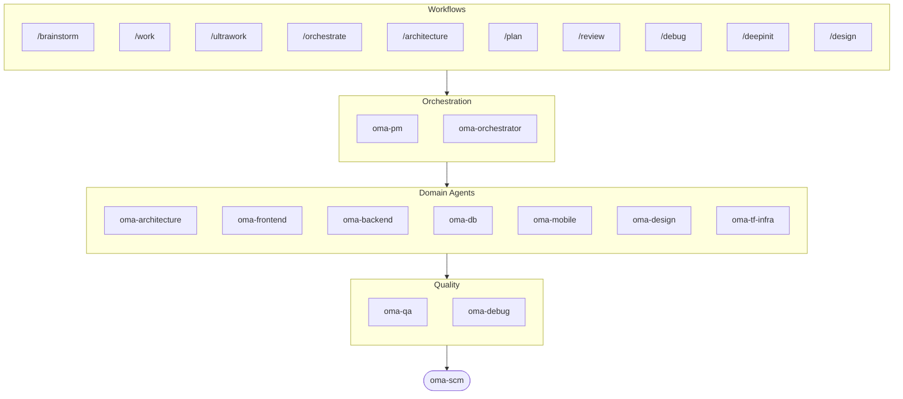

# oh-my-agent: Portable Multi-Agent Harness

[](https://www.npmjs.com/package/oh-my-agent) [](https://www.npmjs.com/package/oh-my-agent) [](https://github.com/first-fluke/oh-my-agent) [](https://github.com/first-fluke/oh-my-agent/blob/main/LICENSE) [](https://github.com/first-fluke/oh-my-agent/commits/main)

[English](../README.md) | [한국어](./README.ko.md) | [中文](./README.zh.md) | [Português](./README.pt.md) | [日本語](./README.ja.md) | [Français](./README.fr.md) | [Español](./README.es.md) | [Nederlands](./README.nl.md) | [Polski](./README.pl.md) | [Русский](./README.ru.md) | [Tiếng Việt](./README.vi.md) | [ภาษาไทย](./README.th.md)

Hast du dir schon mal gewünscht, dein KI-Assistent hätte Kollegen? Genau das macht oh-my-agent.

Statt dass eine einzige KI alles erledigt (und sich auf halbem Weg verheddert), verteilt oh-my-agent die Arbeit auf **spezialisierte Agenten** — Frontend, Backend, Architektur, QA, PM, DB, Mobile, Infra, Debug, Design und mehr. Jeder kennt sein Fachgebiet in- und auswendig, hat eigene Tools und Checklisten und bleibt in seiner Spur.

Funktioniert mit allen großen KI-IDEs: Antigravity, Claude Code, Cursor, Gemini CLI, Codex CLI, OpenCode und weiteren.

## Schnellstart

```bash
# macOS / Linux — installiert bun & uv automatisch, falls nicht vorhanden
curl -fsSL https://raw.githubusercontent.com/first-fluke/oh-my-agent/main/cli/install.sh | bash
```

```powershell
# Windows (PowerShell) — installiert bun & uv automatisch, falls nicht vorhanden
irm https://raw.githubusercontent.com/first-fluke/oh-my-agent/main/cli/install.ps1 | iex
```

```bash
# Oder manuell (beliebiges OS, benötigt bun + uv)
bunx oh-my-agent@latest
```

### Installation via Agent Package Manager

<details>
<summary>Microsofts <a href="https://github.com/microsoft/apm">Agent Package Manager</a> (APM) — nur Skills. Klick zum Ausklappen.</summary>

> Nicht zu verwechseln mit dem APM (Application Performance Monitoring) von `oma-observability`.

```bash
# Alle Skills, in jede erkannte Runtime ausgerollt
# (.claude, .cursor, .codex, .opencode, .github, .agents)
apm install first-fluke/oh-my-agent

# Ein einzelnes Skill
apm install first-fluke/oh-my-agent/.agents/skills/oma-frontend
```

APM liest den `skills: .agents/skills/`-Pointer aus `.claude-plugin/plugin.json`, also ist die `.agents/`-SSOT die einzige Quelle — kein Build-Schritt, kein Mirror.

APM liefert nur die Skills. Für Workflows, Regeln, `oma-config.yaml`, Keyword-Detection-Hooks und das `oma agent:spawn`-CLI nimmst du `bunx oh-my-agent@latest`. Pro Projekt eine Distribution wählen, sonst läuft das auseinander.

</details>

Wähl ein Preset und los geht's:

| Preset | Was Du Bekommst |
|--------|-------------|
| ✨ All | Alle Agenten und Skills |
| 🌐 Fullstack | architecture + frontend + backend + db + pm + qa + debug + brainstorm + scm |
| 🎨 Frontend | architecture + frontend + pm + qa + debug + brainstorm + scm |
| ⚙️ Backend | architecture + backend + db + pm + qa + debug + brainstorm + scm |
| 📱 Mobile | architecture + mobile + pm + qa + debug + brainstorm + scm |
| 🚀 DevOps | architecture + tf-infra + dev-workflow + pm + qa + debug + brainstorm + scm |

## Dein Agenten-Team

| Agent | Was Er Macht |
|-------|-------------|
| **oma-architecture** | Architektur-Trade-offs, Grenzen, ADR-/ATAM-/CBAM-bewusste Analyse |
| **oma-backend** | APIs in Python, Node.js oder Rust |
| **oma-brainstorm** | Erkundet Ideen, bevor du loslegst |
| **oma-db** | Schema-Design, Migrationen, Indexierung, Vector DB |
| **oma-debug** | Ursachenanalyse, Fixes, Regressionstests |
| **oma-design** | Design-Systeme, Tokens, Barrierefreiheit, Responsive |
| **oma-dev-workflow** | CI/CD, Releases, Monorepo-Automatisierung |
| **oma-docs** | Dokumentations-Drift-Erkennung — Code↔Docs-Referenzen prüfen, Docs nach Diff synchronisieren |
| **oma-frontend** | React/Next.js, TypeScript, Tailwind CSS v4, shadcn/ui |
| **oma-hwp** | HWP/HWPX/HWPML-zu-Markdown-Konvertierung |
| **oma-image** | Multi-Vendor KI-Bildgenerierung |
| **oma-mobile** | Plattformübergreifende Apps mit Flutter |
| **oma-observability** | Observability-Router — APM/RUM, Metriken/Logs/Traces/Profile, SLO, Incident-Forensik, Transport-Tuning |
| **oma-orchestrator** | Parallele Agentenausführung über CLI |
| **oma-pdf** | PDF-zu-Markdown-Konvertierung |
| **oma-pm** | Plant Aufgaben, zerlegt Anforderungen, definiert API-Verträge |
| **oma-qa** | OWASP-Sicherheit, Performance, Barrierefreiheits-Review |
| **oma-recap** | Analyse des Gespraechsverlaufs und thematischer Arbeitszusammenfassungen |
| **oma-scholar** | Begleiter für akademische Forschung — Literaturrecherche, Peer-Review |
| **oma-scm** | SCM (Software-Konfigurationsmanagement): Branching, Merges, Worktrees, Baselines; Conventional Commits |
| **oma-search** | Intent-basierter Such-Router + Vertrauensbewertung — Docs, Web, Code, Lokal |
| **oma-skill-creator** | OMA-Skills im SSL-lite-Format erstellen und prüfen |
| **oma-tf-infra** | Multi-Cloud IaC mit Terraform (Infrastructure as Code) |
| **oma-translator** | Natürliche mehrsprachige Übersetzung |

## So Funktioniert's

Einfach chatten. Beschreib, was du willst, und oh-my-agent sucht die passenden Agenten aus.

```
Du: "Bau eine TODO-App mit User-Authentifizierung"
→ PM plant die Arbeit
→ Backend baut die Auth-API
→ Frontend baut die React-UI
→ DB entwirft das Schema
→ QA prüft alles durch
→ Fertig: koordinierter, geprüfter Code
```

Oder nutz Slash Commands für strukturierte Workflows:

| Schritt | Befehl | Was Er Macht |
|---------|--------|-------------|
| 1 | `/brainstorm` | Freie Ideenfindung |
| 2 | `/architecture` | Softwarearchitektur-Review, Trade-offs, Analyse im Stil von ADR/ATAM/CBAM |
| 2 | `/design` | 7-Phasen Design-System-Workflow |
| 2 | `/plan` | PM zerlegt dein Feature in Aufgaben |
| 3 | `/work` | Schritt-für-Schritt Multi-Agent-Ausführung |
| 3 | `/orchestrate` | Automatisiertes paralleles Agenten-Spawning |
| 3 | `/ultrawork` | 5-Phasen-Qualitätsworkflow mit 11 Review-Gates |
| 4 | `/review` | Sicherheits- + Performance- + Barrierefreiheits-Audit |
| 5 | `/debug` | Strukturiertes Ursachen-Debugging |
| 6 | `/scm` | SCM- und Git-Workflow sowie Unterstützung für Conventional Commits |

**Auto-Erkennung**: Du brauchst nicht mal Slash Commands — Schlüsselwörter wie "Architektur", "plan", "review" und "debug" in deiner Nachricht (in 11 Sprachen!) aktivieren automatisch den richtigen Workflow.

## CLI

```bash
# Global installieren
bun install --global oh-my-agent   # oder: brew install oh-my-agent

# Überall nutzen
oma doctor                  # Gesundheitscheck
oma dashboard               # Echtzeit-Agenten-Monitoring
oma link                    # Regeneriert .claude/.codex/.gemini/etc. aus .agents/
oma agent:spawn backend "Build auth API" session-01
oma agent:parallel -i backend:"Auth API" frontend:"Login form"
```

Die Modellauswahl folgt zwei Schichten:
- Same-Vendor-Native-Dispatch verwendet die generierte Vendor-Agent-Definition in `.claude/agents/`, `.codex/agents/` oder `.gemini/agents/`.
- Cross-Vendor- oder Fallback-CLI-Dispatch verwendet die Vendor-Defaults in `.agents/skills/oma-orchestrator/config/cli-config.yaml`.

**Per-Agent-Modelle**: Jeder Agent kann ein eigenes Modell und `effort` über `.agents/oma-config.yaml` beziehen. Fünf Runtime-Profile sind vorkonfiguriert: `claude-only`, `codex-only`, `gemini-only`, `antigravity`, `qwen-only`. Prüfe die aufgelöste Auth-Matrix mit `oma doctor --profile`. Vollständige Anleitung: [web/docs/guide/per-agent-models.md](../web/docs/guide/per-agent-models.md).

## Warum oh-my-agent?

> [Mehr erfahren →](https://github.com/first-fluke/oh-my-agent/issues/155#issuecomment-4142133589)

- **Portabel** — `.agents/` reist mit deinem Projekt, nicht in einer IDE eingesperrt
- **Rollenbasiert** — Agenten wie ein echtes Engineering-Team modelliert, kein Haufen Prompts
- **Token-effizient** — Zwei-Schichten-Skill-Design spart ~75% der Tokens
- **Qualität zuerst** — Charter Preflight, Quality Gates und Review-Workflows eingebaut
- **Multi-Vendor** — Mische Gemini, Claude, Codex und Qwen je nach Agententyp
- **Beobachtbar** — Terminal- und Web-Dashboards für Echtzeit-Monitoring

## Architektur



## Mehr Erfahren

- **[Detaillierte Dokumentation](./AGENTS_SPEC.md)** — Vollständige technische Spec und Architektur
- **[Unterstützte Agenten](./SUPPORTED_AGENTS.md)** — Agenten-Support-Matrix nach IDE
- **[Web-Docs](https://first-fluke.github.io/oh-my-agent/)** — Guides, Tutorials und CLI-Referenz

## Sponsors

Dieses Projekt wird dank unserer großzügigen Sponsors gepflegt.

> **Gefällt dir das Projekt?** Gib ihm einen Stern!
>
> ```bash
> gh api --method PUT /user/starred/first-fluke/oh-my-agent
> ```
>
> Probier unser optimiertes Starter-Template: [fullstack-starter](https://github.com/first-fluke/fullstack-starter)

<a href="https://github.com/sponsors/first-fluke">
  
</a>
<a href="https://buymeacoffee.com/firstfluke">
  
</a>

### 🚀 Champion

<!-- Champion tier ($100/mo) logos here -->

### 🛸 Booster

<!-- Booster tier ($30/mo) logos here -->

### ☕ Contributor

<!-- Contributor tier ($10/mo) names here -->

[Sponsor werden →](https://github.com/sponsors/first-fluke)

Siehe [SPONSORS.md](../SPONSORS.md) für die vollständige Liste der Unterstützer.


## Star History

[](https://www.star-history.com/#first-fluke/oh-my-agent&type=date&legend=bottom-right)


## Literatur

- Liang, Q., Wang, H., Liang, Z., & Liu, Y. (2026). *From skill text to skill structure: The scheduling-structural-logical representation for agent skills* (Version 2) [Preprint]. arXiv. https://doi.org/10.48550/arXiv.2604.24026


## Lizenz

MIT
