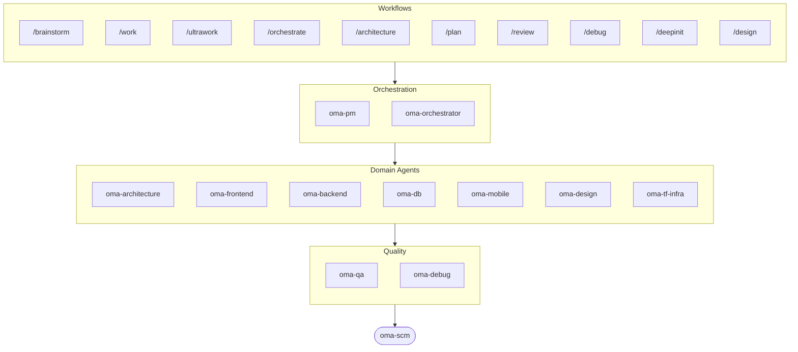

# oh-my-agent: Portable Multi-Agent Harness

[](https://www.npmjs.com/package/oh-my-agent) [](https://www.npmjs.com/package/oh-my-agent) [](https://github.com/first-fluke/oh-my-agent) [](https://github.com/first-fluke/oh-my-agent/blob/main/LICENSE) [](https://github.com/first-fluke/oh-my-agent/commits/main)

[English](../README.md) | [한국어](./README.ko.md) | [中文](./README.zh.md) | [Português](./README.pt.md) | [日本語](./README.ja.md) | [Français](./README.fr.md) | [Nederlands](./README.nl.md) | [Polski](./README.pl.md) | [Русский](./README.ru.md) | [Deutsch](./README.de.md) | [Tiếng Việt](./README.vi.md) | [ภาษาไทย](./README.th.md)

¿Alguna vez quisiste que tu asistente de IA tuviera compañeros de trabajo? Eso es lo que hace oh-my-agent.

En vez de que una sola IA haga todo (y se pierda a mitad de camino), oh-my-agent reparte el trabajo entre **agentes especializados**: frontend, backend, architecture, QA, PM, DB, mobile, infra, debug, design y más. Cada uno conoce su dominio a fondo, tiene sus propias herramientas y checklists, y se mantiene en su carril.

Funciona con todos los IDEs de IA principales: Antigravity, Claude Code, Cursor, Gemini CLI, Codex CLI, OpenCode y más.

## Inicio Rápido

```bash
# macOS / Linux — instala bun, uv y serena automáticamente si faltan
curl -fsSL https://raw.githubusercontent.com/first-fluke/oh-my-agent/main/cli/install.sh | bash
```

```powershell
# Windows (PowerShell) — instala bun, uv y serena automáticamente si faltan
irm https://raw.githubusercontent.com/first-fluke/oh-my-agent/main/cli/install.ps1 | iex
```

```bash
# O manualmente (cualquier SO, requiere bun + uv + serena)
bunx oh-my-agent@latest
```

### Instalación vía Agent Package Manager

<details>
<summary><a href="https://github.com/microsoft/apm">Agent Package Manager</a> (APM) de Microsoft: distribución solo de skills. Click para expandir.</summary>

> No lo confundas con el APM (Application Performance Monitoring) de `oma-observability`.

```bash
# Todos los skills, desplegados en cada runtime detectado
# (.claude, .cursor, .codex, .opencode, .github, .agents)
apm install first-fluke/oh-my-agent

# Un solo skill
apm install first-fluke/oh-my-agent/.agents/skills/oma-frontend
```

APM solo trae los skills. Para workflows, reglas, `oma-config.yaml`, hooks de detección de palabras clave y el CLI `oma agent:spawn`, usa `bunx oh-my-agent@latest`. Elige una sola forma de distribución por proyecto para no acabar con todo desincronizado.

</details>

Elige un preset y listo:

| Preset | Lo Que Incluye |
|--------|-------------|
| ✨ All | Todos los agentes y skills |
| 🌐 Fullstack | architecture + frontend + backend + db + pm + qa + debug + brainstorm + scm |
| 🎨 Frontend | architecture + frontend + pm + qa + debug + brainstorm + scm |
| ⚙️ Backend | architecture + backend + db + pm + qa + debug + brainstorm + scm |
| 📱 Mobile | architecture + mobile + pm + qa + debug + brainstorm + scm |
| 🚀 DevOps | architecture + tf-infra + dev-workflow + pm + qa + debug + brainstorm + scm |

## Compatible con Todos los Agentes

`oh-my-agent` mantiene `.agents/` como única fuente de verdad (SSOT) y la proyecta al diseño nativo de cada runtime. Así, todas las herramientas compatibles comparten los mismos skills, workflows y reglas.

<table>
<colgroup>
<col span="6" style="width:16.67%" />
</colgroup>
<tr>
<td align="center">
<a href="https://claude.com/product/claude-code"></a><br/>
<strong>Claude Code</strong><br/>
<sub>nativo + adaptador</sub>
</td>
<td align="center">
<a href="https://github.com/openai/codex"></a><br/>
<strong>Codex CLI</strong><br/>
<sub>nativo + adaptador</sub>
</td>
<td align="center">
<a href="https://github.com/google-gemini/gemini-cli"></a><br/>
<strong>Gemini CLI</strong><br/>
<sub>nativo + adaptador</sub>
</td>
<td align="center">
<a href="https://cursor.com"></a><br/>
<strong>Cursor</strong><br/>
<sub>nativo + adaptador</sub>
</td>
<td align="center">
<a href="https://github.com/QwenLM/qwen-code"></a><br/>
<strong>Qwen Code</strong><br/>
<sub>dispatch nativo</sub>
</td>
<td align="center">
<a href="https://github.com/esengine/DeepSeek-Reasonix"></a><br/>
<strong>Reasonix</strong><br/>
<sub>compatible nativamente</sub>
</td>
</tr>
<tr>
<td align="center">
<a href="https://antigravity.google"></a><br/>
<strong>Antigravity</strong><br/>
<sub>SSOT nativo</sub>
</td>
<td align="center">
<a href="https://github.com/anomalyco/opencode"></a><br/>
<strong>OpenCode</strong><br/>
<sub>compatible nativamente</sub>
</td>
<td align="center">
<a href="https://ampcode.com"></a><br/>
<strong>Amp</strong><br/>
<sub>compatible nativamente</sub>
</td>
<td align="center">
<a href="https://github.com/features/copilot"></a><br/>
<strong>GitHub Copilot</strong><br/>
<sub>skills por symlink</sub>
</td>
<td align="center">
<a href="https://grok.x.ai"></a><br/>
<strong>Grok</strong><br/>
<sub>hooks nativos</sub>
</td>
<td align="center">
<a href="https://kiro.dev"></a><br/>
<strong>Kiro CLI</strong><br/>
<sub>hooks nativos + agentes</sub>
</td>
</tr>
</table>

<p align="center"><sub><a href="./SUPPORTED_AGENTS.md">& más</a></sub></p>

## Tu Equipo de Agentes

| Agente | Qué Hace |
|-------|-------------|
| **oma-academic-writer** | Redacta, revisa y audita prosa académica hasta alcanzar calidad de publicación |
| **oma-architecture** | Evalúa trade-offs arquitectónicos y define límites de módulos con análisis ADR/ATAM/CBAM |
| **oma-backend** | Construye y protege tus APIs en Python, Node.js o Rust |
| **oma-brainstorm** | Explora ideas contigo antes de que te comprometas a construir |
| **oma-db** | Diseña tu esquema, migraciones, índices y almacenes vectoriales |
| **oma-debug** | Encuentra la causa raíz, corrige el bug y escribe un test de regresión |
| **oma-deepsec** | Escanea tu código en busca de vulnerabilidades y bloquea pull requests con riesgos |
| **oma-design** | Construye sistemas de diseño con tokens, accesibilidad y layouts responsive |
| **oma-dev-workflow** | Automatiza tu CI/CD, releases y tareas de monorepo |
| **oma-docs** | Detecta referencias rotas en tu documentación y señala los docs afectados por cambios en el código |
| **oma-frontend** | Construye tu UI con React/Next.js, TypeScript, Tailwind CSS v4 y shadcn/ui |
| **oma-hwp** | Convierte archivos HWP, HWPX y HWPML a Markdown |
| **oma-image** | Genera imágenes a través de varios proveedores de IA a la vez |
| **oma-market** | Investiga tu mercado a partir de señales de comunidad y lo encuadra con SWOT, Porter's 5F y PESTEL |
| **oma-mobile** | Construye apps móviles multiplataforma con Flutter |
| **oma-observability** | Enruta el trabajo de observabilidad entre métricas, logs, trazas, SLOs y forense de incidentes |
| **oma-orchestrator** | Ejecuta múltiples agentes en paralelo desde el CLI |
| **oma-pdf** | Convierte archivos PDF a Markdown |
| **oma-pm** | Planifica tareas, desglosa requisitos y define contratos de API |
| **oma-qa** | Revisa tu código en busca de problemas de seguridad OWASP, rendimiento y accesibilidad |
| **oma-recap** | Convierte tu historial de conversaciones en resúmenes de trabajo organizados por tema |
| **oma-scholar** | Busca literatura académica y te ayuda a llevar a cabo revisiones por pares |
| **oma-scm** | Gestiona tus ramas, fusiones, worktrees y Conventional Commits |
| **oma-search** | Dirige cada consulta a la mejor fuente y puntúa qué tan confiable es el resultado |
| **oma-skill-creator** | Escribe y audita nuevos skills OMA en formato SSL-lite |
| **oma-slide** | Genera decks de presentaciones HTML distintivos y ricos en animaciones, y exporta a PDF/PNG/PPTX |
| **oma-tf-infra** | Aprovisiona infraestructura multi-cloud con Terraform |
| **oma-translator** | Traduce entre idiomas de forma que parezca escrito por un hablante nativo |
| **oma-voice** | Genera voiceovers y transcribe audio en el dispositivo, sin necesidad de nube |

## Cómo Funciona

Solo chatea. Describe lo que quieres y oh-my-agent se encarga de elegir los agentes adecuados.

```
Tú: "Construye una app de TODO con autenticación de usuarios"
→ PM planifica el trabajo
→ Backend construye la API de auth
→ Frontend construye la UI en React
→ DB diseña el esquema
→ QA revisa todo
→ Listo: código coordinado y revisado
```

O usa slash commands para flujos estructurados:

| Paso | Comando | Qué Hace |
|------|---------|-------------|
| 1 | `/brainstorm` | Ideación libre |
| 2 | `/architecture` | Revisión de arquitectura, trade-offs, análisis estilo ADR/ATAM/CBAM |
| 2 | `/design` | Flujo de sistema de diseño en 7 fases |
| 2 | `/plan` | PM desglosa tu feature en tareas |
| 3 | `/work` | Ejecución multi-agente paso a paso |
| 3 | `/orchestrate` | Lanzamiento automatizado de agentes en paralelo |
| 3 | `/ultrawork` | Flujo de calidad en 5 fases con 11 puertas de revisión |
| 4 | `/review` | Auditoría de seguridad + rendimiento + accesibilidad |
| 4 | `/deepsec` | Escaneo de seguridad profundo por agente |
| 5 | `/debug` | Debugging estructurado de causa raíz |
| 5 | `/docs` | Verificación y sincronización de drift de documentación con `oma-docs` |
| 6 | `/scm` | Flujo SCM y Git con soporte de Conventional Commits |

**Auto-detección**: Ni siquiera necesitas slash commands. Palabras clave como "arquitectura", "plan", "review" y "debug" en tu mensaje (¡en 11 idiomas!) activan automáticamente el flujo correcto.

## CLI

```bash
# Instalar globalmente
bun install --global oh-my-agent   # o: brew install oh-my-agent

# Usar donde sea
oma agent:parallel -i backend:"Auth API" frontend:"Login form"
oma agent:spawn backend "Build auth API" session-01
oma dashboard               # Monitoreo de agentes en tiempo real
oma doctor                  # Chequeo de salud
oma image generate "cat"    # Generación de imágenes IA multi-proveedor
oma link                    # Regenera .claude/.codex/.gemini/etc. desde .agents/
oma model:check             # Detecta deriva entre modelos registrados y listas de proveedor en vivo
oma recap --window 1d       # Resumen del historial de conversación entre herramientas
oma retro 7d --compare      # Retrospectiva de ingeniería con métricas + tendencias
oma search fetch <url>      # Búsqueda mecánica con estrategias auto-escaladas
```

La selección de modelo sigue dos capas:
- El despacho nativo del mismo proveedor usa la definición de agente generada en `.claude/agents/`, `.codex/agents/` o `.gemini/agents/`.
- El despacho entre proveedores o el fallback por CLI usa los valores por defecto del proveedor en `.agents/skills/oma-orchestrator/config/cli-config.yaml`.

**modelos por agente**: cada agente puede apuntar a un modelo y `effort` propios desde `.agents/oma-config.yaml`. Runtime profiles disponibles: `antigravity`, `claude`, `codex`, `cursor`, `grok`, `mixed`, `qwen`. Revisa la matriz de auth resuelta con `oma doctor --profile`. Guía completa: [web/docs/guide/per-agent-models.md](../web/docs/guide/per-agent-models.md).

## ¿Por Qué oh-my-agent?

> [Leer más →](https://github.com/first-fluke/oh-my-agent/issues/155#issuecomment-4142133589)

- **Portable**: `.agents/` viaja con tu proyecto, no queda atrapado en un IDE
- **Basado en roles**: agentes modelados como un equipo de ingeniería real, no un montón de prompts
- **Eficiente en tokens**: diseño de skills en dos capas ahorra ~75% de tokens
- **Calidad primero**: Charter preflight, quality gates y flujos de revisión integrados:
  - `oma verify <agent>` — 14 chequeos deterministas por tipo de agente (TypeScript strict, tests, raw SQL, secretos hardcoded, Flutter analyze, inline styles, scope violation, charter alignment …)
  - `session.quota_cap` — topes de tokens / spawn / por-vendor por sesión en `oma-config.yaml`; el Step 5 de `orchestrate` bloquea el siguiente spawn al excederse
  - workflow `ralph` — un JUDGE independiente re-verifica cada criterion en cada iteración para detectar regresiones silenciosas; cache para tests >30s
  - Exploration Loop — tras 2 reintentos, `orchestrate` lanza variantes de hipótesis en paralelo y conserva la de mayor puntaje
  - Auto-routing de monorepo — `detectWorkspace` lee pnpm / nx / turbo / lerna y enruta cada agente a su workspace
- **Multi-vendor**: mezcla Claude, Codex, Cursor y Qwen por tipo de agente
- **Observable**: dashboards en terminal y web para monitoreo en tiempo real

## Arquitectura



## Más Información

- **[Documentación Detallada](./AGENTS_SPEC.md)**: spec técnico completo y arquitectura
- **[Agentes Soportados](./SUPPORTED_AGENTS.md)**: matriz de soporte de agentes por IDE
- **[Docs Web](https://first-fluke.github.io/oh-my-agent/)**: guías, tutoriales y referencia del CLI

## Sponsors

Este proyecto se mantiene gracias a nuestros generosos sponsors.

> **¿Te gusta este proyecto?** ¡Dale una estrella!
>
> ```bash
> gh api --method PUT /user/starred/first-fluke/oh-my-agent
> ```
>
> Prueba nuestra plantilla starter optimizada: [fullstack-starter](https://github.com/first-fluke/fullstack-starter)

<a href="https://github.com/sponsors/first-fluke">
  
</a>
<a href="https://buymeacoffee.com/firstfluke">
  
</a>

### 🚀 Champion

<!-- Champion tier ($100/mo) logos here -->

### 🛸 Booster

<!-- Booster tier ($30/mo) logos here -->

### ☕ Contributor

<!-- Contributor tier ($10/mo) names here -->

[Hazte sponsor →](https://github.com/sponsors/first-fluke)

Consulta [SPONSORS.md](../SPONSORS.md) para la lista completa de supporters.


## Star History

[](https://www.star-history.com/#first-fluke/oh-my-agent&type=date&legend=bottom-right)


## Referencias

- Liang, Q., Wang, H., Liang, Z., & Liu, Y. (2026). *From skill text to skill structure: The scheduling-structural-logical representation for agent skills* (Version 4) [Preprint]. arXiv. https://doi.org/10.48550/arXiv.2604.24026
- Chen, C., Yu, Q., Gu, Y., Huang, Z., Li, H., Liu, H., Liu, S., Liu, J., Peng, D., Wang, J., Yan, Z., Meng, F., Qin, E., Che, C., & Hu, M. (2026). *The scaling laws of skills in LLM agent systems* (Version 1) [Preprint]. arXiv. https://doi.org/10.48550/arXiv.2605.16508


## Licencia

MIT
