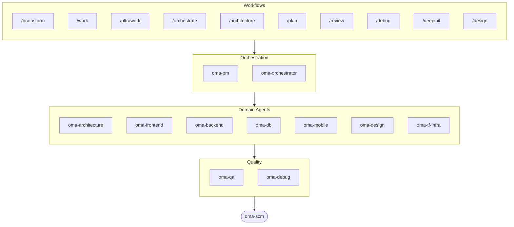

# oh-my-agent: Portable Multi-Agent Harness

[](https://www.npmjs.com/package/oh-my-agent) [](https://www.npmjs.com/package/oh-my-agent) [](https://github.com/first-fluke/oh-my-agent) [](https://github.com/first-fluke/oh-my-agent/blob/main/LICENSE) [](https://github.com/first-fluke/oh-my-agent/commits/main)

[English](../README.md) | [한국어](./README.ko.md) | [中文](./README.zh.md) | [Português](./README.pt.md) | [日本語](./README.ja.md) | [Español](./README.es.md) | [Nederlands](./README.nl.md) | [Polski](./README.pl.md) | [Русский](./README.ru.md) | [Deutsch](./README.de.md) | [Tiếng Việt](./README.vi.md) | [ภาษาไทย](./README.th.md)

Tu as déjà rêvé que ton assistant IA ait des collègues ? C'est exactement ce que fait oh-my-agent.

Au lieu qu'une seule IA fasse tout (et se perde en route), oh-my-agent répartit le boulot entre des **agents spécialisés** — frontend, backend, architecture, QA, PM, DB, mobile, infra, debug, design, et plus encore. Chacun connaît son domaine sur le bout des doigts, a ses propres outils et checklists, et reste dans sa voie.

Compatible avec tous les principaux IDEs IA : Antigravity, Claude Code, Cursor, Gemini CLI, Codex CLI, OpenCode, et d'autres.

## Démarrage Rapide

```bash
# macOS / Linux — installe bun & uv automatiquement si absents
curl -fsSL https://raw.githubusercontent.com/first-fluke/oh-my-agent/main/cli/install.sh | bash
```

```powershell
# Windows (PowerShell) — installe bun & uv automatiquement si absents
irm https://raw.githubusercontent.com/first-fluke/oh-my-agent/main/cli/install.ps1 | iex
```

```bash
# Ou manuellement (n'importe quel OS, nécessite bun + uv)
bunx oh-my-agent@latest
```

### Installation via Agent Package Manager

<details>
<summary>L'<a href="https://github.com/microsoft/apm">Agent Package Manager</a> (APM) de Microsoft — distribution skills uniquement. Clique pour déplier.</summary>

> À ne pas confondre avec l'APM (Application Performance Monitoring) d'`oma-observability`.

```bash
# Tous les skills, déployés sur chaque runtime détectée
# (.claude, .cursor, .codex, .opencode, .github, .agents)
apm install first-fluke/oh-my-agent

# Un seul skill
apm install first-fluke/oh-my-agent/.agents/skills/oma-frontend
```

APM lit le pointeur `skills: .agents/skills/` de `.claude-plugin/plugin.json`, donc le SSOT `.agents/` reste la seule source — pas d'étape de build ni de miroir.

APM ne livre que les skills. Pour les workflows, les règles, `oma-config.yaml`, les hooks de détection de mots-clés et la CLI `oma agent:spawn`, utilise `bunx oh-my-agent@latest`. Une seule méthode de distribution par projet, sinon ça finit par diverger.

</details>

Choisis un preset et c'est parti :

| Preset | Ce Que Tu Obtiens |
|--------|-------------|
| ✨ All | Tous les agents et skills |
| 🌐 Fullstack | architecture + frontend + backend + db + pm + qa + debug + brainstorm + scm |
| 🎨 Frontend | architecture + frontend + pm + qa + debug + brainstorm + scm |
| ⚙️ Backend | architecture + backend + db + pm + qa + debug + brainstorm + scm |
| 📱 Mobile | architecture + mobile + pm + qa + debug + brainstorm + scm |
| 🚀 DevOps | architecture + tf-infra + dev-workflow + pm + qa + debug + brainstorm + scm |

## Ton Équipe d'Agents

| Agent | Ce Qu'il Fait |
|-------|-------------|
| **oma-architecture** | Arbitrages d'architecture, frontières, analyse au regard d'ADR/ATAM/CBAM |
| **oma-backend** | APIs en Python, Node.js ou Rust |
| **oma-brainstorm** | Explore les idées avant que tu te lances dans le code |
| **oma-db** | Conception de schémas, migrations, indexation, vector DB |
| **oma-debug** | Analyse de cause racine, corrections, tests de régression |
| **oma-design** | Systèmes de design, tokens, accessibilité, responsive |
| **oma-dev-workflow** | CI/CD, releases, automatisation monorepo |
| **oma-docs** | Détection de dérive de docs — vérifie les références code↔docs, synchronise les docs affectés par un diff |
| **oma-frontend** | React/Next.js, TypeScript, Tailwind CSS v4, shadcn/ui |
| **oma-hwp** | Conversion HWP/HWPX/HWPML vers Markdown |
| **oma-image** | Génération d'images IA multi-fournisseur |
| **oma-mobile** | Apps multiplateformes avec Flutter |
| **oma-observability** | Routeur d'observabilité — APM/RUM, métriques/logs/traces/profils, SLO, forensique d'incidents, tuning du transport |
| **oma-orchestrator** | Exécution parallèle d'agents via CLI |
| **oma-pdf** | Conversion PDF vers Markdown |
| **oma-pm** | Planifie les tâches, découpe les specs, définit les contrats d'API |
| **oma-qa** | Sécurité OWASP, performance, revue d'accessibilité |
| **oma-recap** | Analyse de l'historique des conversations et resumes thematiques du travail |
| **oma-scholar** | Compagnon de recherche académique — recherche bibliographique, évaluation par les pairs |
| **oma-scm** | SCM (gestion de configuration logicielle) — branches, fusions, worktrees, références de base ; Conventional Commits |
| **oma-search** | Routeur de recherche basé sur l'intention + score de confiance — docs, web, code, local |
| **oma-skill-creator** | Rédige et audite les skills OMA au format SSL-lite |
| **oma-tf-infra** | IaC multi-cloud avec Terraform (Infrastructure as Code) |
| **oma-translator** | Traduction multilingue naturelle |

## Comment Ça Marche

Discute, tout simplement. Décris ce que tu veux et oh-my-agent choisit les bons agents.

```
Toi : "Construis une app TODO avec authentification"
→ PM planifie le travail
→ Backend construit l'API d'auth
→ Frontend construit l'UI React
→ DB conçoit le schéma
→ QA passe tout en revue
→ Terminé : code coordonné et vérifié
```

Ou utilise les slash commands pour des workflows structurés :

| Étape | Commande | Description |
|-------|----------|-------------|
| 1 | `/brainstorm` | Idéation libre |
| 2 | `/architecture` | Revue d'architecture, arbitrages, analyse type ADR/ATAM/CBAM |
| 2 | `/design` | Workflow de système de design en 7 phases |
| 2 | `/plan` | PM découpe ta feature en tâches |
| 3 | `/work` | Exécution multi-agent étape par étape |
| 3 | `/orchestrate` | Lancement automatisé d'agents en parallèle |
| 3 | `/ultrawork` | Workflow qualité en 5 phases avec 11 portes de revue |
| 4 | `/review` | Audit sécurité + performance + accessibilité |
| 5 | `/debug` | Debugging structuré par cause racine |
| 6 | `/scm` | Workflow SCM et Git, prise en charge des Conventional Commits |

**Auto-détection** : Tu n'as même pas besoin des slash commands — des mots-clés comme "architecture", "plan", "review" et "debug" dans ton message (en 11 langues !) activent automatiquement le bon workflow.

## CLI

```bash
# Installer globalement
bun install --global oh-my-agent   # ou : brew install oh-my-agent

# Utiliser n'importe où
oma doctor                  # Bilan de santé
oma dashboard               # Monitoring des agents en temps réel
oma link                    # Régénère .claude/.codex/.gemini/etc. depuis .agents/
oma agent:spawn backend "Build auth API" session-01
oma agent:parallel -i backend:"Auth API" frontend:"Login form"
```

La sélection de modèle suit deux couches :
- Le dispatch natif du même fournisseur utilise la définition d'agent générée dans `.claude/agents/`, `.codex/agents/` ou `.gemini/agents/`.
- Le dispatch inter-fournisseur ou le fallback CLI utilise les valeurs par défaut du fournisseur dans `.agents/skills/oma-orchestrator/config/cli-config.yaml`.

**modèles par agent** : chaque agent peut cibler son propre modèle et son `effort` via `.agents/oma-config.yaml`. Cinq runtime profiles prêts à l'emploi : `claude-only`, `codex-only`, `gemini-only`, `antigravity`, `qwen-only`. Vérifiez la matrice d'auth résolue avec `oma doctor --profile`. Guide complet : [web/docs/guide/per-agent-models.md](../web/docs/guide/per-agent-models.md).

## Pourquoi oh-my-agent ?

> [En savoir plus →](https://github.com/first-fluke/oh-my-agent/issues/155#issuecomment-4142133589)

- **Portable** — `.agents/` voyage avec ton projet, pas enfermé dans un IDE
- **Basé sur les rôles** — Des agents modélisés comme une vraie équipe d'ingé, pas un tas de prompts
- **Économe en tokens** — Le design de skills à deux couches économise ~75% de tokens
- **Qualité d'abord** — Charter preflight, quality gates et workflows de revue intégrés
- **Multi-vendor** — Mélange Gemini, Claude, Codex et Qwen par type d'agent
- **Observable** — Dashboards terminal et web pour le monitoring en temps réel

## Architecture



## En Savoir Plus

- **[Documentation Détaillée](./AGENTS_SPEC.md)** — Spec technique complète et architecture
- **[Agents Supportés](./SUPPORTED_AGENTS.md)** — Matrice de support des agents par IDE
- **[Docs Web](https://first-fluke.github.io/oh-my-agent/)** — Guides, tutoriels et référence CLI

## Sponsors

Ce projet est maintenu grâce à nos généreux sponsors.

> **Tu aimes ce projet ?** Mets-lui une étoile !
>
> ```bash
> gh api --method PUT /user/starred/first-fluke/oh-my-agent
> ```
>
> Essaie notre template starter optimisé : [fullstack-starter](https://github.com/first-fluke/fullstack-starter)

<a href="https://github.com/sponsors/first-fluke">
  
</a>
<a href="https://buymeacoffee.com/firstfluke">
  
</a>

### 🚀 Champion

<!-- Champion tier ($100/mo) logos here -->

### 🛸 Booster

<!-- Booster tier ($30/mo) logos here -->

### ☕ Contributor

<!-- Contributor tier ($10/mo) names here -->

[Devenir sponsor →](https://github.com/sponsors/first-fluke)

Voir [SPONSORS.md](../SPONSORS.md) pour la liste complète des supporters.


## Star History

[](https://www.star-history.com/#first-fluke/oh-my-agent&type=date&legend=bottom-right)


## Références

- Liang, Q., Wang, H., Liang, Z., & Liu, Y. (2026). *From skill text to skill structure: The scheduling-structural-logical representation for agent skills* (Version 2) [Preprint]. arXiv. https://doi.org/10.48550/arXiv.2604.24026


## Licence

MIT
