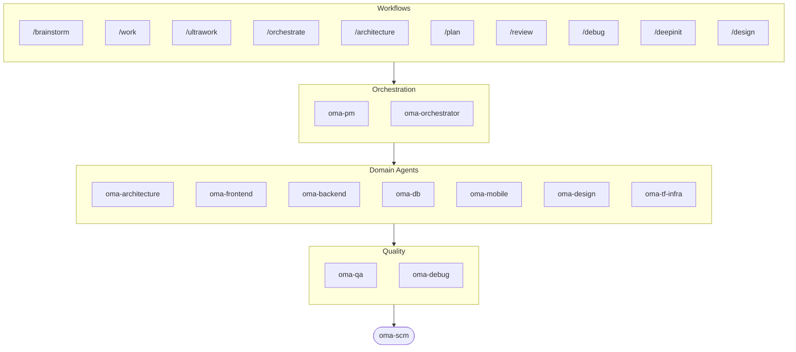

# oh-my-agent: Portable Multi-Agent Harness

[](https://www.npmjs.com/package/oh-my-agent) [](https://www.npmjs.com/package/oh-my-agent) [](https://github.com/first-fluke/oh-my-agent) [](https://github.com/first-fluke/oh-my-agent/blob/main/LICENSE) [](https://github.com/first-fluke/oh-my-agent/commits/main)

[English](../README.md) | [한국어](./README.ko.md) | [中文](./README.zh.md) | [Português](./README.pt.md) | [Français](./README.fr.md) | [Español](./README.es.md) | [Nederlands](./README.nl.md) | [Polski](./README.pl.md) | [Русский](./README.ru.md) | [Deutsch](./README.de.md) | [Tiếng Việt](./README.vi.md) | [ภาษาไทย](./README.th.md)

AIアシスタントに同僚がいたらいいのに、って思ったことありませんか？ oh-my-agentはまさにそれです。

1つのAIに全部やらせて途中で混乱する代わりに、oh-my-agentは作業を**専門エージェント**に分担します。担当するのはfrontend、backend、architecture、QA、PM、DB、mobile、infra、debug、designなどの領域です。各エージェントは自分の領域を深く理解し、専用ツールとチェックリストを持ち、担当範囲に集中します。

主要なAI IDEすべてに対応: Antigravity、Claude Code、Cursor、Gemini CLI、Codex CLI、OpenCodeなど。

## クイックスタート

```bash
# macOS / Linux — bun & uv & serena がなければ自動インストール
curl -fsSL https://raw.githubusercontent.com/first-fluke/oh-my-agent/main/cli/install.sh | bash
```

```powershell
# Windows (PowerShell) — bun & uv & serena がなければ自動インストール
irm https://raw.githubusercontent.com/first-fluke/oh-my-agent/main/cli/install.ps1 | iex
```

```bash
# または手動で（任意の OS、bun + uv + serena が必要）
bunx oh-my-agent@latest
```

### Agent Package Manager でインストール

<details>
<summary>Microsoft の <a href="https://github.com/microsoft/apm">Agent Package Manager</a>（APM）はスキルだけを配布する仕組み。クリックで展開。</summary>

> `oma-observability` の APM（Application Performance Monitoring）とは別物です。

```bash
# 全スキルを検出されたすべてのランタイムに展開
# (.claude, .cursor, .codex, .opencode, .github, .agents)
apm install first-fluke/oh-my-agent

# スキル 1 つだけ
apm install first-fluke/oh-my-agent/.agents/skills/oma-frontend
```

APM が配るのはスキル一式だけです。ワークフロー、ルール、`oma-config.yaml`、キーワード検出フック、`oma agent:spawn` CLI には `bunx oh-my-agent@latest` を使ってください。プロジェクトごとに配布方式は 1 つに絞り、ずれが出ないようにしましょう。

</details>

プリセットを選べばすぐ使えます:

| プリセット | 内容 |
|-----------|------|
| ✨ All | すべてのエージェントとスキル |
| 🌐 Fullstack | architecture + frontend + backend + db + pm + qa + debug + brainstorm + scm |
| 🎨 Frontend | architecture + frontend + pm + qa + debug + brainstorm + scm |
| ⚙️ Backend | architecture + backend + db + pm + qa + debug + brainstorm + scm |
| 📱 Mobile | architecture + mobile + pm + qa + debug + brainstorm + scm |
| 🚀 DevOps | architecture + tf-infra + dev-workflow + pm + qa + debug + brainstorm + scm |

## あらゆるエージェントで動く

`oh-my-agent` は `.agents/` を唯一の真実の源（SSOT）として保ち、各ランタイムのネイティブレイアウトに投影します。だから対応するすべてのツールが同じスキル、ワークフロー、ルールを共有できます。

<table>
<colgroup>
<col span="6" style="width:16.67%" />
</colgroup>
<tr>
<td align="center">
<a href="https://claude.com/product/claude-code"></a><br/>
<strong>Claude Code</strong><br/>
<sub>ネイティブ + アダプター</sub>
</td>
<td align="center">
<a href="https://github.com/openai/codex"></a><br/>
<strong>Codex CLI</strong><br/>
<sub>ネイティブ + アダプター</sub>
</td>
<td align="center">
<a href="https://github.com/google-gemini/gemini-cli"></a><br/>
<strong>Gemini CLI</strong><br/>
<sub>ネイティブ + アダプター</sub>
</td>
<td align="center">
<a href="https://cursor.com"></a><br/>
<strong>Cursor</strong><br/>
<sub>ネイティブ + アダプター</sub>
</td>
<td align="center">
<a href="https://github.com/QwenLM/qwen-code"></a><br/>
<strong>Qwen Code</strong><br/>
<sub>ネイティブディスパッチ</sub>
</td>
<td align="center">
<a href="https://github.com/esengine/DeepSeek-Reasonix"></a><br/>
<strong>Reasonix</strong><br/>
<sub>ネイティブ互換</sub>
</td>
</tr>
<tr>
<td align="center">
<a href="https://antigravity.google"></a><br/>
<strong>Antigravity</strong><br/>
<sub>ネイティブ SSOT</sub>
</td>
<td align="center">
<a href="https://github.com/anomalyco/opencode"></a><br/>
<strong>OpenCode</strong><br/>
<sub>ネイティブ互換</sub>
</td>
<td align="center">
<a href="https://ampcode.com"></a><br/>
<strong>Amp</strong><br/>
<sub>ネイティブ互換</sub>
</td>
<td align="center">
<a href="https://github.com/features/copilot"></a><br/>
<strong>GitHub Copilot</strong><br/>
<sub>シンボリックリンクのスキル</sub>
</td>
<td align="center">
<a href="https://grok.x.ai"></a><br/>
<strong>Grok</strong><br/>
<sub>ネイティブフック</sub>
</td>
<td align="center">
<a href="https://kiro.dev"></a><br/>
<strong>Kiro CLI</strong><br/>
<sub>ネイティブフック + エージェント</sub>
</td>
</tr>
</table>

<p align="center"><sub><a href="./SUPPORTED_AGENTS.md">& その他</a></sub></p>

## エージェントチーム

| エージェント | 役割 |
|-------------|------|
| **oma-academic-writer** | アカデミック文章の起草・改稿・監査を通じ、出版品質に仕上げる |
| **oma-architecture** | ADR/ATAM/CBAM分析でアーキテクチャのトレードオフを評価し、モジュール境界を定義する |
| **oma-backend** | Python、Node.js、RustでAPIを構築し、セキュリティを確保する |
| **oma-brainstorm** | 実装を決める前にアイデアをいっしょに探索する |
| **oma-db** | スキーマ、マイグレーション、インデックス、ベクトルストアを設計する |
| **oma-debug** | 根本原因を特定してバグを修正し、リグレッションテストを追加する |
| **oma-deepsec** | コードのセキュリティホールをスキャンし、危険なプルリクエストをブロックする |
| **oma-design** | トークン、アクセシビリティ、レスポンシブレイアウトを備えたデザインシステムを構築する |
| **oma-dev-workflow** | CI/CD、リリース、monorepoタスクを自動化する |
| **oma-docs** | ドキュメントの参照切れを検出し、コード変更の影響を受けた箇所を特定する |
| **oma-frontend** | React/Next.js、TypeScript、Tailwind CSS v4、shadcn/uiでUIを構築する |
| **oma-hwp** | HWP、HWPX、HWPMLファイルをMarkdownに変換する |
| **oma-image** | 複数のAIプロバイダーに並列で画像生成をリクエストする |
| **oma-market** | コミュニティシグナルから市場を調査し、SWOT/Porter's 5F/PESTELで整理する |
| **oma-mobile** | Flutterでクロスプラットフォームモバイルアプリを構築する |
| **oma-observability** | メトリクス、ログ、トレース、SLO、インシデント調査にまたがるオブザーバビリティ作業をルーティングする |
| **oma-orchestrator** | CLIから複数のエージェントを並列で起動・管理する |
| **oma-pdf** | PDFファイルをMarkdownに変換する |
| **oma-pm** | タスクを計画し、要件を分解し、APIコントラクトを定義する |
| **oma-qa** | OWASPセキュリティ、パフォーマンス、アクセシビリティの観点でコードをレビューする |
| **oma-recap** | 会話履歴をテーマ別の作業サマリーにまとめる |
| **oma-scholar** | 学術文献を検索し、ピアレビューを支援する |
| **oma-scm** | ブランチ、マージ、ワークツリー、Conventional Commitsを管理する |
| **oma-search** | クエリを最適なソースにルーティングし、結果の信頼スコアを付与する |
| **oma-skill-creator** | 新しいOMAスキルをSSL-liteフォーマットで作成・監査する |
| **oma-slide** | 特徴的でアニメーション豊かなHTMLプレゼンテーションデッキを生成し、PDF/PNG/PPTXへエクスポートする |
| **oma-tf-infra** | Terraformでマルチクラウドインフラをプロビジョニングする |
| **oma-translator** | ネイティブが書いたように自然な多言語翻訳を行う |
| **oma-voice** | クラウド不要のオンデバイスでボイスオーバーを生成し、音声を文字起こしする |

## 仕組み

チャットするだけ。やりたいことを説明すれば、oh-my-agentが適切なエージェントを選びます。

```
You: "ユーザー認証付きのTODOアプリを作って"
→ PMが作業を計画
→ Backendが認証APIを構築
→ FrontendがReact UIを構築
→ DBがスキーマを設計
→ QAが全体をレビュー
→ 完了: 統制されたコード、レビュー済み
```

スラッシュコマンドで構造化されたワークフローも実行できます:

| 順 | コマンド | 説明 |
|---|---------|------|
| 1 | `/brainstorm` | 自由なアイデア発散 |
| 2 | `/architecture` | ソフトウェアアーキテクチャのレビュー、トレードオフ、ADR/ATAM/CBAM型の分析 |
| 2 | `/design` | 7フェーズのデザインシステムワークフロー |
| 2 | `/plan` | PMが機能をタスクに分解 |
| 3 | `/work` | ステップごとのマルチエージェント実行 |
| 3 | `/orchestrate` | 自動並列エージェントスポーン |
| 3 | `/ultrawork` | 11のレビューゲート付き5フェーズ品質ワークフロー |
| 4 | `/review` | セキュリティ + パフォーマンス + アクセシビリティ監査 |
| 4 | `/deepsec` | エージェントベースの深層セキュリティスキャン |
| 5 | `/debug` | 構造化された根本原因デバッグ |
| 5 | `/docs` | `oma-docs` によるドキュメントドリフト検証と同期 |
| 6 | `/scm` | SCMとGitのワークフロー、Conventional Commitsの支援 |

**自動検出**: スラッシュコマンドがなくても、メッセージに「アーキテクチャ」「計画」「レビュー」「デバッグ」などのキーワードがあれば（11言語対応！）適切なワークフローが自動で起動します。

## CLI

```bash
# グローバルインストール
bun install --global oh-my-agent   # または: brew install oh-my-agent

# どこでも使える
oma agent:parallel -i backend:"Auth API" frontend:"Login form"
oma agent:spawn backend "Build auth API" session-01
oma dashboard               # リアルタイムエージェントモニタリング
oma doctor                  # ヘルスチェック
oma image generate "cat"    # マルチベンダー AI 画像生成
oma link                    # .agents/ から .claude/.codex/.gemini などを再生成
oma model:check             # 登録済みモデルとライブベンダーリストのドリフト検知
oma recap --window 1d       # ツール横断の会話履歴サマリー
oma retro 7d --compare      # メトリクス + トレンド付きエンジニアリングレトロ
oma search fetch <url>      # 自動エスカレーション戦略によるメカニカル検索
```

モデル選択は2層で行われます。
- 同一ベンダーのネイティブディスパッチは、`.claude/agents/`、`.codex/agents/`、`.gemini/agents/` に生成されたベンダーエージェント定義を使用します。
- クロスベンダーや CLI フォールバックのディスパッチでは、`.agents/skills/oma-orchestrator/config/cli-config.yaml` のベンダーデフォルトを使用します。

**エージェント別モデル**: `.agents/oma-config.yaml` で各エージェントに独自のモデルと `effort` を割り当てられます。プリセットは runtime profile: `antigravity`、`claude`、`codex`、`cursor`、`grok`、`mixed`、`qwen`。解決後の auth マトリクスは `oma doctor --profile` で確認できます。完全ガイド: [web/docs/guide/per-agent-models.md](../web/docs/guide/per-agent-models.md)。

## なぜ oh-my-agent？

> [詳しくはこちら →](https://github.com/first-fluke/oh-my-agent/issues/155#issuecomment-4142133589)

- **ポータブル**: `.agents/` はプロジェクトと一緒に移動し、特定のIDEに縛られません
- **ロールベース**: プロンプトの寄せ集めではなく、実際のエンジニアリングチームのように設計
- **トークン効率**: 2レイヤースキル設計でトークンを約75%節約
- **品質重視**: Charter preflight、quality gate、レビューワークフローを内蔵:
  - `oma verify <agent>` — エージェントタイプ別14種の決定論的チェック（TypeScript strict、テスト、raw SQL、ハードコードされたシークレット、Flutter analyze、インラインスタイル、スコープ違反、charter alignment …）
  - `session.quota_cap` — `oma-config.yaml` でセッションごとのトークン / spawn / ベンダー別予算上限；`orchestrate` Step 5 は上限超過時に次の spawn を遮断します
  - `ralph` ワークフロー — 独立した JUDGE がイテレーションごとに全 criterion を再検証し silent regression を捕捉；30秒超のテストはキャッシュします
  - Exploration Loop — 2回リトライ後、`orchestrate` が hypothesis のバリアントを並列 spawn し最高スコアのみ残します
  - モノレポ自動ルーティング — `detectWorkspace` が pnpm / nx / turbo / lerna を読み取り、各エージェントを担当 workspace にルーティングします
- **マルチベンダー**: エージェントタイプごとにClaude、Codex、Cursor、Qwenを混在可能
- **可観測性**: ターミナルとWebダッシュボードでリアルタイムにモニタリング

## アーキテクチャ



## もっと詳しく

- **[詳細ドキュメント](./AGENTS_SPEC.md)**: 完全な技術仕様とアーキテクチャ
- **[対応エージェント](./SUPPORTED_AGENTS.md)**: IDE別エージェント対応状況
- **[Webドキュメント](https://first-fluke.github.io/oh-my-agent/)**: ガイド、チュートリアル、CLIリファレンス

## スポンサー

このプロジェクトは素敵なスポンサーの皆さんのおかげで維持されています。

> **気に入りましたか？** スターをお願いします！
>
> ```bash
> gh api --method PUT /user/starred/first-fluke/oh-my-agent
> ```
>
> 最適化されたスターターテンプレートもどうぞ: [fullstack-starter](https://github.com/first-fluke/fullstack-starter)

<a href="https://github.com/sponsors/first-fluke">
  
</a>
<a href="https://buymeacoffee.com/firstfluke">
  
</a>

### 🚀 Champion

<!-- Champion tier ($100/mo) logos here -->

### 🛸 Booster

<!-- Booster tier ($30/mo) logos here -->

### ☕ Contributor

<!-- Contributor tier ($10/mo) names here -->

[スポンサーになる →](https://github.com/sponsors/first-fluke)

全サポーターの一覧は [SPONSORS.md](../SPONSORS.md) をご覧ください。


## Star History

[](https://www.star-history.com/#first-fluke/oh-my-agent&type=date&legend=bottom-right)


## 参考文献

- Liang, Q., Wang, H., Liang, Z., & Liu, Y. (2026). *From skill text to skill structure: The scheduling-structural-logical representation for agent skills* (Version 4) [Preprint]. arXiv. https://doi.org/10.48550/arXiv.2604.24026
- Chen, C., Yu, Q., Gu, Y., Huang, Z., Li, H., Liu, H., Liu, S., Liu, J., Peng, D., Wang, J., Yan, Z., Meng, F., Qin, E., Che, C., & Hu, M. (2026). *The scaling laws of skills in LLM agent systems* (Version 1) [Preprint]. arXiv. https://doi.org/10.48550/arXiv.2605.16508


## ライセンス

MIT
