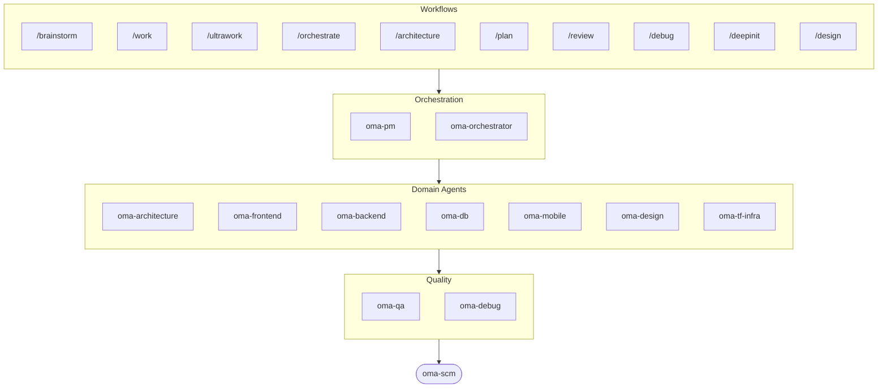

# oh-my-agent: Portable Multi-Agent Harness

[](https://www.npmjs.com/package/oh-my-agent) [](https://www.npmjs.com/package/oh-my-agent) [](https://github.com/first-fluke/oh-my-agent) [](https://github.com/first-fluke/oh-my-agent/blob/main/LICENSE) [](https://github.com/first-fluke/oh-my-agent/commits/main)

[English](../README.md) | [中文](./README.zh.md) | [Português](./README.pt.md) | [日本語](./README.ja.md) | [Français](./README.fr.md) | [Español](./README.es.md) | [Nederlands](./README.nl.md) | [Polski](./README.pl.md) | [Русский](./README.ru.md) | [Deutsch](./README.de.md) | [Tiếng Việt](./README.vi.md) | [ภาษาไทย](./README.th.md)

AI 어시스턴트에게도 동료가 있으면 좋겠다고 생각해본 적 없으신가요? 그게 바로 oh-my-agent입니다.

AI 하나에 모든 걸 맡기면 중간에 헤매기 쉽지만, oh-my-agent는 작업을 **전문 에이전트**들에게 나눠 맡깁니다. frontend, backend, architecture, QA, PM, DB, mobile, infra, debug, design 같은 전문가들이죠. 각 에이전트는 자기 영역을 깊이 알고, 전용 도구와 체크리스트를 갖춘 채 맡은 역할에만 집중합니다.

주요 AI IDE를 모두 지원합니다: Antigravity, Claude Code, Cursor, Gemini CLI, Codex CLI, OpenCode 등.

## 빠른 시작

```bash
# macOS / Linux — bun, uv, serena가 없으면 자동으로 설치됩니다
curl -fsSL https://raw.githubusercontent.com/first-fluke/oh-my-agent/main/cli/install.sh | bash
```

```powershell
# Windows (PowerShell) — bun, uv, serena가 없으면 자동으로 설치됩니다
irm https://raw.githubusercontent.com/first-fluke/oh-my-agent/main/cli/install.ps1 | iex
```

```bash
# 또는 직접 실행 (모든 OS, bun + uv + serena 필요)
bunx oh-my-agent@latest
```

### Agent Package Manager로 설치

<details>
<summary>Microsoft의 <a href="https://github.com/microsoft/apm">Agent Package Manager</a> (APM): 스킬 전용 배포. 클릭하면 펼쳐집니다.</summary>

> `oma-observability`의 APM(Application Performance Monitoring)과는 다릅니다.

```bash
# 스킬 전체를 감지된 모든 런타임에 배포
# (.claude, .cursor, .codex, .opencode, .github, .agents)
apm install first-fluke/oh-my-agent

# 스킬 하나만
apm install first-fluke/oh-my-agent/.agents/skills/oma-frontend
```

APM은 스킬만 제공합니다. 워크플로우, 규칙, `oma-config.yaml`, 키워드 감지 훅, `oma agent:spawn` CLI는 `bunx oh-my-agent@latest`를 쓰세요. 드리프트를 피하려면 프로젝트당 한 가지 배포 방식만 고르는 게 좋습니다.

</details>

프리셋만 고르면 바로 시작할 수 있습니다:

| 프리셋 | 구성 |
|--------|------|
| ✨ All | 모든 에이전트와 스킬 |
| 🌐 Fullstack | architecture + frontend + backend + db + pm + qa + debug + brainstorm + scm |
| 🎨 Frontend | architecture + frontend + pm + qa + debug + brainstorm + scm |
| ⚙️ Backend | architecture + backend + db + pm + qa + debug + brainstorm + scm |
| 📱 Mobile | architecture + mobile + pm + qa + debug + brainstorm + scm |
| 🚀 DevOps | architecture + tf-infra + dev-workflow + pm + qa + debug + brainstorm + scm |

## 모든 에이전트에서 동작

`oh-my-agent`는 `.agents/`를 단일 소스(SSOT)로 유지하면서 각 런타임의 네이티브 레이아웃으로 그대로 투영합니다. 덕분에 지원되는 도구 전부가 같은 스킬, 워크플로우, 규칙을 공유합니다.

<table>
<colgroup>
<col span="6" style="width:16.67%" />
</colgroup>
<tr>
<td align="center">
<a href="https://claude.com/product/claude-code"></a><br/>
<strong>Claude Code</strong><br/>
<sub>네이티브 + 어댑터</sub>
</td>
<td align="center">
<a href="https://github.com/openai/codex"></a><br/>
<strong>Codex CLI</strong><br/>
<sub>네이티브 + 어댑터</sub>
</td>
<td align="center">
<a href="https://github.com/google-gemini/gemini-cli"></a><br/>
<strong>Gemini CLI</strong><br/>
<sub>네이티브 + 어댑터</sub>
</td>
<td align="center">
<a href="https://cursor.com"></a><br/>
<strong>Cursor</strong><br/>
<sub>네이티브 + 어댑터</sub>
</td>
<td align="center">
<a href="https://github.com/QwenLM/qwen-code"></a><br/>
<strong>Qwen Code</strong><br/>
<sub>네이티브 디스패치</sub>
</td>
<td align="center">
<a href="https://github.com/esengine/DeepSeek-Reasonix"></a><br/>
<strong>Reasonix</strong><br/>
<sub>네이티브 호환</sub>
</td>
</tr>
<tr>
<td align="center">
<a href="https://antigravity.google"></a><br/>
<strong>Antigravity</strong><br/>
<sub>네이티브 SSOT</sub>
</td>
<td align="center">
<a href="https://github.com/anomalyco/opencode"></a><br/>
<strong>OpenCode</strong><br/>
<sub>네이티브 호환</sub>
</td>
<td align="center">
<a href="https://ampcode.com"></a><br/>
<strong>Amp</strong><br/>
<sub>네이티브 호환</sub>
</td>
<td align="center">
<a href="https://github.com/features/copilot"></a><br/>
<strong>GitHub Copilot</strong><br/>
<sub>심볼릭 링크 스킬</sub>
</td>
<td align="center">
<a href="https://grok.x.ai"></a><br/>
<strong>Grok</strong><br/>
<sub>네이티브 훅</sub>
</td>
<td align="center">
<a href="https://kiro.dev"></a><br/>
<strong>Kiro CLI</strong><br/>
<sub>네이티브 훅 + 에이전트</sub>
</td>
</tr>
</table>

<p align="center"><sub><a href="./SUPPORTED_AGENTS.md">& 더 보기</a></sub></p>

## 에이전트 팀

| 에이전트 | 하는 일 |
|----------|------|
| **oma-academic-writer** | 학술 문장을 출판 수준으로 작성·수정하고 감사 |
| **oma-architecture** | 아키텍처 트레이드오프를 검토하고 모듈 경계를 정의하며 ADR/ATAM/CBAM 분석 수행 |
| **oma-backend** | Python, Node.js, Rust로 API를 구축하고 보안 강화 |
| **oma-brainstorm** | 구현을 결정하기 전에 함께 아이디어를 탐색 |
| **oma-db** | 스키마, 마이그레이션, 인덱스, vector store 설계 |
| **oma-debug** | 근본 원인을 찾아 버그를 수정하고 회귀 테스트 작성 |
| **oma-deepsec** | 코드의 보안 취약점을 스캔하고 위험한 PR을 차단 |
| **oma-design** | 토큰, 접근성, 반응형 레이아웃을 갖춘 디자인 시스템 구축 |
| **oma-dev-workflow** | CI/CD, 릴리스, monorepo 작업을 자동화 |
| **oma-docs** | 문서의 깨진 참조를 확인하고 코드 변경에 영향받은 문서를 식별 |
| **oma-frontend** | React/Next.js, TypeScript, Tailwind CSS v4, shadcn/ui로 UI 구축 |
| **oma-hwp** | HWP, HWPX, HWPML 파일을 Markdown으로 변환 |
| **oma-image** | 여러 AI 공급업체로 이미지를 동시에 생성 |
| **oma-market** | 커뮤니티 시그널로 시장을 조사하고 SWOT, Porter's 5F, PESTEL로 프레임화 |
| **oma-mobile** | Flutter로 크로스플랫폼 모바일 앱 구축 |
| **oma-observability** | 메트릭, 로그, 트레이스, SLO, 인시던트 포렌식에 걸친 관측성 작업을 라우팅 |
| **oma-orchestrator** | CLI에서 여러 에이전트를 병렬로 실행 |
| **oma-pdf** | PDF 파일을 Markdown으로 변환 |
| **oma-pm** | 태스크를 계획하고 요구사항을 분해하며 API 계약을 정의 |
| **oma-qa** | OWASP 보안, 성능, 접근성 관점에서 코드를 리뷰 |
| **oma-recap** | 대화 이력을 주제별 작업 요약으로 정리 |
| **oma-scholar** | 학술 문헌을 검색하고 동료 평가를 지원 |
| **oma-scm** | 브랜치, 머지, 워크트리, Conventional Commits 관리 |
| **oma-search** | 각 쿼리를 최적 소스로 라우팅하고 결과의 신뢰 점수를 제공 |
| **oma-skill-creator** | SSL-lite 포맷으로 새로운 OMA 스킬을 작성하고 검증 |
| **oma-slide** | 애니메이션이 풍부한 HTML 프레젠테이션 덱을 생성하고 PDF/PNG/PPTX로 내보냄 |
| **oma-tf-infra** | Terraform으로 멀티 클라우드 인프라를 프로비저닝 |
| **oma-translator** | 원어민이 쓴 것처럼 자연스럽게 언어 간 번역 |
| **oma-voice** | 클라우드 없이 온디바이스로 보이스오버를 생성하고 오디오를 텍스트로 변환 |

## 작동 방식

그냥 채팅하듯 말하면 됩니다. 원하는 걸 설명하면 oh-my-agent가 알아서 적절한 에이전트를 골라줍니다.

```
You: "사용자 인증이 있는 TODO 앱 만들어줘"
→ PM이 작업을 계획
→ Backend가 인증 API 구축
→ Frontend가 React UI 구축
→ DB가 스키마 설계
→ QA가 전체 리뷰
→ 완료: 서로 맞물린 코드, 리뷰까지 마침
```

슬래시 커맨드로 구조화된 워크플로우를 실행할 수도 있습니다:

| 순서 | 커맨드 | 하는 일 |
|------|--------|------|
| 1 | `/brainstorm` | 자유로운 아이디어 발산 |
| 2 | `/architecture` | 소프트웨어 아키텍처 리뷰, 트레이드오프, ADR/ATAM/CBAM 스타일 분석 |
| 2 | `/design` | 7단계 디자인 시스템 워크플로우 |
| 2 | `/plan` | PM이 기능을 태스크로 분해 |
| 3 | `/work` | 단계별 멀티 에이전트 실행 |
| 3 | `/orchestrate` | 병렬 에이전트 자동 스폰 |
| 3 | `/ultrawork` | 11개 리뷰 게이트가 포함된 5단계 품질 워크플로우 |
| 4 | `/review` | 보안 + 성능 + 접근성 감사 |
| 4 | `/deepsec` | 에이전트 기반 심층 보안 스캔 |
| 5 | `/debug` | 구조화된 근본 원인 디버깅 |
| 5 | `/docs` | `oma-docs` 기반 문서 드리프트 검증·동기화 |
| 6 | `/scm` | SCM·Git 워크플로우, Conventional Commits 지원 |

**자동 감지**: 슬래시 커맨드를 쓰지 않아도, 메시지에 "아키텍처", "계획", "리뷰", "디버그" 같은 키워드만 있으면 (11개 언어 지원!) 맞는 워크플로우가 자동으로 실행됩니다.

## CLI

```bash
# 전역 설치
bun install --global oh-my-agent   # 또는: brew install oh-my-agent

# 어디서든 사용
oma agent:parallel -i backend:"Auth API" frontend:"Login form"
oma agent:spawn backend "Build auth API" session-01
oma dashboard               # 실시간 에이전트 모니터링
oma doctor                  # 상태 점검
oma image generate "cat"    # 멀티 벤더 AI 이미지 생성
oma link                    # .agents/에서 .claude/.codex/.gemini 등 재생성
oma model:check             # 등록된 모델과 실제 벤더 목록 사이 드리프트 감지
oma recap --window 1d       # 도구 간 대화 히스토리 요약
oma retro 7d --compare      # 메트릭 + 트렌드 기반 엔지니어링 회고
oma search fetch <url>      # 자동 단계 상승 전략으로 메커니컬 검색
```

모델 선택은 두 단계로 이뤄집니다.
- 같은 벤더 네이티브 디스패치는 `.claude/agents/`, `.codex/agents/`, `.gemini/agents/`에 생성된 벤더 에이전트 정의를 사용합니다.
- 벤더가 다르거나 CLI 폴백으로 디스패치할 때는 `.agents/skills/oma-orchestrator/config/cli-config.yaml`의 벤더 기본값을 사용합니다.

**에이전트별 모델**: `.agents/oma-config.yaml`에서 각 에이전트마다 모델과 `effort`를 따로 지정할 수 있습니다. runtime profile이 기본 제공됩니다: `antigravity`, `claude`, `codex`, `cursor`, `grok`, `mixed`, `qwen`. `oma doctor --profile`로 해석된 auth 매트릭스를 확인하세요. 전체 가이드: [web/docs/guide/per-agent-models.md](../web/docs/guide/per-agent-models.md).

## 왜 oh-my-agent인가?

> [자세한 배경 보기 →](https://github.com/first-fluke/oh-my-agent/issues/155#issuecomment-4142133589)

- **이식성**: `.agents/`가 프로젝트와 함께 움직이며, 특정 IDE에 묶이지 않습니다
- **역할 기반**: 프롬프트 뭉치가 아니라 실제 엔지니어링 팀처럼 설계했습니다
- **토큰 효율**: 2계층 스킬 구조로 토큰을 약 75% 절감합니다
- **품질 우선**: Charter preflight, quality gate, 리뷰 워크플로우가 내장되어 있습니다:
  - `oma verify <agent>` — 에이전트 유형별 14개 결정론 체크 (TypeScript strict, 테스트, raw SQL, 하드코딩 시크릿, Flutter analyze, 인라인 스타일, 스코프 위반, charter alignment, …)
  - `session.quota_cap` — `oma-config.yaml`의 세션별 토큰 / spawn / 벤더별 예산 캡; `orchestrate` Step 5는 캡 초과 시 다음 spawn을 차단합니다
  - `ralph` 워크플로우 — 독립 JUDGE가 매 iteration마다 모든 criterion을 재검증해 silent regression을 잡습니다; 30초 초과 테스트 캐싱
  - Exploration Loop — 2회 retry 후 `orchestrate`가 hypothesis 변형을 병렬 spawn하고 최고 점수만 남깁니다
  - 모노레포 자동 라우팅 — `detectWorkspace`가 pnpm / nx / turbo / lerna를 읽어 각 에이전트를 자기 workspace로 보냅니다
- **멀티 벤더**: 에이전트 유형별로 Claude, Codex, Cursor, Qwen을 섞어 쓸 수 있습니다
- **가시성**: 터미널과 웹 대시보드로 실시간 모니터링이 가능합니다

## 아키텍처



## 더 알아보기

- **[상세 문서](./AGENTS_SPEC.md)**: 전체 기술 스펙과 아키텍처
- **[지원 에이전트](./SUPPORTED_AGENTS.md)**: IDE별 에이전트 지원 현황
- **[웹 문서](https://first-fluke.github.io/oh-my-agent/)**: 가이드, 튜토리얼, CLI 레퍼런스

## 스폰서

이 프로젝트는 든든한 스폰서 여러분 덕분에 이어지고 있습니다.

> **마음에 드셨나요?** 스타를 눌러주세요!
>
> ```bash
> gh api --method PUT /user/starred/first-fluke/oh-my-agent
> ```
>
> 최적화된 스타터 템플릿도 함께 확인해보세요: [fullstack-starter](https://github.com/first-fluke/fullstack-starter)

<a href="https://github.com/sponsors/first-fluke">
  
</a>
<a href="https://buymeacoffee.com/firstfluke">
  
</a>

### 🚀 Champion

<!-- Champion tier ($100/mo) logos here -->

### 🛸 Booster

<!-- Booster tier ($30/mo) logos here -->

### ☕ Contributor

<!-- Contributor tier ($10/mo) names here -->

[스폰서 되기 →](https://github.com/sponsors/first-fluke)

전체 후원자 목록은 [SPONSORS.md](../SPONSORS.md)를 참고하세요.


## Star History

[](https://www.star-history.com/#first-fluke/oh-my-agent&type=date&legend=bottom-right)


## 참고문헌

- Liang, Q., Wang, H., Liang, Z., & Liu, Y. (2026). *From skill text to skill structure: The scheduling-structural-logical representation for agent skills* (Version 4) [Preprint]. arXiv. https://doi.org/10.48550/arXiv.2604.24026
- Chen, C., Yu, Q., Gu, Y., Huang, Z., Li, H., Liu, H., Liu, S., Liu, J., Peng, D., Wang, J., Yan, Z., Meng, F., Qin, E., Che, C., & Hu, M. (2026). *The scaling laws of skills in LLM agent systems* (Version 1) [Preprint]. arXiv. https://doi.org/10.48550/arXiv.2605.16508


## 라이선스

MIT
