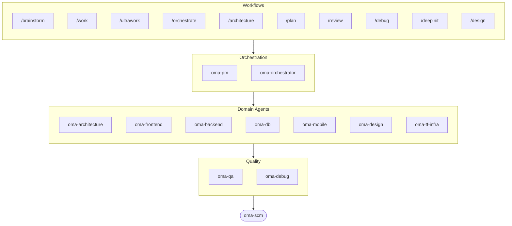

# oh-my-agent: Portable Multi-Agent Harness

[](https://www.npmjs.com/package/oh-my-agent) [](https://www.npmjs.com/package/oh-my-agent) [](https://github.com/first-fluke/oh-my-agent) [](https://github.com/first-fluke/oh-my-agent/blob/main/LICENSE) [](https://github.com/first-fluke/oh-my-agent/commits/main)

[English](../README.md) | [한국어](./README.ko.md) | [中文](./README.zh.md) | [Português](./README.pt.md) | [日本語](./README.ja.md) | [Français](./README.fr.md) | [Español](./README.es.md) | [Polski](./README.pl.md) | [Русский](./README.ru.md) | [Deutsch](./README.de.md) | [Tiếng Việt](./README.vi.md) | [ภาษาไทย](./README.th.md)

Ooit gewenst dat je AI-assistent collega's had? Dat is precies wat oh-my-agent doet.

In plaats van een enkele AI die alles doet (en halverwege de draad kwijtraakt), verdeelt oh-my-agent het werk over **gespecialiseerde agents**: frontend, backend, architecture, QA, PM, DB, mobile, infra, debug, design en meer. Elk van hen kent zijn domein door en door, heeft eigen tools en checklists, en blijft in zijn eigen baan.

Werkt met alle grote AI IDE's: Antigravity, Claude Code, Cursor, Gemini CLI, Codex CLI, OpenCode en meer.

## Snel starten

```bash
# macOS / Linux — installeert bun & uv automatisch als ze ontbreken
curl -fsSL https://raw.githubusercontent.com/first-fluke/oh-my-agent/main/cli/install.sh | bash
```

```powershell
# Windows (PowerShell) — installeert bun & uv automatisch als ze ontbreken
irm https://raw.githubusercontent.com/first-fluke/oh-my-agent/main/cli/install.ps1 | iex
```

```bash
# Of handmatig (elk OS, vereist bun + uv)
bunx oh-my-agent@latest
```

### Installatie via Agent Package Manager

<details>
<summary>Microsofts <a href="https://github.com/microsoft/apm">Agent Package Manager</a> (APM): alleen skills. Klik om uit te klappen.</summary>

> Niet te verwarren met de APM (Application Performance Monitoring) van `oma-observability`.

```bash
# Alle skills, uitgerold naar elke gedetecteerde runtime
# (.claude, .cursor, .codex, .opencode, .github, .agents)
apm install first-fluke/oh-my-agent

# Eén skill
apm install first-fluke/oh-my-agent/.agents/skills/oma-frontend
```

APM leest de `skills: .agents/skills/`-pointer in `.claude-plugin/plugin.json`, dus de `.agents/`-SSOT is de enige bron, zonder build-stap en zonder mirror.

APM levert alleen de skills. Voor workflows, regels, `oma-config.yaml`, keyword-detection-hooks en de `oma agent:spawn`-CLI gebruik je `bunx oh-my-agent@latest`. Kies per project één distributie, anders loopt het uit elkaar.

</details>

Kies een preset en je bent klaar:

| Preset | Wat je krijgt |
|--------|-------------|
| ✨ All | Alle agents en skills |
| 🌐 Fullstack | architecture + frontend + backend + db + pm + qa + debug + brainstorm + scm |
| 🎨 Frontend | architecture + frontend + pm + qa + debug + brainstorm + scm |
| ⚙️ Backend | architecture + backend + db + pm + qa + debug + brainstorm + scm |
| 📱 Mobile | architecture + mobile + pm + qa + debug + brainstorm + scm |
| 🚀 DevOps | architecture + tf-infra + dev-workflow + pm + qa + debug + brainstorm + scm |

## Jouw Agent Team

| Agent | Wat ze doen |
|-------|-------------|
| **oma-academic-writer** | Academisch proza op publicatieniveau: schrijven, herzien en rubric-audits |
| **oma-architecture** | Architectuur-trade-offs, grenzen, ADR/ATAM/CBAM-bewuste analyse |
| **oma-backend** | API's in Python, Node.js of Rust |
| **oma-brainstorm** | Verkent ideeen voordat je begint met bouwen |
| **oma-db** | Schema-ontwerp, migraties, indexering, vector DB |
| **oma-debug** | Root cause-analyse, fixes, regressietests |
| **oma-deepsec** | Agent-gedreven vulnerability scanner, PR-gate, eigen matchers |
| **oma-design** | Design systems, tokens, toegankelijkheid, responsive |
| **oma-dev-workflow** | CI/CD, releases, monorepo-automatisering |
| **oma-docs** | Referentie-integriteitscontroles, detectie van door diff geraakte docs |
| **oma-frontend** | React/Next.js, TypeScript, Tailwind CSS v4, shadcn/ui |
| **oma-hwp** | HWP/HWPX/HWPML naar Markdown conversie |
| **oma-image** | Multi-vendor AI-beeldgeneratie |
| **oma-market** | Marktonderzoek op basis van community-signalen voor pain/trend/concurrent/discovery met SWOT/5F/PESTEL |
| **oma-mobile** | Cross-platform apps met Flutter |
| **oma-observability** | Observability-router voor APM/RUM, metrics/logs/traces/profiles, SLO, incident forensics en transport-tuning |
| **oma-orchestrator** | Parallelle agent-uitvoering via CLI |
| **oma-pdf** | PDF naar Markdown conversie |
| **oma-pm** | Plant taken, splitst requirements op, definieert API-contracten |
| **oma-qa** | OWASP-beveiliging, performance, toegankelijkheidsreview |
| **oma-recap** | Analyse van gespreksgeschiedenis en thematische werksamenvattingen |
| **oma-scholar** | Academische onderzoekspartner voor literatuuronderzoek en peer review |
| **oma-scm** | Softwareconfiguratiebeheer met branching, merges, worktrees, baselines, Conventional Commits |
| **oma-search** | Intentiegebaseerde zoekrouter met vertrouwensscore voor docs, web, code en lokaal |
| **oma-skill-creator** | Schrijft en auditeert OMA-skills in het SSL-lite-formaat |
| **oma-tf-infra** | Multi-cloud Terraform IaC (Infrastructure as Code) |
| **oma-translator** | Natuurlijke meertalige vertaling |
| **oma-voice** | Local-first TTS/STT via Voicebox MCP voor spraakgeneratie, voice-over en transcriptie |

## Hoe het werkt

Gewoon chatten. Beschrijf wat je wilt en oh-my-agent zoekt uit welke agents nodig zijn.

```
Jij: "Bouw een TODO-app met gebruikersauthenticatie"
→ PM plant het werk
→ Backend bouwt de auth API
→ Frontend bouwt de React UI
→ DB ontwerpt het schema
→ QA reviewt alles
→ Klaar: gecoordineerde, gereviewde code
```

Of gebruik slash commands voor gestructureerde workflows:

| Stap | Commando | Wat het doet |
|------|----------|-------------|
| 1 | `/brainstorm` | Vrije brainstorm |
| 2 | `/architecture` | Software-architectuurreview, trade-offs, ADR/ATAM/CBAM-stijl analyse |
| 2 | `/design` | 7-fasen design system workflow |
| 2 | `/plan` | PM splitst je feature op in taken |
| 3 | `/work` | Stapsgewijze multi-agent uitvoering |
| 3 | `/orchestrate` | Automatische parallelle agent-spawning |
| 3 | `/ultrawork` | 5-fasen kwaliteitsworkflow met 11 review gates |
| 4 | `/review` | Beveiligings- + performance- + toegankelijkheidsaudit |
| 4 | `/deepsec` | Diepe agent-gedreven security scan |
| 5 | `/debug` | Gestructureerde root cause-debugging |
| 5 | `/docs` | Documentatie-drift verifiëren en synchroniseren via `oma-docs` |
| 6 | `/scm` | SCM- en Git-workflow met ondersteuning voor Conventional Commits |

**Autodetectie**: Je hebt de slash commands niet eens nodig. Woorden als "architectuur", "plan", "review" en "debug" in je bericht (in 11 talen!) activeren automatisch de juiste workflow.

## CLI

```bash
# Globaal installeren
bun install --global oh-my-agent   # of: brew install oh-my-agent

# Overal gebruiken
oma agent:parallel -i backend:"Auth API" frontend:"Login form"
oma agent:spawn backend "Build auth API" session-01
oma dashboard               # Realtime agent-monitoring
oma doctor                  # Health check
oma image generate "cat"    # Multi-vendor AI-beeldgeneratie
oma link                    # Regenereer .claude/.codex/.gemini/etc. uit .agents/
oma model:check             # Drift detecteren tussen geregistreerde modellen en live vendor-lijsten
oma recap --window 1d       # Cross-tool gespreksgeschiedenis-samenvatting
oma retro 7d --compare      # Engineering-retro met metrics + trends
oma search fetch <url>      # Mechanisch zoeken met auto-opschalende strategieën
```

Modelselectie volgt twee lagen:
- Same-vendor native dispatch gebruikt de gegenereerde vendor-agent-definitie in `.claude/agents/`, `.codex/agents/` of `.gemini/agents/`.
- Cross-vendor of fallback CLI dispatch gebruikt de vendor-defaults in `.agents/skills/oma-orchestrator/config/cli-config.yaml`.

**modellen per agent**: elke agent kan via `.agents/oma-config.yaml` een eigen model en `effort` kiezen. Er zijn zes kant-en-klare runtime profiles: `claude-only`, `codex-only`, `gemini-only`, `qwen-only`, `cursor-only`, `antigravity`. Bekijk de opgeloste auth-matrix met `oma doctor --profile`. Volledige gids: [web/docs/guide/per-agent-models.md](../web/docs/guide/per-agent-models.md).

## Waarom oh-my-agent?

> [Meer lezen →](https://github.com/first-fluke/oh-my-agent/issues/155#issuecomment-4142133589)

- **Draagbaar**: `.agents/` reist mee met je project, niet opgesloten in een IDE
- **Rolgebaseerd**: agents gemodelleerd als een echt engineeringteam, niet een stapel prompts
- **Token-efficient**: tweelaags skill-ontwerp bespaart ~75% tokens
- **Kwaliteit eerst**: Charter preflight, quality gates en review-workflows ingebouwd
- **Multi-vendor**: mix Gemini, Claude, Codex en Qwen per agent-type
- **Observeerbaar**: terminal- en webdashboards voor realtime monitoring

## Architectuur



## Meer informatie

- **[Uitgebreide documentatie](./AGENTS_SPEC.md)**: volledige technische spec en architectuur
- **[Ondersteunde agents](./SUPPORTED_AGENTS.md)**: agent-ondersteuningsmatrix per IDE
- **[Webdocs](https://first-fluke.github.io/oh-my-agent/)**: handleidingen, tutorials en CLI-referentie

## Sponsors

Dit project wordt onderhouden dankzij onze gulle sponsors.

> **Vind je dit project leuk?** Geef een ster!
>
> ```bash
> gh api --method PUT /user/starred/first-fluke/oh-my-agent
> ```
>
> Probeer onze geoptimaliseerde startertemplate: [fullstack-starter](https://github.com/first-fluke/fullstack-starter)

<a href="https://github.com/sponsors/first-fluke">
  
</a>
<a href="https://buymeacoffee.com/firstfluke">
  
</a>

### 🚀 Champion

<!-- Champion tier ($100/mo) logos here -->

### 🛸 Booster

<!-- Booster tier ($30/mo) logos here -->

### ☕ Contributor

<!-- Contributor tier ($10/mo) names here -->

[Word sponsor →](https://github.com/sponsors/first-fluke)

Zie [SPONSORS.md](../SPONSORS.md) voor de volledige lijst van supporters.


## Star History

[](https://www.star-history.com/#first-fluke/oh-my-agent&type=date&legend=bottom-right)


## Referenties

- Liang, Q., Wang, H., Liang, Z., & Liu, Y. (2026). *From skill text to skill structure: The scheduling-structural-logical representation for agent skills* (Version 2) [Preprint]. arXiv. https://doi.org/10.48550/arXiv.2604.24026


## Licentie

MIT
