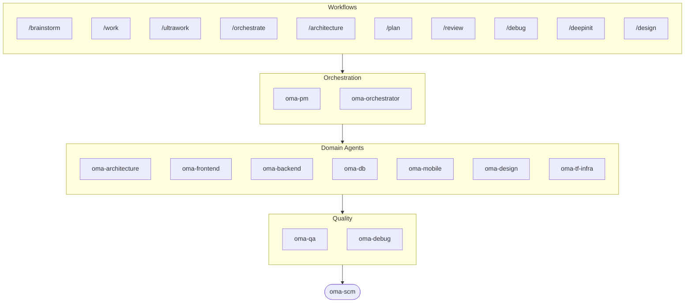

# oh-my-agent: Portable Multi-Agent Harness

[](https://www.npmjs.com/package/oh-my-agent) [](https://www.npmjs.com/package/oh-my-agent) [](https://github.com/first-fluke/oh-my-agent) [](https://github.com/first-fluke/oh-my-agent/blob/main/LICENSE) [](https://github.com/first-fluke/oh-my-agent/commits/main)

[English](../README.md) | [한국어](./README.ko.md) | [中文](./README.zh.md) | [Português](./README.pt.md) | [日本語](./README.ja.md) | [Français](./README.fr.md) | [Español](./README.es.md) | [Nederlands](./README.nl.md) | [Русский](./README.ru.md) | [Deutsch](./README.de.md) | [Tiếng Việt](./README.vi.md) | [ภาษาไทย](./README.th.md)

Chcialbys, zeby Twoj asystent AI mial wspolpracownikow? Wlasnie to robi oh-my-agent.

Zamiast jednego AI, ktory robi wszystko (i gubi sie w polowie), oh-my-agent rozdziela prace miedzy **wyspecjalizowanych agentow**: frontend, backend, architecture, QA, PM, DB, mobile, infra, debug, design i innych. Kazdy doskonale zna swoja dziedzine, ma wlasne narzedzia i checklisty, i nie wychodzi poza swoj zakres.

Dziala ze wszystkimi glownymi AI IDE: Antigravity, Claude Code, Cursor, Gemini CLI, Codex CLI, OpenCode i innymi.

## Szybki start

```bash
# macOS / Linux — automatycznie zainstaluje bun & uv, jesli brakuje
curl -fsSL https://raw.githubusercontent.com/first-fluke/oh-my-agent/main/cli/install.sh | bash
```

```powershell
# Windows (PowerShell) — automatycznie zainstaluje bun & uv, jesli brakuje
irm https://raw.githubusercontent.com/first-fluke/oh-my-agent/main/cli/install.ps1 | iex
```

```bash
# Lub recznie (dowolny system, wymaga bun + uv)
bunx oh-my-agent@latest
```

### Instalacja przez Agent Package Manager

<details>
<summary><a href="https://github.com/microsoft/apm">Agent Package Manager</a> (APM) od Microsoftu: dystrybucja tylko ze skillami. Kliknij, zeby rozwinac.</summary>

> Nie myl tego z APM (Application Performance Monitoring) z `oma-observability`.

```bash
# Wszystkie skille, wdrazane do kazdego wykrytego runtime
# (.claude, .cursor, .codex, .opencode, .github, .agents)
apm install first-fluke/oh-my-agent

# Pojedynczy skill
apm install first-fluke/oh-my-agent/.agents/skills/oma-frontend
```

APM czyta wskaznik `skills: .agents/skills/` z `.claude-plugin/plugin.json`, wiec SSOT z `.agents/` jest jedynym zrodlem, bez kroku build i bez mirrora.

APM dostarcza tylko skille. Do workflowow, regul, `oma-config.yaml`, hookow detekcji slow kluczowych i CLI `oma agent:spawn` uzyj `bunx oh-my-agent@latest`. W jednym projekcie trzymaj sie jednej dystrybucji, zeby nic sie nie rozjechalo.

</details>

Wybierz preset i gotowe:

| Preset | Co dostajesz |
|--------|-------------|
| ✨ All | Wszyscy agenci i umiejetnosci |
| 🌐 Fullstack | architecture + frontend + backend + db + pm + qa + debug + brainstorm + scm |
| 🎨 Frontend | architecture + frontend + pm + qa + debug + brainstorm + scm |
| ⚙️ Backend | architecture + backend + db + pm + qa + debug + brainstorm + scm |
| 📱 Mobile | architecture + mobile + pm + qa + debug + brainstorm + scm |
| 🚀 DevOps | architecture + tf-infra + dev-workflow + pm + qa + debug + brainstorm + scm |

## Twoj zespol agentow

| Agent | Co robi |
|-------|-------------|
| **oma-academic-writer** | Pisanie, redakcja i audyt akademickiej prozy w jakości publikacyjnej według rubryki |
| **oma-architecture** | Kompromisy architektoniczne, granice, analiza w duchu ADR/ATAM/CBAM |
| **oma-backend** | API w Python, Node.js lub Rust |
| **oma-brainstorm** | Eksploruje pomysly, zanim zaczniesz budowac |
| **oma-db** | Projektowanie schematow, migracje, indeksowanie, vector DB |
| **oma-debug** | Analiza przyczyn, poprawki, testy regresji |
| **oma-deepsec** | Skaner podatnosci przez agenta, bramka PR, wlasne matchery |
| **oma-design** | Design systemy, tokeny, dostepnosc, responsywnosc |
| **oma-dev-workflow** | CI/CD, releasy, automatyzacja monorepo |
| **oma-docs** | Sprawdzanie integralnosci referencji, wykrywanie docs dotknietych diffem |
| **oma-frontend** | React/Next.js, TypeScript, Tailwind CSS v4, shadcn/ui |
| **oma-hwp** | Konwersja HWP/HWPX/HWPML do Markdown |
| **oma-image** | Wielodostawcze generowanie obrazów AI |
| **oma-market** | Badanie rynku na podstawie sygnalow spolecznosciowych dla pain/trend/konkurencja/discovery z SWOT/5F/PESTEL |
| **oma-mobile** | Wieloplatformowe aplikacje we Flutter |
| **oma-observability** | Router obserwowalności obsługujący APM/RUM, metryki/logi/trace/profile, SLO, analizę incydentów i dostrajanie transportu |
| **oma-orchestrator** | Rownolegle uruchamianie agentow przez CLI |
| **oma-pdf** | Konwersja PDF do Markdown |
| **oma-pm** | Planuje zadania, rozbija wymagania, definiuje kontrakty API |
| **oma-qa** | Bezpieczenstwo OWASP, wydajnosc, przeglad dostepnosci |
| **oma-recap** | Analiza historii rozmow i tematyczne podsumowania pracy |
| **oma-scholar** | Towarzysz badań akademickich do wyszukiwania literatury i recenzji naukowej |
| **oma-scm** | Zarządzanie konfiguracją oprogramowania z branchowaniem, merge, worktree, baseline, Conventional Commits |
| **oma-search** | Router wyszukiwania oparty na intencji z oceną zaufania dla dokumentacji, web, kodu i wyszukiwania lokalnego |
| **oma-skill-creator** | Tworzy i audytuje skille OMA w formacie SSL-lite |
| **oma-tf-infra** | Wielochmurowy IaC z Terraform (Infrastructure as Code) |
| **oma-translator** | Naturalne tlumaczenie wielojezyczne |
| **oma-voice** | Lokalny TTS/STT przez Voicebox MCP do generowania głosu, voiceoveru i transkrypcji |

## Jak to dziala

Po prostu pisz. Opisz, czego potrzebujesz, a oh-my-agent sam ustali, ktorych agentow uzyc.

```
Ty: "Zbuduj aplikacje TODO z uwierzytelnianiem uzytkownikow"
→ PM planuje prace
→ Backend buduje API uwierzytelniania
→ Frontend buduje UI w React
→ DB projektuje schemat
→ QA przeglada wszystko
→ Gotowe: skoordynowany, sprawdzony kod
```

Lub uzyj slash commands do ustrukturyzowanych workflow:

| Krok | Komenda | Co robi |
|------|---------|-------------|
| 1 | `/brainstorm` | Swobodna burza mozgow |
| 2 | `/architecture` | Przeglad architektury, trade-offy, analiza w stylu ADR/ATAM/CBAM |
| 2 | `/design` | 7-fazowy workflow design systemu |
| 2 | `/plan` | PM rozbija Twoja funkcjonalnosc na zadania |
| 3 | `/work` | Krokowe wykonanie wieloagentowe |
| 3 | `/orchestrate` | Automatyczne rownolegle uruchamianie agentow |
| 3 | `/ultrawork` | 5-fazowy workflow jakosci z 11 bramkami rewizji |
| 4 | `/review` | Audyt bezpieczenstwa + wydajnosci + dostepnosci |
| 4 | `/deepsec` | Gleboki skan bezpieczenstwa przez agenta |
| 5 | `/debug` | Ustrukturyzowane debugowanie z analiza przyczyn |
| 5 | `/docs` | Weryfikacja i synchronizacja dryfu dokumentacji przez `oma-docs` |
| 6 | `/scm` | Workflow SCM i Git oraz wsparcie Conventional Commits |

**Autodetekcja**: Nie musisz nawet uzywac slash commands. Slowa takie jak "architektura", "plan", "review" i "debug" w Twojej wiadomosci (w 11 jezykach!) automatycznie uruchamiaja odpowiedni workflow.

## CLI

```bash
# Zainstaluj globalnie
bun install --global oh-my-agent   # lub: brew install oh-my-agent

# Uzywaj gdziekolwiek
oma agent:parallel -i backend:"Auth API" frontend:"Login form"
oma agent:spawn backend "Build auth API" session-01
oma dashboard               # Monitoring w czasie rzeczywistym
oma doctor                  # Sprawdzenie stanu
oma image generate "cat"    # Generowanie obrazów AI od wielu dostawców
oma link                    # Regeneruj .claude/.codex/.gemini/itd. z .agents/
oma model:check             # Wykrywanie rozbieżności między zarejestrowanymi modelami a aktualnymi listami dostawców
oma recap --window 1d       # Podsumowanie historii rozmów między narzędziami
oma retro 7d --compare      # Retrospekcja inżynierska z metrykami + trendami
oma search fetch <url>      # Wyszukiwanie mechaniczne z automatyczną eskalacją strategii
```

Wybor modelu przebiega w dwoch warstwach:
- Natywny dispatch tego samego dostawcy uzywa wygenerowanej definicji agenta dostawcy w `.claude/agents/`, `.codex/agents/` lub `.gemini/agents/`.
- Dispatch miedzy dostawcami lub awaryjny CLI uzywa domyslnych wartosci dostawcy w `.agents/skills/oma-orchestrator/config/cli-config.yaml`.

**modele per agent**: kazdy agent moze miec wlasny model i `effort` zdefiniowany w `.agents/oma-config.yaml`. Dostepnych jest szesc gotowych runtime profiles: `claude-only`, `codex-only`, `gemini-only`, `qwen-only`, `cursor-only`, `antigravity`. Sprawdz rozwiazana macierz auth komenda `oma doctor --profile`. Pelny przewodnik: [web/docs/guide/per-agent-models.md](../web/docs/guide/per-agent-models.md).

## Dlaczego oh-my-agent?

> [Czytaj więcej →](https://github.com/first-fluke/oh-my-agent/issues/155#issuecomment-4142133589)

- **Przenosny**: `.agents/` wedruje z Twoim projektem, nie jest uwieziony w jednym IDE
- **Oparty na rolach**: agenci zamodelowani jak prawdziwy zespol inzynierski, nie sterta promptow
- **Oszczedny z tokenami**: dwuwarstwowy design umiejetnosci oszczedza ~75% tokenow
- **Jakosc przede wszystkim**: Charter preflight, quality gates i workflow rewizji wbudowane
- **Multi-vendor**: mieszaj Gemini, Claude, Codex i Qwen dla roznych typow agentow
- **Obserwowalny**: dashboardy w terminalu i w przegladarce do monitoringu w czasie rzeczywistym

## Architektura



## Dowiedz sie wiecej

- **[Szczegolowa dokumentacja](./AGENTS_SPEC.md)**: pelna specyfikacja techniczna i architektura
- **[Wspierani agenci](./SUPPORTED_AGENTS.md)**: macierz wsparcia agentow w roznych IDE
- **[Dokumentacja webowa](https://first-fluke.github.io/oh-my-agent/)**: poradniki, tutoriale i referencja CLI

## Sponsorzy

Ten projekt jest utrzymywany dzieki naszym hojnym sponsorom.

> **Podoba Ci sie projekt?** Daj gwiazdke!
>
> ```bash
> gh api --method PUT /user/starred/first-fluke/oh-my-agent
> ```
>
> Wyprobuj nasz zoptymalizowany szablon startowy: [fullstack-starter](https://github.com/first-fluke/fullstack-starter)

<a href="https://github.com/sponsors/first-fluke">
  
</a>
<a href="https://buymeacoffee.com/firstfluke">
  
</a>

### 🚀 Champion

<!-- Champion tier ($100/mo) logos here -->

### 🛸 Booster

<!-- Booster tier ($30/mo) logos here -->

### ☕ Contributor

<!-- Contributor tier ($10/mo) names here -->

[Zostan sponsorem →](https://github.com/sponsors/first-fluke)

Zobacz [SPONSORS.md](../SPONSORS.md), aby zobaczyc pelna liste wspierajacych.


## Star History

[](https://www.star-history.com/#first-fluke/oh-my-agent&type=date&legend=bottom-right)


## Bibliografia

- Liang, Q., Wang, H., Liang, Z., & Liu, Y. (2026). *From skill text to skill structure: The scheduling-structural-logical representation for agent skills* (Version 2) [Preprint]. arXiv. https://doi.org/10.48550/arXiv.2604.24026


## Licencja

MIT
