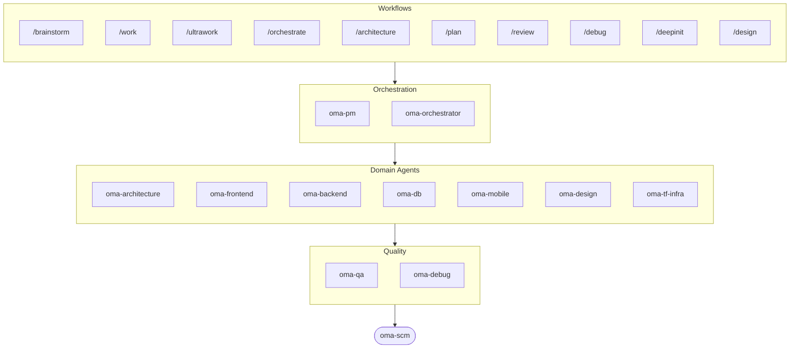

# oh-my-agent: Portable Multi-Agent Harness

[](https://www.npmjs.com/package/oh-my-agent) [](https://www.npmjs.com/package/oh-my-agent) [](https://github.com/first-fluke/oh-my-agent) [](https://github.com/first-fluke/oh-my-agent/blob/main/LICENSE) [](https://github.com/first-fluke/oh-my-agent/commits/main)

[English](../README.md) | [한국어](./README.ko.md) | [中文](./README.zh.md) | [日本語](./README.ja.md) | [Français](./README.fr.md) | [Español](./README.es.md) | [Nederlands](./README.nl.md) | [Polski](./README.pl.md) | [Русский](./README.ru.md) | [Deutsch](./README.de.md) | [Tiếng Việt](./README.vi.md) | [ภาษาไทย](./README.th.md)

Ja quis que seu assistente de IA tivesse colegas de trabalho? E isso que o oh-my-agent faz.

Em vez de uma unica IA fazendo tudo (e se perdendo no meio do caminho), o oh-my-agent divide o trabalho entre **agentes especializados**: frontend, backend, architecture, QA, PM, DB, mobile, infra, debug, design e mais. Cada um conhece bem o seu dominio, tem suas proprias ferramentas e checklists, e nao sai da sua area.

Funciona com todas as principais IDEs de IA: Antigravity, Claude Code, Cursor, Gemini CLI, Codex CLI, OpenCode e mais.

## Inicio Rapido

```bash
# macOS / Linux — instala bun & uv automaticamente se nao tiver
curl -fsSL https://raw.githubusercontent.com/first-fluke/oh-my-agent/main/cli/install.sh | bash
```

```powershell
# Windows (PowerShell) — instala bun & uv automaticamente se nao tiver
irm https://raw.githubusercontent.com/first-fluke/oh-my-agent/main/cli/install.ps1 | iex
```

```bash
# Ou manualmente (qualquer SO, requer bun + uv)
bunx oh-my-agent@latest
```

### Instalacao via Agent Package Manager

<details>
<summary><a href="https://github.com/microsoft/apm">Agent Package Manager</a> (APM) da Microsoft: distribuicao so com skills. Clique para expandir.</summary>

> Nao confunda com o APM (Application Performance Monitoring) do `oma-observability`.

```bash
# Todos os skills, instalados em cada runtime detectado
# (.claude, .cursor, .codex, .opencode, .github, .agents)
apm install first-fluke/oh-my-agent

# Um unico skill
apm install first-fluke/oh-my-agent/.agents/skills/oma-frontend
```

O APM le o ponteiro `skills: .agents/skills/` do `.claude-plugin/plugin.json`, entao o SSOT em `.agents/` e a unica fonte, sem etapa de build e sem mirror.

O APM so entrega os skills. Para workflows, regras, `oma-config.yaml`, hooks de deteccao de palavras-chave e a CLI `oma agent:spawn`, use `bunx oh-my-agent@latest`. Escolha so um modo de distribuicao por projeto, senao acaba dando ruim.

</details>

Escolha um preset e pronto:

| Preset | O Que Voce Ganha |
|--------|-------------|
| ✨ All | Todos os agentes e skills |
| 🌐 Fullstack | architecture + frontend + backend + db + pm + qa + debug + brainstorm + scm |
| 🎨 Frontend | architecture + frontend + pm + qa + debug + brainstorm + scm |
| ⚙️ Backend | architecture + backend + db + pm + qa + debug + brainstorm + scm |
| 📱 Mobile | architecture + mobile + pm + qa + debug + brainstorm + scm |
| 🚀 DevOps | architecture + tf-infra + dev-workflow + pm + qa + debug + brainstorm + scm |

## Seu Time de Agentes

| Agente | O Que Faz |
|-------|-------------|
| **oma-academic-writer** | Redacao, revisao e auditorias por rubrica de prosa academica em nivel de publicacao |
| **oma-architecture** | Trade-offs de arquitetura, limites, analise com foco em ADR/ATAM/CBAM |
| **oma-backend** | APIs em Python, Node.js ou Rust |
| **oma-brainstorm** | Explora ideias antes de voce comecar a construir |
| **oma-db** | Design de schema, migrations, indexacao, vector DB |
| **oma-debug** | Analise de causa raiz, correcoes, testes de regressao |
| **oma-deepsec** | Scanner de vulnerabilidades por agente, gate de PR, matchers personalizados |
| **oma-design** | Design systems, tokens, acessibilidade, responsividade |
| **oma-dev-workflow** | CI/CD, releases, automacao de monorepo |
| **oma-docs** | Verificações de integridade de refs, detecção de docs afetados por diff |
| **oma-frontend** | React/Next.js, TypeScript, Tailwind CSS v4, shadcn/ui |
| **oma-hwp** | Conversão de HWP/HWPX/HWPML para Markdown |
| **oma-image** | Geração de imagens IA multi-fornecedor |
| **oma-market** | Pesquisa de mercado por sinais de comunidade para pain/trend/concorrente/discovery com SWOT/5F/PESTEL |
| **oma-mobile** | Apps cross-platform com Flutter |
| **oma-observability** | Roteador de observabilidade para APM/RUM, métricas/logs/traces/profiles, SLO, forense de incidentes e ajuste de transporte |
| **oma-orchestrator** | Execucao paralela de agentes via CLI |
| **oma-pdf** | Conversão de PDF para Markdown |
| **oma-pm** | Planeja tarefas, detalha requisitos, define contratos de API |
| **oma-qa** | Seguranca OWASP, performance, revisao de acessibilidade |
| **oma-recap** | Analise de historico de conversas e resumos tematicos de trabalho |
| **oma-scholar** | Companheiro de pesquisa acadêmica para busca bibliográfica e revisão por pares |
| **oma-scm** | Gestão de configuração de software com branches, merges, worktrees, baselines, Conventional Commits |
| **oma-search** | Roteador de busca baseado em intenção com pontuação de confiança para docs, web, código e local |
| **oma-skill-creator** | Cria e audita skills OMA no formato SSL-lite |
| **oma-tf-infra** | IaC multi-cloud com Terraform (Infrastructure as Code) |
| **oma-translator** | Traducao multilingual natural |
| **oma-voice** | TTS/STT local-first via Voicebox MCP para geracao de voz, voiceover e transcricao |

## Como Funciona

So conversar. Descreva o que voce quer e o oh-my-agent descobre quais agentes usar.

```
Voce: "Cria um app de TODO com autenticacao de usuario"
→ PM planeja o trabalho
→ Backend constroi a API de auth
→ Frontend constroi a UI em React
→ DB desenha o schema
→ QA revisa tudo
→ Pronto: codigo coordenado e revisado
```

Ou use slash commands para workflows estruturados:

| Etapa | Comando | O Que Faz |
|-------|---------|-------------|
| 1 | `/brainstorm` | Ideacao livre |
| 2 | `/architecture` | Revisao de arquitetura, trade-offs, analise estilo ADR/ATAM/CBAM |
| 2 | `/design` | Workflow de design system em 7 fases |
| 2 | `/plan` | PM detalha sua feature em tarefas |
| 3 | `/work` | Execucao multi-agente passo a passo |
| 3 | `/orchestrate` | Spawn automatico e paralelo de agentes |
| 3 | `/ultrawork` | Workflow de qualidade em 5 fases com 11 gates de revisao |
| 4 | `/review` | Auditoria de seguranca + performance + acessibilidade |
| 4 | `/deepsec` | Varredura de seguranca profunda por agente |
| 5 | `/debug` | Debugging estruturado de causa raiz |
| 5 | `/docs` | Verificação e sincronização de drift de documentação via `oma-docs` |
| 6 | `/scm` | Workflow SCM e Git com suporte a Conventional Commits |

**Auto-deteccao**: Voce nem precisa dos slash commands. Palavras como "arquitetura", "plan", "review" e "debug" na sua mensagem (em 11 idiomas!) ativam automaticamente o workflow certo.

## CLI

```bash
# Instalar globalmente
bun install --global oh-my-agent   # ou: brew install oh-my-agent

# Usar em qualquer lugar
oma agent:parallel -i backend:"Auth API" frontend:"Login form"
oma agent:spawn backend "Build auth API" session-01
oma dashboard               # Monitoramento em tempo real
oma doctor                  # Health check
oma image generate "cat"    # Geração de imagens IA multi-fornecedor
oma link                    # Regenera .claude/.codex/.gemini/etc. a partir de .agents/
oma model:check             # Detecta drift entre modelos registrados e listas de vendor ao vivo
oma recap --window 1d       # Recap de histórico de conversa entre ferramentas
oma retro 7d --compare      # Retrospectiva de engenharia com métricas + tendências
oma search fetch <url>      # Busca mecânica com estratégias auto-escaláveis
```

A seleção de modelo segue duas camadas:
- Dispatch nativo de mesmo vendor usa a definição de agente gerada em `.claude/agents/`, `.codex/agents/` ou `.gemini/agents/`.
- Dispatch cross-vendor ou fallback via CLI usa os padrões de vendor em `.agents/skills/oma-orchestrator/config/cli-config.yaml`.

**modelos por agente**: cada agente pode apontar para seu próprio modelo e `effort` a partir de `.agents/oma-config.yaml`. Seis runtime profiles já vêm prontos: `claude-only`, `codex-only`, `gemini-only`, `qwen-only`, `cursor-only`, `antigravity`. Confira a matriz de auth resolvida com `oma doctor --profile`. Guia completo: [web/docs/guide/per-agent-models.md](../web/docs/guide/per-agent-models.md).

## Por Que oh-my-agent?

> [Saiba mais →](https://github.com/first-fluke/oh-my-agent/issues/155#issuecomment-4142133589)

- **Portavel**: `.agents/` viaja com seu projeto, sem ficar preso a uma IDE
- **Baseado em papeis**: agentes modelados como um time de engenharia real, nao um amontoado de prompts
- **Eficiente em tokens**: design de skills em duas camadas economiza ~75% de tokens
- **Qualidade primeiro**: Charter preflight, quality gates e workflows de revisao integrados
- **Multi-vendor**: misture Gemini, Claude, Codex e Qwen por tipo de agente
- **Observavel**: dashboards no terminal e na web para monitoramento em tempo real

## Arquitetura



## Saiba Mais

- **[Documentacao Detalhada](./AGENTS_SPEC.md)**: spec tecnica completa e arquitetura
- **[Agentes Suportados](./SUPPORTED_AGENTS.md)**: matriz de suporte de agentes por IDE
- **[Docs Web](https://first-fluke.github.io/oh-my-agent/)**: guias, tutoriais e referencia da CLI

## Sponsors

Este projeto e mantido gracas aos nossos generosos sponsors.

> **Curtiu o projeto?** Da uma estrela!
>
> ```bash
> gh api --method PUT /user/starred/first-fluke/oh-my-agent
> ```
>
> Experimente nosso template starter otimizado: [fullstack-starter](https://github.com/first-fluke/fullstack-starter)

<a href="https://github.com/sponsors/first-fluke">
  
</a>
<a href="https://buymeacoffee.com/firstfluke">
  
</a>

### 🚀 Champion

<!-- Champion tier ($100/mo) logos here -->

### 🛸 Booster

<!-- Booster tier ($30/mo) logos here -->

### ☕ Contributor

<!-- Contributor tier ($10/mo) names here -->

[Torne-se um sponsor →](https://github.com/sponsors/first-fluke)

Veja [SPONSORS.md](../SPONSORS.md) para a lista completa de apoiadores.


## Star History

[](https://www.star-history.com/#first-fluke/oh-my-agent&type=date&legend=bottom-right)


## Referências

- Liang, Q., Wang, H., Liang, Z., & Liu, Y. (2026). *From skill text to skill structure: The scheduling-structural-logical representation for agent skills* (Version 2) [Preprint]. arXiv. https://doi.org/10.48550/arXiv.2604.24026


## Licenca

MIT
