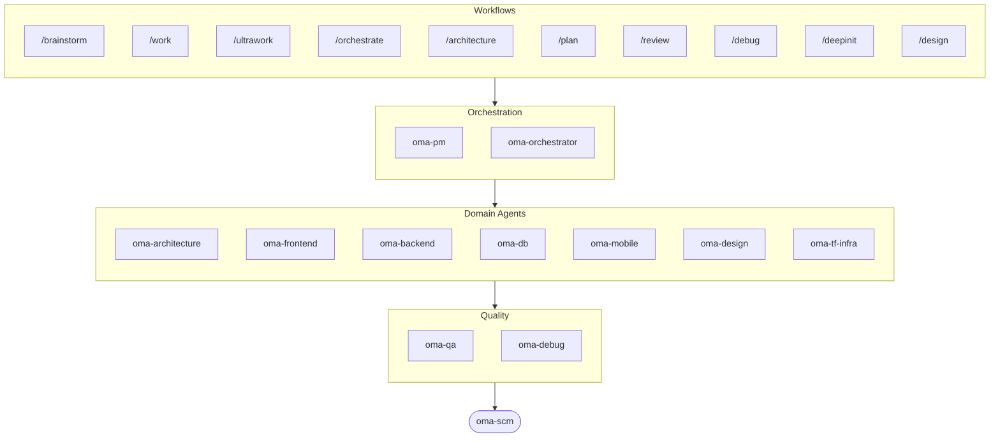

# oh-my-agent: Portable Multi-Agent Harness

[](https://www.npmjs.com/package/oh-my-agent) [](https://www.npmjs.com/package/oh-my-agent) [](https://github.com/first-fluke/oh-my-agent) [](https://github.com/first-fluke/oh-my-agent/blob/main/LICENSE) [](https://github.com/first-fluke/oh-my-agent/commits/main)

[English](../README.md) | [한국어](./README.ko.md) | [中文](./README.zh.md) | [Português](./README.pt.md) | [日本語](./README.ja.md) | [Français](./README.fr.md) | [Español](./README.es.md) | [Nederlands](./README.nl.md) | [Polski](./README.pl.md) | [Deutsch](./README.de.md) | [Tiếng Việt](./README.vi.md) | [ภาษาไทย](./README.th.md)

Когда-нибудь хотели, чтобы у вашего ИИ-ассистента были коллеги? Именно это и делает oh-my-agent.

Вместо того чтобы один ИИ делал все (и терялся на полпути), oh-my-agent распределяет работу между **специализированными агентами**: frontend, backend, architecture, QA, PM, DB, mobile, infra, debug, design и другими. Каждый глубоко знает свою область, имеет свои инструменты и чеклисты и не лезет в чужую зону.

Работает со всеми основными AI IDE: Antigravity, Claude Code, Cursor, Gemini CLI, Codex CLI, OpenCode и другими.

## Быстрый старт

```bash
# macOS / Linux — автоматически установит bun, uv & serena, если их нет
curl -fsSL https://raw.githubusercontent.com/first-fluke/oh-my-agent/main/cli/install.sh | bash
```

```powershell
# Windows (PowerShell) — автоматически установит bun, uv & serena, если их нет
irm https://raw.githubusercontent.com/first-fluke/oh-my-agent/main/cli/install.ps1 | iex
```

```bash
# Или вручную (любая ОС, требуется bun + uv + serena)
bunx oh-my-agent@latest
```

### Установка через Agent Package Manager

<details>
<summary><a href="https://github.com/microsoft/apm">Agent Package Manager</a> (APM) от Microsoft: дистрибуция только со скилами. Нажмите, чтобы развернуть.</summary>

> Не путайте с APM (Application Performance Monitoring) из `oma-observability`.

```bash
# Все скилы, разворачиваются во все обнаруженные runtime
# (.claude, .cursor, .codex, .opencode, .github, .agents)
apm install first-fluke/oh-my-agent

# Один скил
apm install first-fluke/oh-my-agent/.agents/skills/oma-frontend
```

APM поставляет только скилы. Для workflow, правил, `oma-config.yaml`, хуков детекции ключевых слов и CLI `oma agent:spawn` используйте `bunx oh-my-agent@latest`. На один проект выбирайте один способ дистрибуции, иначе всё разъедется.

</details>

Выберите пресет, и готово:

| Пресет | Что получаете |
|--------|-------------|
| ✨ All | Все агенты и навыки |
| 🌐 Fullstack | architecture + frontend + backend + db + pm + qa + debug + brainstorm + scm |
| 🎨 Frontend | architecture + frontend + pm + qa + debug + brainstorm + scm |
| ⚙️ Backend | architecture + backend + db + pm + qa + debug + brainstorm + scm |
| 📱 Mobile | architecture + mobile + pm + qa + debug + brainstorm + scm |
| 🚀 DevOps | architecture + tf-infra + dev-workflow + pm + qa + debug + brainstorm + scm |

## Работает с любым агентом

`oh-my-agent` хранит `.agents/` как единый источник истины (SSOT) и проецирует его в нативный layout каждого runtime. Поэтому все поддерживаемые инструменты используют одни и те же skills, workflows и правила.

<table>
<tr>
<td align="center" width="20%">
<a href="https://claude.com/product/claude-code"></a><br/>
<strong>Claude Code</strong><br/>
<sub>нативный + адаптер</sub>
</td>
<td align="center" width="20%">
<a href="https://github.com/openai/codex"></a><br/>
<strong>Codex CLI</strong><br/>
<sub>нативный + адаптер</sub>
</td>
<td align="center" width="20%">
<a href="https://github.com/google-gemini/gemini-cli"></a><br/>
<strong>Gemini CLI</strong><br/>
<sub>нативный + адаптер</sub>
</td>
<td align="center" width="20%">
<a href="https://cursor.com"></a><br/>
<strong>Cursor</strong><br/>
<sub>нативный + адаптер</sub>
</td>
<td align="center" width="16%">
<a href="https://github.com/QwenLM/qwen-code"></a><br/>
<strong>Qwen Code</strong><br/>
<sub>нативный dispatch</sub>
</td>
<td align="center" width="16%">
<a href="https://grok.x.ai"></a><br/>
<strong>Grok</strong><br/>
<sub>native hooks + agents</sub>
</td>
</tr>
<tr>
<td align="center" width="20%">
<a href="https://antigravity.google"></a><br/>
<strong>Antigravity</strong><br/>
<sub>нативный SSOT</sub>
</td>
<td align="center" width="20%">
<a href="https://github.com/anomalyco/opencode"></a><br/>
<strong>OpenCode</strong><br/>
<sub>нативная совместимость</sub>
</td>
<td align="center" width="20%">
<a href="https://ampcode.com"></a><br/>
<strong>Amp</strong><br/>
<sub>нативная совместимость</sub>
</td>
<td align="center" width="20%">
<a href="https://github.com/features/copilot"></a><br/>
<strong>GitHub Copilot</strong><br/>
<sub>skills через symlink</sub>
</td>
<td align="center" width="20%">
<a href="./SUPPORTED_AGENTS.md"></a><br/>
<strong>& ещё</strong><br/>
<sub><a href="./SUPPORTED_AGENTS.md">матрица поддержки →</a></sub>
</td>
</tr>
</table>

## Ваша команда агентов

| Агент | Что делает |
|-------|-------------|
| **oma-academic-writer** | Пишет, редактирует и проверяет академические тексты до уровня публикации |
| **oma-architecture** | Анализирует архитектурные компромиссы и определяет границы модулей с помощью ADR/ATAM/CBAM |
| **oma-backend** | Строит и защищает ваши API на Python, Node.js или Rust |
| **oma-brainstorm** | Помогает обдумать идеи до того, как вы приступите к реализации |
| **oma-db** | Проектирует схемы, миграции, индексы и векторные хранилища |
| **oma-debug** | Находит корневую причину, исправляет баг и пишет регрессионный тест |
| **oma-deepsec** | Сканирует код на уязвимости и блокирует рискованные pull request'ы |
| **oma-design** | Строит дизайн-системы с токенами, доступностью и адаптивными макетами |
| **oma-dev-workflow** | Автоматизирует CI/CD, релизы и задачи в monorepo |
| **oma-docs** | Проверяет документацию на битые ссылки и выявляет страницы, затронутые изменениями кода |
| **oma-frontend** | Строит интерфейс на React/Next.js, TypeScript, Tailwind CSS v4 и shadcn/ui |
| **oma-hwp** | Конвертирует файлы HWP, HWPX и HWPML в Markdown |
| **oma-image** | Генерирует изображения через несколько AI-провайдеров одновременно |
| **oma-market** | Исследует рынок по сигналам сообществ и структурирует результаты через SWOT, Porter's 5F и PESTEL |
| **oma-mobile** | Разрабатывает кроссплатформенные мобильные приложения на Flutter |
| **oma-observability** | Маршрутизирует задачи наблюдаемости по метрикам, логам, трейсам, SLO и форензике инцидентов |
| **oma-orchestrator** | Запускает несколько агентов параллельно через CLI |
| **oma-pdf** | Конвертирует PDF-файлы в Markdown |
| **oma-pm** | Планирует задачи, декомпозирует требования и определяет API-контракты |
| **oma-qa** | Проверяет код на уязвимости OWASP, проблемы производительности и доступности |
| **oma-recap** | Преобразует историю диалогов в тематические сводки о проделанной работе |
| **oma-scholar** | Ищет академическую литературу и помогает проводить рецензирование |
| **oma-scm** | Управляет ветками, слияниями, worktree и Conventional Commits |
| **oma-search** | Направляет каждый запрос к лучшему источнику и оценивает степень доверия к результату |
| **oma-skill-creator** | Пишет и проверяет новые OMA-скилы в формате SSL-lite |
| **oma-tf-infra** | Разворачивает мультиоблачную инфраструктуру с помощью Terraform |
| **oma-translator** | Переводит между языками так, будто текст изначально написан носителем |
| **oma-voice** | Генерирует озвучку и транскрибирует аудио на устройстве — без облака |

## Как это работает

Просто пишите. Опишите, что вам нужно, и oh-my-agent сам разберется, каких агентов подключить.

```
Вы: "Собери TODO-приложение с аутентификацией пользователей"
→ PM планирует работу
→ Backend строит API аутентификации
→ Frontend строит UI на React
→ DB проектирует схему
→ QA проверяет все
→ Готово: скоординированный, проверенный код
```

Или используйте slash-команды для структурированных воркфлоу:

| Шаг | Команда | Что делает |
|-----|---------|-------------|
| 1 | `/brainstorm` | Свободная генерация идей |
| 2 | `/architecture` | Обзор архитектуры, компромиссы, анализ в духе ADR/ATAM/CBAM |
| 2 | `/design` | 7-фазный воркфлоу дизайн-системы |
| 2 | `/plan` | PM разбивает фичу на задачи |
| 3 | `/work` | Пошаговое мульти-агентное выполнение |
| 3 | `/orchestrate` | Автоматический параллельный запуск агентов |
| 3 | `/ultrawork` | 5-фазный воркфлоу качества с 11 ревью-гейтами |
| 4 | `/review` | Аудит безопасности + производительности + доступности |
| 4 | `/deepsec` | Глубокое агентное сканирование безопасности |
| 5 | `/debug` | Структурированная отладка с поиском корневой причины |
| 5 | `/docs` | Проверка и синхронизация дрейфа документации через `oma-docs` |
| 6 | `/scm` | Рабочий процесс SCM и Git, поддержка Conventional Commits |

**Автодетекция**: Slash-команды не обязательны. Слова вроде «архитектура», «plan», «review» и «debug» в сообщении (на 11 языках!) автоматически активируют нужный воркфлоу.

## CLI

```bash
# Установить глобально
bun install --global oh-my-agent   # или: brew install oh-my-agent

# Использовать где угодно
oma agent:parallel -i backend:"Auth API" frontend:"Login form"
oma agent:spawn backend "Build auth API" session-01
oma dashboard               # Мониторинг в реальном времени
oma doctor                  # Проверка здоровья
oma image generate "cat"    # Мультивендорная генерация AI-изображений
oma link                    # Регенерирует .claude/.codex/.gemini/и т.д. из .agents/
oma model:check             # Обнаружение расхождений между зарегистрированными моделями и актуальными списками вендоров
oma recap --window 1d       # Сводка истории диалогов между инструментами
oma retro 7d --compare      # Инженерная ретроспектива с метриками + трендами
oma search fetch <url>      # Механический поиск со стратегиями автоэскалации
```

Выбор модели работает в два слоя:
- Нативный диспатч того же вендора использует сгенерированное определение агента в `.claude/agents/`, `.codex/agents/` или `.gemini/agents/`.
- Кросс-вендорный или fallback CLI диспатч использует дефолты вендора из `.agents/skills/oma-orchestrator/config/cli-config.yaml`.

**модели по агенту**: каждый агент может указывать собственную модель и `effort` через `.agents/oma-config.yaml`. Доступные runtime profiles: `antigravity`, `claude`, `codex`, `qwen`, `cursor`, `mixed`. Проверьте итоговую auth-матрицу командой `oma doctor --profile`. Полное руководство: [web/docs/guide/per-agent-models.md](../web/docs/guide/per-agent-models.md).

## Почему oh-my-agent?

> [Подробнее →](https://github.com/first-fluke/oh-my-agent/issues/155#issuecomment-4142133589)

- **Портативный**: `.agents/` путешествует с вашим проектом, не привязан к одной IDE
- **Ролевой**: агенты смоделированы как настоящая инженерная команда, а не куча промптов
- **Экономит токены**: двухуровневый дизайн навыков экономит ~75% токенов
- **Качество прежде всего**: Charter preflight, quality gates и ревью-воркфлоу из коробки:
  - `oma verify <agent>` — 14 детерминированных проверок на тип агента (TypeScript strict, тесты, raw SQL, захардкоженные секреты, Flutter analyze, inline styles, нарушение scope, charter alignment …)
  - `session.quota_cap` — лимиты токенов / spawn / по вендору на сессию в `oma-config.yaml`; Step 5 `orchestrate` блокирует следующий spawn при превышении
  - workflow `ralph` — независимый JUDGE перепроверяет каждый criterion на каждой итерации, чтобы поймать тихие регрессии; кеширование для тестов >30с
  - Exploration Loop — после 2 retry `orchestrate` параллельно spawn'ит варианты гипотез и оставляет с лучшим скором
  - Авто-роутинг монорепо — `detectWorkspace` читает pnpm / nx / turbo / lerna и направляет каждого агента в его workspace
- **Мультивендорный**: комбинируйте Claude, Codex, Cursor и Qwen для разных типов агентов
- **Наблюдаемый**: дашборды в терминале и в вебе для мониторинга в реальном времени

## Архитектура



## Узнать больше

- **[Подробная документация](./AGENTS_SPEC.md)**: полная техническая спецификация и архитектура
- **[Поддерживаемые агенты](./SUPPORTED_AGENTS.md)**: матрица поддержки агентов по IDE
- **[Веб-документация](https://first-fluke.github.io/oh-my-agent/)**: гайды, туториалы и справочник CLI

## Спонсоры

Этот проект поддерживается благодаря нашим щедрым спонсорам.

> **Нравится проект?** Поставьте звезду!
>
> ```bash
> gh api --method PUT /user/starred/first-fluke/oh-my-agent
> ```
>
> Попробуйте наш оптимизированный стартовый шаблон: [fullstack-starter](https://github.com/first-fluke/fullstack-starter)

<a href="https://github.com/sponsors/first-fluke">
  
</a>
<a href="https://buymeacoffee.com/firstfluke">
  
</a>

### 🚀 Champion

<!-- Champion tier ($100/mo) logos here -->

### 🛸 Booster

<!-- Booster tier ($30/mo) logos here -->

### ☕ Contributor

<!-- Contributor tier ($10/mo) names here -->

[Стать спонсором →](https://github.com/sponsors/first-fluke)

Полный список поддерживающих доступен в [SPONSORS.md](../SPONSORS.md).


## Star History

[](https://www.star-history.com/#first-fluke/oh-my-agent&type=date&legend=bottom-right)


## Список литературы

- Liang, Q., Wang, H., Liang, Z., & Liu, Y. (2026). *From skill text to skill structure: The scheduling-structural-logical representation for agent skills* (Version 2) [Preprint]. arXiv. https://doi.org/10.48550/arXiv.2604.24026
- Chen, C., Yu, Q., Gu, Y., Huang, Z., Li, H., Liu, H., Liu, S., Liu, J., Peng, D., Wang, J., Yan, Z., Meng, F., Qin, E., Che, C., & Hu, M. (2026). *The scaling laws of skills in LLM agent systems* (Version 1) [Preprint]. arXiv. https://doi.org/10.48550/arXiv.2605.16508


## Лицензия

MIT
