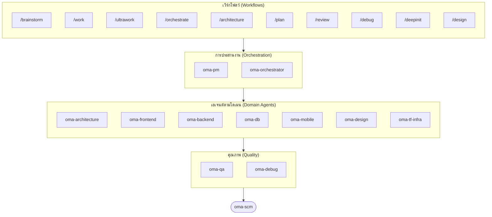

# oh-my-agent: เครื่องมือจัดการชุดเอเจนต์หลากหลายรูปแบบ (Portable Multi-Agent Harness)

[](https://www.npmjs.com/package/oh-my-agent) [](https://www.npmjs.com/package/oh-my-agent) [](https://github.com/first-fluke/oh-my-agent) [](https://github.com/first-fluke/oh-my-agent/blob/main/LICENSE) [](https://github.com/first-fluke/oh-my-agent/commits/main)

[English](../README.md) | [한국어](./README.ko.md) | [中文](./README.zh.md) | [Português](./README.pt.md) | [日本語](./README.ja.md) | [Français](./README.fr.md) | [Español](./README.es.md) | [Nederlands](./README.nl.md) | [Polski](./README.pl.md) | [Русский](./README.ru.md) | [Deutsch](./README.de.md) | [Tiếng Việt](./README.vi.md)

คุณเคยหวังว่าผ AI Assistant ของคุณจะมี "เพื่อนร่วมงาน" บ้างไหม? นั่นคือสิ่งที่ oh-my-agent ทำได้

แทนที่จะให้ AI ตัวเดียวทำทุกอย่าง (และเริ่มสับสนระหว่างทำงาน) oh-my-agent จะแบ่งงานออกเป็น **Specialized agents** เช่น frontend, backend, architecture, QA, PM, DB, mobile, infra, debug, design และอื่นๆ แต่ละตัวจะมีความเข้าใจในโดเมนของตัวเองอย่างลึกซึ้ง มีเครื่องมือและรายการตรวจสอบ (checklists) ของตัวเอง และมุ่งเน้นเฉพาะงานในหน้าที่ของตน

ตอนนี้ใช้งานได้กับ AI IDE ชั้นนำทั้งหมดได้แก่: Antigravity, Claude Code, Cursor, Gemini CLI, Codex CLI, OpenCode และอื่นๆ

## Quick Start

```bash
# macOS / Linux — ติดตั้ง bun และ uv ให้อัตโนมัติหากยังไม่ได้ install ไว้
curl -fsSL https://raw.githubusercontent.com/first-fluke/oh-my-agent/main/cli/install.sh | bash
```

```powershell
# Windows (PowerShell) — ติดตั้ง bun และ uv ให้อัตโนมัติหากยังไม่ได้ install ไว้
irm https://raw.githubusercontent.com/first-fluke/oh-my-agent/main/cli/install.ps1 | iex
```

```bash
# หรือรันด้วยตนเอง (ทุก OS, ต้องการ bun + uv)
bunx oh-my-agent@latest
```

### ติดตั้งผ่าน Agent Package Manager

<details>
<summary><a href="https://github.com/microsoft/apm">Agent Package Manager</a> (APM) จาก Microsoft แจกเฉพาะ skill เท่านั้น คลิกเพื่อขยาย</summary>

> อย่าสับสนกับ APM (Application Performance Monitoring) ของ `oma-observability`

```bash
# ทุก skill ติดตั้งลงทุก runtime ที่ตรวจพบ
# (.claude, .cursor, .codex, .opencode, .github, .agents)
apm install first-fluke/oh-my-agent

# Skill เดี่ยว
apm install first-fluke/oh-my-agent/.agents/skills/oma-frontend
```

APM อ่าน pointer `skills: .agents/skills/` จาก `.claude-plugin/plugin.json` ดังนั้น `.agents/` SSOT จึงเป็นต้นทางเดียว ไม่ต้อง build เพิ่ม และไม่ต้อง mirror

APM แจกแค่ skill เท่านั้น ส่วน workflow, rules, `oma-config.yaml`, hook สำหรับตรวจจับคำสำคัญ และ CLI `oma agent:spawn` ให้ใช้ `bunx oh-my-agent@latest` แทน เลือกใช้แค่วิธีเดียวต่อโปรเจกต์ จะได้ไม่ตีกัน

</details>

เลือก Preset ที่ต้องการ แล้วคุณก็พร้อมใช้งาน:

| Preset | สิ่งที่คุณจะได้รับ |
|--------|-------------|
| ✨ All | Agents และ skills ทั้งหมด |
| 🌐 Fullstack | architecture + frontend + backend + db + pm + qa + debug + brainstorm + scm |
| 🎨 Frontend | architecture + frontend + pm + qa + debug + brainstorm + scm |
| ⚙️ Backend | architecture + backend + db + pm + qa + debug + brainstorm + scm |
| 📱 Mobile | architecture + mobile + pm + qa + debug + brainstorm + scm |
| 🚀 DevOps | architecture + tf-infra + dev-workflow + pm + qa + debug + brainstorm + scm |

## ทีมเอเจนต์ของคุณ

| Agent | หน้าที่ |
|-------|-------------|
| **oma-academic-writer** | ร่าง ปรับปรุง และตรวจสอบงานเขียนเชิงวิชาการระดับตีพิมพ์ตามรูบริก |
| **oma-architecture** | การวิเคราะห์ความคุ้มค่าด้านสถาปัตยกรรม (tradeoffs), กำหนดขอบเขต, รองรับ ADR/ATAM/CBAM |
| **oma-backend** | สร้าง API ด้วย Python, Node.js หรือ Rust |
| **oma-brainstorm** | สำรวจไอเดียก่อนที่จะเริ่มลงมือสร้างจริง |
| **oma-db** | ออกแบบ Schema, จัดการ migration, indexing, vector DB |
| **oma-debug** | วิเคราะห์สาเหตุต้นตอ (root cause), แก้ไขบัค, ทำ regression tests |
| **oma-deepsec** | สแกนเนอร์ช่องโหว่โดยเอเจนต์, PR gate, custom matcher |
| **oma-design** | ระบบการออกแบบ (Design systems), tokens, accessibility, responsive |
| **oma-dev-workflow** | CI/CD, releases, ระบบอัตโนมัติสำหรับ monorepo |
| **oma-docs** | ตรวจสอบความสมบูรณ์ของการอ้างอิง, ระบุ docs ที่ได้รับผลกระทบจาก diff |
| **oma-frontend** | React/Next.js, TypeScript, Tailwind CSS v4, shadcn/ui |
| **oma-hwp** | แปลงไฟล์ HWP/HWPX/HWPML เป็น Markdown |
| **oma-image** | สร้างภาพ AI แบบหลายผู้ให้บริการ |
| **oma-market** | วิจัยตลาดจากสัญญาณคอมมิวนิตี้ ครอบคลุม pain/trend/competitor/discovery พร้อม SWOT/5F/PESTEL |
| **oma-mobile** | จัดการ cross platform application ด้วย Flutter |
| **oma-observability** | เราเตอร์ด้านการสังเกตระบบ (observability) ครอบคลุม APM/RUM, metrics/logs/traces/profiles, SLO, วิเคราะห์สาเหตุเหตุการณ์ และปรับจูน transport |
| **oma-orchestrator** | รันเอเจนต์แบบ parallel ผ่าน CLI |
| **oma-pdf** | แปลงไฟล์ PDF เป็น Markdown |
| **oma-pm** | วางแผนงาน, ย่อย requirements, กำหนด API contracts |
| **oma-qa** | ตรวจสอบความปลอดภัยตามมาตรฐาน OWASP, ประสิทธิภาพ, accessibility |
| **oma-recap** | วิเคราะห์ประวัติการสนทนาและสรุปงานตามธีม |
| **oma-scholar** | เพื่อนร่วมวิจัยเชิงวิชาการสำหรับค้นหาวรรณกรรมและทบทวนโดยเพื่อนร่วมงาน |
| **oma-scm** | การจัดการโครงสร้างซอฟต์แวร์ (SCM) ครอบคลุมการแตกกิ่ง (branching), รวมโค้ด (merges), worktrees และรองรับ Conventional Commits |
| **oma-search** | เราเตอร์ค้นหาตามเจตนาพร้อมคะแนนความน่าเชื่อถือ ครอบคลุมเอกสาร เว็บ โค้ด และโลคัล |
| **oma-skill-creator** | เขียนและตรวจสอบ OMA skill ในรูปแบบ SSL-lite |
| **oma-tf-infra** | Multi-cloud Terraform IaC (Infrastructure as Code) |
| **oma-translator** | การแปลภาษาหลากหลายภาษาอย่างเป็นธรรมชาติ |
| **oma-voice** | TTS/STT แบบ local-first ผ่าน Voicebox MCP ครอบคลุมการสร้างเสียง, voiceover และถอดเสียง |

## วิธีการทำงาน

เพียงแค่แชท อธิบายสิ่งที่คุณต้องการ แล้ว oh-my-agent จะคิดเองว่าควรใช้เอเจนต์ตัวไหน

```
คุณ: "สร้างแอป TODO พร้อมระบบล็อกอินผู้ใช้"
→ PM วางแผนงาน
→ Backend สร้าง API สำหรับ authentication
→ Frontend สร้าง UI ด้วย React
→ DB ออกแบบ schema
→ QA ตรวจสอบความเรียบร้อยทั้งหมด
→ เสร็จสิ้น: โค้ดที่ผ่านการประสานงานและตรวจสอบแล้ว
```

หรือใช้คำสั่ง Slash commands สำหรับเวิร์กโฟลว์ที่มีโครงสร้าง:

| ขั้นตอน | คำสั่ง | หน้าที่ |
|------|---------|-------------|
| 1 | `/brainstorm` | การระดมสมองแบบอิสระ |
| 2 | `/architecture` | ตรวจสอบสถาปัตยกรรม, วิเคราะห์ความคุ้มค่า (tradeoffs), ADR/ATAM/CBAM |
| 2 | `/design` | เวิร์กโฟลว์ระบบการออกแบบ 7 ขั้นตอน |
| 2 | `/plan` | PM ย่อยฟีเจอร์ของคุณออกเป็นงานย่อย (tasks) |
| 3 | `/work` | การรันเอเจนต์หลากหลายตัวแบบทีละขั้นตอน |
| 3 | `/orchestrate` | การรันเอเจนต์แบบขนานโดยอัตโนมัติ |
| 3 | `/ultrawork` | เวิร์กโฟลว์คุณภาพสูง 5 ระยะ พร้อมจุดตรวจสอบ 11 จุด |
| 4 | `/review` | ตรวจสอบความปลอดภัย + ประสิทธิภาพ + accessibility |
| 4 | `/deepsec` | สแกนความปลอดภัยเชิงลึกโดยเอเจนต์ |
| 5 | `/debug` | การแก้บัคแบบมีโครงสร้างเพื่อหาสาเหตุต้นตอ |
| 5 | `/docs` | ตรวจสอบและซิงก์ความคลาดเคลื่อนของเอกสารผ่าน `oma-docs` |
| 6 | `/scm` | SCM + กระบวนการ Git และรองรับ Conventional Commit |

**การตรวจจับอัตโนมัติ**: คุณไม่จำเป็นต้องใช้คำสั่ง slash ตลอดเวลา คำสำคัญเช่น "architecture", "plan", "review", และ "debug" ในข้อความของคุณ (รองรับ 11 ภาษา!) จะเปิดใช้งานเวิร์กโฟลว์ที่ถูกต้องโดยอัตโนมัติ

## CLI

```bash
# ติดตั้งแบบ Global
bun install --global oh-my-agent   # หรือ: brew install oh-my-agent

# ใช้งานได้ทุกที่
oma agent:parallel -i backend:"Auth API" frontend:"Login form"
oma agent:spawn backend "Build auth API" session-01
oma dashboard               # ตรวจสอบการทำงานของเอเจนต์แบบเรียลไทม์
oma doctor                  # ตรวจสอบความพร้อมของระบบ
oma image generate "cat"    # สร้างภาพ AI แบบหลายผู้ให้บริการ
oma link                    # สร้าง .claude/.codex/.gemini/ฯลฯ ใหม่จาก .agents/
oma model:check             # ตรวจจับความคลาดเคลื่อนระหว่างโมเดลที่ลงทะเบียนกับรายการผู้ให้บริการจริง
oma recap --window 1d       # สรุปประวัติบทสนทนาข้ามเครื่องมือ
oma retro 7d --compare      # ย้อนทบทวนงานวิศวกรรมพร้อมเมตริกและเทรนด์
oma search fetch <url>      # ค้นหาเชิงกลด้วยกลยุทธ์ยกระดับอัตโนมัติ
```

การเลือกโมเดลทำงานเป็นสองชั้น:
- Dispatch แบบ same-vendor native ใช้คำนิยาม vendor agent ที่สร้างไว้ใน `.claude/agents/`, `.codex/agents/` หรือ `.gemini/agents/`
- Dispatch แบบ cross-vendor หรือ fallback CLI ใช้ค่าเริ่มต้นของ vendor ใน `.agents/skills/oma-orchestrator/config/cli-config.yaml`

**โมเดลต่อเอเจนต์**: แต่ละเอเจนต์สามารถกำหนดโมเดลและ `effort` ของตัวเองผ่าน `.agents/oma-config.yaml` ได้ มี runtime profiles พร้อมใช้งาน 6 แบบ: `claude-only`, `codex-only`, `gemini-only`, `qwen-only`, `cursor-only`, `antigravity` ตรวจสอบ auth matrix ที่ resolve แล้วด้วย `oma doctor --profile` คู่มือฉบับเต็ม: [web/docs/guide/per-agent-models.md](../web/docs/guide/per-agent-models.md)

## ทำไมต้อง oh-my-agent?

- **Portable**: ใช้ได้ผ่านโฟลเดอร์ `.agents/` โปรเจกต์ของคุณ โดยไม่ยึดติดกับ IDE ใด IDE หนึ่ง
- **Role-based**: เอเจนต์ถูกจำลองตามทีมวิศวกรจริง ไม่ใช่แค่กลุ่มของ prompt
- **ประหยัด Token**: การออกแบบ Two layer skill ช่วยประหยัด token ได้ประมาณ 75%
- **Quality-first**: มี Charter preflight, quality gates และรีวิวเวิร์กโฟลว์ในตัว
- **รองรับหลายผู้ให้บริการ (Multi-vendor)**: ผสมผสานการใช้ Gemini, Claude, Codex และ Qwen ตามประเภทของเอเจนต์
- **ตรวจสอบได้ (Observable)**: มีหน้าจอ Dashboard ทั้งใน Terminal และ Web เพื่อดูสถานะแบบเรียลไทม์

## สถาปัตยกรรม (Architecture)



## เรียนรู้เพิ่มเติม

- **[รายละเอียดสเปก (Docs)](./AGENTS_SPEC.md)**: รายละเอียดทางเทคนิคและสถาปัตยกรรมฉบับเต็ม
- **[เอเจนต์ที่รองรับ](./SUPPORTED_AGENTS.md)**: ตารางเปรียบเทียบเอเจนต์ใน IDE ต่างๆ
- **[เอกสารบนเว็บ](https://first-fluke.github.io/oh-my-agent/)**: คู่มือ บทเรียน และการอ้างอิง CLI

## ผู้สนับสนุน (Sponsors)

โปรเจกต์นี้ได้รับการดูแลรักษาขอบคุณผู้สนับสนุนที่ใจดีทุกท่าน
Project นี้ได้รับการสนับสนุนจาก sponsor ใจดีทุกๆท่าน

> **หากชอบ Project นี้?** ติดดาวให้เราได้นะค้าบบ !
>
> ```bash
> gh api --method PUT /user/starred/first-fluke/oh-my-agent
> ```
>
> ลองใช้ template เริ่มต้นที่ปรับแต่งมาแล้วได้ที่: [fullstack-starter](https://github.com/first-fluke/fullstack-starter)

<a href="https://github.com/sponsors/first-fluke">
  
</a>
<a href="https://buymeacoffee.com/firstfluke">
  
</a>

### 🚀 Champion
### 🛸 Booster
### ☕ Contributor

[เป็นผู้สนับสนุน →](https://github.com/sponsors/first-fluke)

ดูรายชื่อผู้สนับสนุนทั้งหมดที่ [SPONSORS.md](../SPONSORS.md)

## ประวัติการติดดาว (Star History)

[](https://www.star-history.com/#first-fluke/oh-my-agent&type=date&legend=bottom-right)

## เอกสารอ้างอิง

- Liang, Q., Wang, H., Liang, Z., & Liu, Y. (2026). *From skill text to skill structure: The scheduling-structural-logical representation for agent skills* (Version 2) [Preprint]. arXiv. https://doi.org/10.48550/arXiv.2604.24026

## License

MIT
