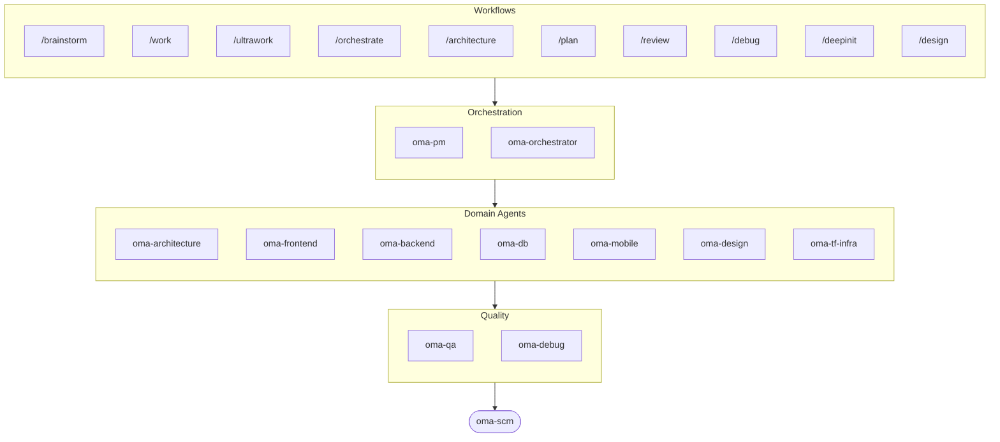

# oh-my-agent: Portable Multi-Agent Harness

[](https://www.npmjs.com/package/oh-my-agent) [](https://www.npmjs.com/package/oh-my-agent) [](https://github.com/first-fluke/oh-my-agent) [](https://github.com/first-fluke/oh-my-agent/blob/main/LICENSE) [](https://github.com/first-fluke/oh-my-agent/commits/main)

[English](../README.md) | [한국어](./README.ko.md) | [中文](./README.zh.md) | [Português](./README.pt.md) | [日本語](./README.ja.md) | [Français](./README.fr.md) | [Español](./README.es.md) | [Nederlands](./README.nl.md) | [Polski](./README.pl.md) | [Русский](./README.ru.md) | [Deutsch](./README.de.md) | [ภาษาไทย](./README.th.md)

Bạn đã bao giờ ước trợ lý AI của mình có đồng nghiệp chưa? Đó chính là điều oh-my-agent làm được.

Thay vì một AI làm tất cả mọi thứ (rồi bị lạc hướng giữa chừng), oh-my-agent phân chia công việc cho các **agent chuyên biệt**: frontend, backend, architecture, QA, PM, DB, mobile, infra, debug, design và nhiều hơn nữa. Mỗi agent hiểu sâu lĩnh vực của mình, có công cụ và checklist riêng, và chỉ tập trung vào phần việc được giao.

Hỗ trợ tất cả các AI IDE chính: Antigravity, Claude Code, Cursor, Gemini CLI, Codex CLI, OpenCode và nhiều hơn nữa.

## Bắt đầu nhanh

```bash
# macOS / Linux — tự động cài bun, uv & serena nếu chưa có
curl -fsSL https://raw.githubusercontent.com/first-fluke/oh-my-agent/main/cli/install.sh | bash
```

```powershell
# Windows (PowerShell) — tự động cài bun, uv & serena nếu chưa có
irm https://raw.githubusercontent.com/first-fluke/oh-my-agent/main/cli/install.ps1 | iex
```

```bash
# Hoặc chạy trực tiếp (mọi OS, cần bun + uv + serena)
bunx oh-my-agent@latest
```

### Cài đặt qua Agent Package Manager

<details>
<summary><a href="https://github.com/microsoft/apm">Agent Package Manager</a> (APM) của Microsoft: bản phân phối chỉ có skill. Click để mở rộng.</summary>

> Đừng nhầm với APM (Application Performance Monitoring) của `oma-observability`.

```bash
# Toàn bộ skill, triển khai vào mọi runtime được phát hiện
# (.claude, .cursor, .codex, .opencode, .github, .agents)
apm install first-fluke/oh-my-agent

# Một skill duy nhất
apm install first-fluke/oh-my-agent/.agents/skills/oma-frontend
```

APM chỉ phân phối skill. Còn workflow, rule, `oma-config.yaml`, hook phát hiện từ khóa và CLI `oma agent:spawn` thì dùng `bunx oh-my-agent@latest`. Mỗi dự án chỉ chọn một cách phân phối thôi, không thì lệch nhau.

</details>

Chọn một preset và bạn đã sẵn sàng:

| Preset | Bạn nhận được |
|--------|--------------|
| ✨ All | Tất cả agent và skill |
| 🌐 Fullstack | architecture + frontend + backend + db + pm + qa + debug + brainstorm + scm |
| 🎨 Frontend | architecture + frontend + pm + qa + debug + brainstorm + scm |
| ⚙️ Backend | architecture + backend + db + pm + qa + debug + brainstorm + scm |
| 📱 Mobile | architecture + mobile + pm + qa + debug + brainstorm + scm |
| 🚀 DevOps | architecture + tf-infra + dev-workflow + pm + qa + debug + brainstorm + scm |

## Tương thích với mọi Agent

`oh-my-agent` giữ `.agents/` làm nguồn sự thật duy nhất (SSOT) và chiếu vào layout gốc của từng runtime. Nhờ đó mọi công cụ được hỗ trợ đều dùng chung skills, workflows và rules.

<table>
<colgroup>
<col span="6" style="width:16.67%" />
</colgroup>
<tr>
<td align="center">
<a href="https://claude.com/product/claude-code"></a><br/>
<strong>Claude Code</strong><br/>
<sub>nguyên bản + adapter</sub>
</td>
<td align="center">
<a href="https://github.com/openai/codex"></a><br/>
<strong>Codex CLI</strong><br/>
<sub>nguyên bản + adapter</sub>
</td>
<td align="center">
<a href="https://github.com/google-gemini/gemini-cli"></a><br/>
<strong>Gemini CLI</strong><br/>
<sub>nguyên bản + adapter</sub>
</td>
<td align="center">
<a href="https://cursor.com"></a><br/>
<strong>Cursor</strong><br/>
<sub>nguyên bản + adapter</sub>
</td>
<td align="center">
<a href="https://github.com/QwenLM/qwen-code"></a><br/>
<strong>Qwen Code</strong><br/>
<sub>dispatch nguyên bản</sub>
</td>
<td align="center">
<a href="https://github.com/esengine/DeepSeek-Reasonix"></a><br/>
<strong>Reasonix</strong><br/>
<sub>tương thích nguyên bản</sub>
</td>
</tr>
<tr>
<td align="center">
<a href="https://antigravity.google"></a><br/>
<strong>Antigravity</strong><br/>
<sub>SSOT nguyên bản</sub>
</td>
<td align="center">
<a href="https://github.com/anomalyco/opencode"></a><br/>
<strong>OpenCode</strong><br/>
<sub>tương thích nguyên bản</sub>
</td>
<td align="center">
<a href="https://ampcode.com"></a><br/>
<strong>Amp</strong><br/>
<sub>tương thích nguyên bản</sub>
</td>
<td align="center">
<a href="https://github.com/features/copilot"></a><br/>
<strong>GitHub Copilot</strong><br/>
<sub>skills qua symlink</sub>
</td>
<td align="center">
<a href="https://grok.x.ai"></a><br/>
<strong>Grok</strong><br/>
<sub>native hooks</sub>
</td>
<td align="center">
<a href="https://kiro.dev"></a><br/>
<strong>Kiro CLI</strong><br/>
<sub>native hooks + agents</sub>
</td>
</tr>
</table>

<p align="center"><sub><a href="./SUPPORTED_AGENTS.md">& thêm</a></sub></p>

## Đội ngũ Agent

| Agent | Chức năng |
|-------|----------|
| **oma-academic-writer** | Soạn, chỉnh sửa và kiểm tra văn xuôi học thuật đạt chuẩn xuất bản |
| **oma-architecture** | Phân tích đánh đổi kiến trúc và vạch ranh giới module theo hướng ADR/ATAM/CBAM |
| **oma-backend** | Xây dựng và bảo mật API bằng Python, Node.js hoặc Rust |
| **oma-brainstorm** | Cùng bạn khám phá ý tưởng trước khi bắt tay vào xây dựng |
| **oma-db** | Thiết kế schema, migration, index và vector store cho dự án của bạn |
| **oma-debug** | Tìm nguyên nhân gốc rễ, sửa lỗi và viết regression test |
| **oma-deepsec** | Quét lỗ hổng bảo mật trong code và chặn pull request rủi ro |
| **oma-design** | Xây dựng hệ thống thiết kế với token, accessibility và responsive layout |
| **oma-dev-workflow** | Tự động hóa CI/CD, release và các tác vụ monorepo |
| **oma-docs** | Kiểm tra tài liệu có tham chiếu bị hỏng và đánh dấu những tài liệu bị ảnh hưởng bởi thay đổi code |
| **oma-frontend** | Xây dựng giao diện với React/Next.js, TypeScript, Tailwind CSS v4 và shadcn/ui |
| **oma-hwp** | Chuyển đổi file HWP, HWPX và HWPML sang Markdown |
| **oma-image** | Tạo ảnh qua nhiều nhà cung cấp AI cùng lúc |
| **oma-market** | Nghiên cứu thị trường từ tín hiệu cộng đồng và trình bày theo khung SWOT, Porter's 5F và PESTEL |
| **oma-mobile** | Xây dựng ứng dụng di động đa nền tảng với Flutter |
| **oma-observability** | Định tuyến công việc observability qua metrics, logs, traces, SLO và điều tra sự cố |
| **oma-orchestrator** | Chạy nhiều agent song song từ CLI |
| **oma-pdf** | Chuyển đổi file PDF sang Markdown |
| **oma-pm** | Lập kế hoạch tác vụ, phân tích yêu cầu và định nghĩa API contract |
| **oma-qa** | Rà soát code theo tiêu chuẩn bảo mật OWASP, hiệu suất và accessibility |
| **oma-recap** | Tóm tắt lịch sử hội thoại thành báo cáo công việc theo chủ đề |
| **oma-scholar** | Tìm kiếm tài liệu học thuật và hỗ trợ bình duyệt khoa học |
| **oma-scm** | Quản lý nhánh, merge, worktree và Conventional Commits |
| **oma-search** | Định tuyến mỗi truy vấn đến nguồn tốt nhất và chấm điểm độ tin cậy của kết quả |
| **oma-skill-creator** | Soạn và kiểm tra skill OMA mới theo định dạng SSL-lite |
| **oma-slide** | Tạo các deck trình bày HTML đặc trưng giàu hoạt hình và xuất sang PDF/PNG/PPTX |
| **oma-tf-infra** | Triển khai hạ tầng đa đám mây bằng Terraform |
| **oma-translator** | Dịch giữa các ngôn ngữ tự nhiên như thể bản ngữ viết |
| **oma-voice** | Tạo lồng tiếng và gỡ băng âm thanh ngay trên thiết bị, không cần đám mây |

## Cách hoạt động

Chỉ cần trò chuyện. Mô tả điều bạn muốn và oh-my-agent sẽ tự tìm ra agent phù hợp.

```
You: "Xây dựng ứng dụng TODO có xác thực người dùng"
→ PM lập kế hoạch công việc
→ Backend xây dựng API xác thực
→ Frontend xây dựng giao diện React
→ DB thiết kế schema
→ QA đánh giá toàn bộ
→ Hoàn thành: mã nguồn được phối hợp và đánh giá
```

Hoặc sử dụng slash command cho các workflow có cấu trúc:

| Bước | Lệnh | Chức năng |
|------|------|----------|
| 1 | `/brainstorm` | Phát triển ý tưởng tự do |
| 2 | `/architecture` | Rà soát kiến trúc, trade-off, phân tích kiểu ADR/ATAM/CBAM |
| 2 | `/design` | Workflow hệ thống thiết kế 7 giai đoạn |
| 2 | `/plan` | PM phân tách tính năng thành các task |
| 3 | `/work` | Thực thi multi-agent từng bước |
| 3 | `/orchestrate` | Tự động spawn agent song song |
| 3 | `/ultrawork` | Workflow chất lượng 5 giai đoạn với 11 cổng đánh giá |
| 4 | `/review` | Kiểm tra bảo mật + hiệu suất + accessibility |
| 4 | `/deepsec` | Quét bảo mật chuyên sâu bằng agent |
| 5 | `/debug` | Debug có cấu trúc tìm nguyên nhân gốc |
| 5 | `/docs` | Xác minh và đồng bộ trôi tài liệu qua `oma-docs` |
| 6 | `/scm` | Quy trình SCM và Git, hỗ trợ Conventional Commits |

**Tự động phát hiện**: Bạn không nhất thiết cần slash command. Các từ khóa như "kiến trúc", "kế hoạch", "đánh giá", "debug" trong tin nhắn (hỗ trợ 11 ngôn ngữ!) sẽ tự động kích hoạt workflow phù hợp.

## CLI

```bash
# Cài đặt toàn cục
bun install --global oh-my-agent   # hoặc: brew install oh-my-agent

# Sử dụng ở bất kỳ đâu
oma agent:parallel -i backend:"Auth API" frontend:"Login form"
oma agent:spawn backend "Build auth API" session-01
oma dashboard               # Giám sát agent thời gian thực
oma doctor                  # Kiểm tra sức khỏe hệ thống
oma image generate "cat"    # Tạo ảnh AI đa nhà cung cấp
oma link                    # Tạo lại .claude/.codex/.gemini/v.v. từ .agents/
oma model:check             # Phát hiện độ lệch giữa model đã đăng ký và danh sách vendor đang hoạt động
oma recap --window 1d       # Tóm tắt lịch sử hội thoại đa công cụ
oma retro 7d --compare      # Retrospective kỹ thuật với metrics + xu hướng
oma search fetch <url>      # Tìm kiếm máy móc với chiến lược tự leo thang
```

Việc chọn model đi theo hai lớp:
- Dispatch bản địa cùng nhà cung cấp dùng định nghĩa agent được sinh ra trong `.claude/agents/`, `.codex/agents/` hoặc `.gemini/agents/`.
- Dispatch chéo nhà cung cấp hoặc fallback CLI dùng giá trị mặc định của nhà cung cấp trong `.agents/skills/oma-orchestrator/config/cli-config.yaml`.

**model theo từng agent**: mỗi agent có thể trỏ tới model và `effort` riêng thông qua `.agents/oma-config.yaml`. Có sẵn các runtime profiles: `antigravity`, `claude`, `codex`, `cursor`, `grok`, `mixed`, `qwen`. Kiểm tra ma trận auth đã resolve bằng `oma doctor --profile`. Hướng dẫn đầy đủ: [web/docs/guide/per-agent-models.md](../web/docs/guide/per-agent-models.md).

## Tại sao chọn oh-my-agent?

> [Đọc thêm lý do →](https://github.com/first-fluke/oh-my-agent/issues/155#issuecomment-4142133589)

- **Di động**: `.agents/` đi cùng dự án, không bị ràng buộc vào một IDE
- **Dựa trên vai trò**: agent được mô hình hóa như đội kỹ thuật thực, không phải một đống prompt
- **Tiết kiệm token**: thiết kế skill 2 lớp tiết kiệm ~75% token
- **Ưu tiên chất lượng**: Charter preflight, quality gate và review workflow được tích hợp sẵn:
  - `oma verify <agent>` — 14 kiểm tra xác định theo từng loại agent (TypeScript strict, tests, raw SQL, secret hardcode, Flutter analyze, inline styles, scope violation, charter alignment …)
  - `session.quota_cap` — giới hạn token / spawn / theo vendor mỗi session trong `oma-config.yaml`; Step 5 của `orchestrate` chặn spawn tiếp theo khi vượt
  - workflow `ralph` — JUDGE độc lập tái xác minh mọi criterion mỗi iteration để bắt regression im lặng; cache cho test >30s
  - Exploration Loop — sau 2 lần retry, `orchestrate` spawn các biến thể hypothesis song song và giữ kết quả điểm cao nhất
  - Auto-routing monorepo — `detectWorkspace` đọc pnpm / nx / turbo / lerna và route mỗi agent đến workspace của nó
- **Đa nhà cung cấp**: kết hợp Claude, Codex, Cursor và Qwen theo loại agent
- **Có thể quan sát**: dashboard terminal và web để giám sát thời gian thực

## Kiến trúc



## Tìm hiểu thêm

- **[Tài liệu chi tiết](./AGENTS_SPEC.md)**: đặc tả kỹ thuật và kiến trúc đầy đủ
- **[Agent được hỗ trợ](./SUPPORTED_AGENTS.md)**: ma trận hỗ trợ agent theo IDE
- **[Tài liệu web](https://first-fluke.github.io/oh-my-agent/)**: hướng dẫn, tutorial và CLI reference

## Nhà tài trợ

Dự án này được duy trì nhờ sự hỗ trợ hào phóng của các nhà tài trợ.

> **Thích dự án này?** Hãy tặng một ngôi sao!
>
> ```bash
> gh api --method PUT /user/starred/first-fluke/oh-my-agent
> ```
>
> Thử template starter tối ưu của chúng tôi: [fullstack-starter](https://github.com/first-fluke/fullstack-starter)

<a href="https://github.com/sponsors/first-fluke">
  
</a>
<a href="https://buymeacoffee.com/firstfluke">
  
</a>

### 🚀 Champion

<!-- Champion tier ($100/mo) logos here -->

### 🛸 Booster

<!-- Booster tier ($30/mo) logos here -->

### ☕ Contributor

<!-- Contributor tier ($10/mo) names here -->

[Trở thành nhà tài trợ →](https://github.com/sponsors/first-fluke)

Xem danh sách đầy đủ người ủng hộ tại [SPONSORS.md](../SPONSORS.md).


## Star History

[](https://www.star-history.com/#first-fluke/oh-my-agent&type=date&legend=bottom-right)


## Tài liệu tham khảo

- Liang, Q., Wang, H., Liang, Z., & Liu, Y. (2026). *From skill text to skill structure: The scheduling-structural-logical representation for agent skills* (Version 4) [Preprint]. arXiv. https://doi.org/10.48550/arXiv.2604.24026
- Chen, C., Yu, Q., Gu, Y., Huang, Z., Li, H., Liu, H., Liu, S., Liu, J., Peng, D., Wang, J., Yan, Z., Meng, F., Qin, E., Che, C., & Hu, M. (2026). *The scaling laws of skills in LLM agent systems* (Version 1) [Preprint]. arXiv. https://doi.org/10.48550/arXiv.2605.16508


## Giấy phép

MIT
