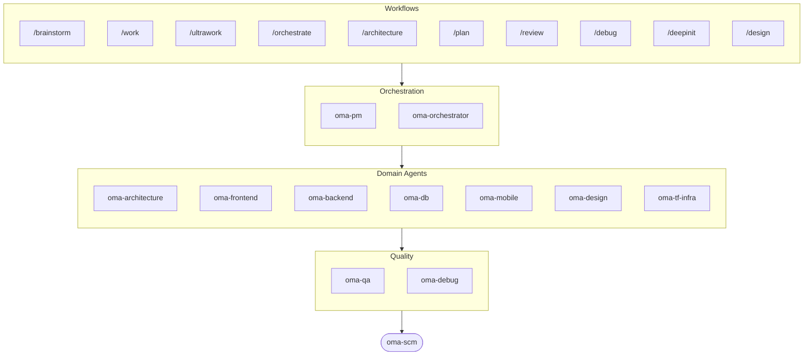

# oh-my-agent: Portable Multi-Agent Harness

[](https://www.npmjs.com/package/oh-my-agent) [](https://www.npmjs.com/package/oh-my-agent) [](https://github.com/first-fluke/oh-my-agent) [](https://github.com/first-fluke/oh-my-agent/blob/main/LICENSE) [](https://github.com/first-fluke/oh-my-agent/commits/main)

[English](../README.md) | [한국어](./README.ko.md) | [Português](./README.pt.md) | [日本語](./README.ja.md) | [Français](./README.fr.md) | [Español](./README.es.md) | [Nederlands](./README.nl.md) | [Polski](./README.pl.md) | [Русский](./README.ru.md) | [Deutsch](./README.de.md) | [Tiếng Việt](./README.vi.md) | [ภาษาไทย](./README.th.md) 

有没有想过，要是你的 AI 助手有同事就好了？oh-my-agent 就是干这个的。

与其让一个 AI 包揽一切（然后做到一半就迷路），oh-my-agent 把工作分配给**专业 agent**：frontend、backend、architecture、QA、PM、DB、mobile、infra、debug、design 等等。每个 agent 深耕自己的领域，拥有专属工具和检查清单，各司其职。

支持所有主流 AI IDE：Pi、Claude Code、Cursor、Antigravity、Codex CLI、OpenCode 等。

## 快速开始

```bash
# macOS / Linux — 自动安装 bun、uv & serena
curl -fsSL https://raw.githubusercontent.com/first-fluke/oh-my-agent/main/cli/install.sh | bash
```

```powershell
# Windows (PowerShell) — 自动安装 bun、uv & serena
irm https://raw.githubusercontent.com/first-fluke/oh-my-agent/main/cli/install.ps1 | iex
```

```bash
# 或者手动运行（任意系统，需要 bun + uv + serena）
bunx oh-my-agent@latest
```

### 通过 Agent Package Manager 安装

<details>
<summary>Microsoft 的 <a href="https://github.com/microsoft/apm">Agent Package Manager</a>（APM）：只分发 skill。点击展开。</summary>

> 别和 `oma-observability` 的 APM（Application Performance Monitoring）搞混。

```bash
# 所有 skill，部署到检测到的每个 runtime
# (.claude, .cursor, .codex, .opencode, .github, .agents)
apm install first-fluke/oh-my-agent

# 单个 skill
apm install first-fluke/oh-my-agent/.agents/skills/oma-frontend
```

APM 只分发 skill。workflow、规则、`oma-config.yaml`、关键词检测 hook 和 `oma agent:spawn` CLI 还是用 `bunx oh-my-agent@latest`。一个项目挑一种分发方式就好，免得跑偏。

</details>

选个预设就能开始：

| 预设 | 包含内容 |
|------|---------|
| ✨ All | 所有 agent 和 skill |
| 🌐 Fullstack | architecture + frontend + backend + db + pm + qa + debug + brainstorm + scm |
| 🎨 Frontend | architecture + frontend + pm + qa + debug + brainstorm + scm |
| ⚙️ Backend | architecture + backend + db + pm + qa + debug + brainstorm + scm |
| 📱 Mobile | architecture + mobile + pm + qa + debug + brainstorm + scm |
| 🚀 DevOps | architecture + tf-infra + dev-workflow + pm + qa + debug + brainstorm + scm |

## 适配所有 Agent

`oh-my-agent` 始终把 `.agents/` 作为唯一信源（SSOT），并按每个运行时的原生布局生成对应文件，所有受支持的工具因此共享同一套技能、工作流和规则。

<table>
<colgroup>
<col span="6" style="width:16.67%" />
</colgroup>
<tr>
<td align="center">
<a href="https://claude.com/product/claude-code"></a><br/>
<strong>Claude Code</strong><br/>
<sub>原生 + 适配器</sub>
</td>
<td align="center">
<a href="https://github.com/openai/codex"></a><br/>
<strong>Codex CLI</strong><br/>
<sub>原生 + 适配器</sub>
</td>
<td align="center">
<a href="https://antigravity.google"></a><br/>
<strong>Antigravity</strong><br/>
<sub>原生 SSOT</sub>
</td>
<td align="center">
<a href="https://cursor.com"></a><br/>
<strong>Cursor</strong><br/>
<sub>原生 + 适配器</sub>
</td>
<td align="center">
<a href="https://github.com/QwenLM/qwen-code"></a><br/>
<strong>Qwen Code</strong><br/>
<sub>原生派发</sub>
</td>
<td align="center">
<a href="https://github.com/esengine/DeepSeek-Reasonix"></a><br/>
<strong>Reasonix</strong><br/>
<sub>原生兼容</sub>
</td>
</tr>
<tr>
<td align="center">
<a href="https://pi.dev/"></a><br/>
<strong>Pi</strong><br/>
<sub>原生兼容</sub>
</td>
<td align="center">
<a href="https://github.com/anomalyco/opencode"></a><br/>
<strong>OpenCode</strong><br/>
<sub>原生兼容</sub>
</td>
<td align="center">
<a href="https://ampcode.com"></a><br/>
<strong>Amp</strong><br/>
<sub>原生兼容</sub>
</td>
<td align="center">
<a href="https://github.com/features/copilot"></a><br/>
<strong>GitHub Copilot</strong><br/>
<sub>符号链接技能</sub>
</td>
<td align="center">
<a href="https://grok.x.ai"></a><br/>
<strong>Grok</strong><br/>
<sub>原生钩子</sub>
</td>
<td align="center">
<a href="https://kiro.dev"></a><br/>
<strong>Kiro CLI</strong><br/>
<sub>原生钩子 + 代理</sub>
</td>
</tr>
</table>

<p align="center"><sub><a href="./SUPPORTED_AGENTS.md">& 更多</a></sub></p>

## Agent 团队

| Agent | 职责 |
|-------|------|
| **oma-academic-writer** | 将学术文章写到发表级别，涵盖起草、修订与审稿 |
| **oma-architecture** | 权衡架构方案、划定模块边界，提供 ADR/ATAM/CBAM 分析 |
| **oma-backend** | 用 Python、Node.js 或 Rust 构建并加固你的 API |
| **oma-brainstorm** | 在动手之前，先和你一起把想法探索清楚 |
| **oma-db** | 设计 schema、迁移、索引与 vector store |
| **oma-debug** | 找到根因、修复 bug，并补上回归测试 |
| **oma-deepsec** | 扫描代码中的安全漏洞，拦截高风险 pull request |
| **oma-design** | 构建含 token、无障碍支持与响应式布局的设计系统 |
| **oma-dev-workflow** | 自动化 CI/CD、发布流程与 monorepo 任务 |
| **oma-docs** | 检查文档中的失效引用，并标出被代码变更波及的内容 |
| **oma-frontend** | 用 React/Next.js、TypeScript、Tailwind CSS v4 与 shadcn/ui 构建 UI |
| **oma-hwp** | 将 HWP、HWPX 和 HWPML 文件转换为 Markdown |
| **oma-image** | 同时调用多家 AI 供应商生成图像 |
| **oma-market** | 从社区信号中挖掘市场洞察，并套用 SWOT、Porter's 5F 和 PESTEL 框架呈现结论 |
| **oma-mobile** | 用 Flutter 构建跨平台移动应用 |
| **oma-observability** | 统一路由可观测性工作，覆盖指标、日志、追踪、SLO 与事故取证 |
| **oma-orchestrator** | 通过 CLI 并行调度多个 agent |
| **oma-pdf** | 将 PDF 文件转换为 Markdown |
| **oma-pm** | 规划任务、拆解需求、定义 API 契约 |
| **oma-qa** | 审查代码的 OWASP 安全性、性能与无障碍合规 |
| **oma-recap** | 将会话历史整理成有主题分类的工作摘要 |
| **oma-scholar** | 检索学术文献，协助开展同行评审 |
| **oma-scm** | 管理分支、合并、worktree 与 Conventional Commits |
| **oma-search** | 将每条查询路由至最优来源，并标注结果的可信度评分 |
| **oma-skill-creator** | 以 SSL-lite 格式编写和审计 OMA skill |
| **oma-slide** | 生成特色鲜明、动画丰富的 HTML 演示文稿卡片，并导出至 PDF/PNG/PPTX |
| **oma-tf-infra** | 使用 Terraform 完成多云基础设施的自动化编排 |
| **oma-translator** | 将内容翻译成目标语言，读来如同母语写就 |
| **oma-voice** | 在本地完成语音合成与转写，无需任何云服务 |

## 工作原理

直接聊就行。描述你想要什么，oh-my-agent 会自动选择合适的 agent。

```
You: "做一个带用户认证的 TODO 应用"
→ PM 规划任务
→ Backend 构建认证 API
→ Frontend 构建 React UI
→ DB 设计 schema
→ QA 审查全部代码
→ 完成：协调一致、经过审查的代码
```

也可以用斜杠命令执行结构化工作流：

| 步骤 | 命令 | 说明 |
|------|------|------|
| 1 | `/brainstorm` | 自由发散想法 |
| 2 | `/architecture` | 软件架构评审、权衡、ADR/ATAM/CBAM 式分析 |
| 2 | `/design` | 7 阶段设计系统工作流 |
| 2 | `/plan` | PM 把功能拆解成任务 |
| 3 | `/work` | 逐步执行多 agent 协作 |
| 3 | `/orchestrate` | 自动并行 agent 调度 |
| 3 | `/ultrawork` | 含 11 个审查门禁的 5 阶段质量工作流 |
| 4 | `/review` | 安全 + 性能 + 无障碍审计 |
| 4 | `/deepsec` | 智能体驱动的深度安全扫描 |
| 5 | `/debug` | 结构化根因调试 |
| 5 | `/docs` | 基于 `oma-docs` 的文档漂移校验与同步 |
| 6 | `/scm` | SCM 与 Git 工作流，Conventional Commits 支持 |

**自动检测**：不用斜杠命令也行，消息里出现“架构”“计划”“审查”“调试”等关键词（支持 11 种语言！）就会自动激活对应工作流。

### 按 agent 配置模型

可在 `.agents/oma-config.yaml` 里为每个 agent 单独指定模型和 `effort`。内置 runtime profiles：`antigravity`、`claude`、`codex`、`cursor`、`grok`、`mixed`、`qwen`。用 `oma doctor --profile` 查看解析后的 auth 矩阵。完整指南：[web/docs/guide/per-agent-models.md](../web/docs/guide/per-agent-models.md)。

## 为什么选 oh-my-agent？

> [深入了解 →](https://github.com/first-fluke/oh-my-agent/issues/155#issuecomment-4142133589)

- **可移植**：`.agents/` 跟着项目走，不被任何 IDE 绑定
- **角色化**：像真正的工程团队一样建模，而不是一堆 prompt 的堆砌
- **省 token**：双层 skill 设计节省约 75% 的 token
- **质量优先**：内置 Charter preflight、quality gate 和审查工作流：
  - `oma verify <agent>` — 按 agent 类型的 14 项确定性检查（TypeScript strict、tests、raw SQL、硬编码密钥、Flutter analyze、inline styles、scope 越界、charter 对齐 …）
  - `session.quota_cap` — 在 `oma-config.yaml` 中按会话设定 token / spawn / 单厂商预算上限；`orchestrate` Step 5 在超限时阻断下一次 spawn
  - `ralph` 工作流 — 独立的 JUDGE 每次迭代都重新校验所有 criterion，捕获静默回归；>30s 的重测有缓存
  - Exploration Loop — 重试 2 次后，`orchestrate` 并行 spawn 多个 hypothesis 变体并保留得分最高的
  - 单仓自动路由 — `detectWorkspace` 读取 pnpm / nx / turbo / lerna 并把每个 agent 路由到自己的 workspace
- **多厂商**：按 agent 类型混用 Claude、Codex、Cursor、Qwen
- **可观测**：终端和 Web 仪表盘实时监控

## 架构



## 了解更多

- **[详细文档](./AGENTS_SPEC.md)**：完整技术规格和架构
- **[支持的 Agent](./SUPPORTED_AGENTS.md)**：各 IDE 的 agent 支持情况
- **[Web 文档](https://first-fluke.github.io/oh-my-agent/)**：指南、教程和 CLI 参考

## 赞助

本项目由慷慨的赞助者们支持维护。

> **喜欢这个项目？** 给个 star 吧！
>
> ```bash
> gh api --method PUT /user/starred/first-fluke/oh-my-agent
> ```
>
> 试试我们优化过的入门模板：[fullstack-starter](https://github.com/first-fluke/fullstack-starter)

<a href="https://github.com/sponsors/first-fluke">
  
</a>
<a href="https://buymeacoffee.com/firstfluke">
  
</a>

### 🚀 Champion

<!-- Champion tier ($100/mo) logos here -->

### 🛸 Booster

<!-- Booster tier ($30/mo) logos here -->

### ☕ Contributor

<!-- Contributor tier ($10/mo) names here -->

[成为赞助者 →](https://github.com/sponsors/first-fluke)

完整赞助者列表请查看 [SPONSORS.md](../SPONSORS.md)。


## Star History

[](https://www.star-history.com/#first-fluke/oh-my-agent&type=date&legend=bottom-right)


## 参考文献

- Liang, Q., Wang, H., Liang, Z., & Liu, Y. (2026). *From skill text to skill structure: The scheduling-structural-logical representation for agent skills* (Version 4) [Preprint]. arXiv. https://doi.org/10.48550/arXiv.2604.24026
- Chen, C., Yu, Q., Gu, Y., Huang, Z., Li, H., Liu, H., Liu, S., Liu, J., Peng, D., Wang, J., Yan, Z., Meng, F., Qin, E., Che, C., & Hu, M. (2026). *The scaling laws of skills in LLM agent systems* (Version 1) [Preprint]. arXiv. https://doi.org/10.48550/arXiv.2605.16508
- Yang, Y., Gong, Z., Huang, W., Yang, Q., Zhou, Z., Huang, Z., Li, Y., Gao, X., Dai, Q., Liu, B., Qiu, K., Yang, Y., Chen, D., Yang, X., & Luo, C. (2026). *SkillOpt: Executive strategy for self-evolving agent skills* [Preprint]. arXiv. https://doi.org/10.48550/arXiv.2605.23904
- Huang, Z., Xu, J., Yang, Y., Gong, Z., Yang, Q., Tian, M., Wang, X., Lv, C., Gao, X., Dai, Q., Liu, B., Qiu, K., Yang, X., Chen, D., Zheng, X., & Luo, C. (2026). *From raw experience to skill consumption: A systematic study of model-generated agent skills* [Preprint]. arXiv. https://doi.org/10.48550/arXiv.2605.23899


## 许可证

MIT
