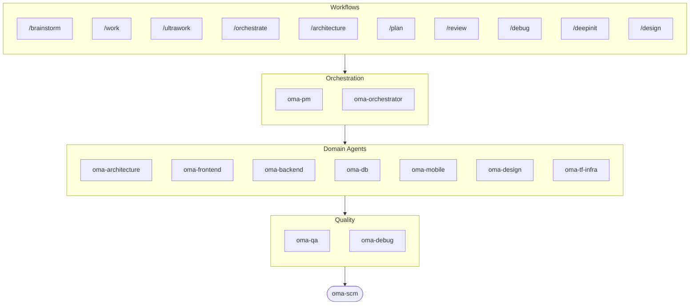

# oh-my-agent: Portable Multi-Agent Harness

[](https://www.npmjs.com/package/oh-my-agent) [](https://www.npmjs.com/package/oh-my-agent) [](https://github.com/first-fluke/oh-my-agent) [](https://github.com/first-fluke/oh-my-agent/blob/main/LICENSE) [](https://github.com/first-fluke/oh-my-agent/commits/main)

[English](../README.md) | [한국어](./README.ko.md) | [Português](./README.pt.md) | [日本語](./README.ja.md) | [Français](./README.fr.md) | [Español](./README.es.md) | [Nederlands](./README.nl.md) | [Polski](./README.pl.md) | [Русский](./README.ru.md) | [Deutsch](./README.de.md) | [Tiếng Việt](./README.vi.md) | [ภาษาไทย](./README.th.md) 

有没有想过，要是你的 AI 助手有同事就好了？oh-my-agent 就是干这个的。

与其让一个 AI 包揽一切（然后做到一半就迷路），oh-my-agent 把工作分配给**专业 agent**：frontend、backend、architecture、QA、PM、DB、mobile、infra、debug、design 等等。每个 agent 深耕自己的领域，拥有专属工具和检查清单，各司其职。

支持所有主流 AI IDE：Antigravity、Claude Code、Cursor、Gemini CLI、Codex CLI、OpenCode 等。

## 快速开始

```bash
# macOS / Linux — 自动安装 bun & uv
curl -fsSL https://raw.githubusercontent.com/first-fluke/oh-my-agent/main/cli/install.sh | bash
```

```powershell
# Windows (PowerShell) — 自动安装 bun & uv
irm https://raw.githubusercontent.com/first-fluke/oh-my-agent/main/cli/install.ps1 | iex
```

```bash
# 或者手动运行（任意系统，需要 bun + uv）
bunx oh-my-agent@latest
```

### 通过 Agent Package Manager 安装

<details>
<summary>Microsoft 的 <a href="https://github.com/microsoft/apm">Agent Package Manager</a>（APM）—— 只分发 skill。点击展开。</summary>

> 别和 `oma-observability` 的 APM（Application Performance Monitoring）搞混。

```bash
# 所有 skill，部署到检测到的每个 runtime
# (.claude, .cursor, .codex, .opencode, .github, .agents)
apm install first-fluke/oh-my-agent

# 单个 skill
apm install first-fluke/oh-my-agent/.agents/skills/oma-frontend
```

APM 读取 `.claude-plugin/plugin.json` 里的 `skills: .agents/skills/` 指针，所以 `.agents/` SSOT 就是唯一来源（不需要构建步骤，也不需要镜像）。

APM 只分发 skill。workflow、规则、`oma-config.yaml`、关键词检测 hook 和 `oma agent:spawn` CLI 还是用 `bunx oh-my-agent@latest`。一个项目挑一种分发方式就好，免得跑偏。

</details>

选个预设就能开始：

| 预设 | 包含内容 |
|------|---------|
| ✨ All | 所有 agent 和 skill |
| 🌐 Fullstack | architecture + frontend + backend + db + pm + qa + debug + brainstorm + scm |
| 🎨 Frontend | architecture + frontend + pm + qa + debug + brainstorm + scm |
| ⚙️ Backend | architecture + backend + db + pm + qa + debug + brainstorm + scm |
| 📱 Mobile | architecture + mobile + pm + qa + debug + brainstorm + scm |
| 🚀 DevOps | architecture + tf-infra + dev-workflow + pm + qa + debug + brainstorm + scm |

## Agent 团队

| Agent | 职责 |
|-------|------|
| **oma-architecture** | 架构权衡、边界划分，以及 ADR/ATAM/CBAM 视角下的分析 |
| **oma-backend** | 用 Python、Node.js 或 Rust 开发 API |
| **oma-brainstorm** | 动手之前先探索想法 |
| **oma-db** | Schema 设计、迁移、索引、vector DB |
| **oma-debug** | 根因分析、修复、回归测试 |
| **oma-design** | 设计系统、token、无障碍、响应式 |
| **oma-dev-workflow** | CI/CD、发布、monorepo 自动化 |
| **oma-docs** | 文档漂移检测 — 验证代码↔文档引用，同步受 diff 影响的文档 |
| **oma-frontend** | React/Next.js、TypeScript、Tailwind CSS v4、shadcn/ui |
| **oma-hwp** | HWP/HWPX/HWPML 转 Markdown |
| **oma-image** | 多供应商 AI 图像生成 |
| **oma-mobile** | Flutter 跨平台应用 |
| **oma-observability** | 可观测性路由器 —— APM/RUM、指标/日志/追踪/Profile、SLO、事故取证、传输层调优 |
| **oma-orchestrator** | 通过 CLI 并行执行 agent |
| **oma-pdf** | PDF 转 Markdown |
| **oma-pm** | 任务规划、需求拆解、API 契约定义 |
| **oma-qa** | OWASP 安全、性能、无障碍审查 |
| **oma-recap** | 会话历史分析与主题化工作摘要 |
| **oma-scholar** | 学术研究伴侣 —— 文献检索、同行评审 |
| **oma-scm** | SCM（软件配置管理）：分支、合并、worktree、基线、Conventional Commits |
| **oma-search** | 基于意图的搜索路由器 + 信任评分（文档、网页、代码、本地） |
| **oma-skill-creator** | 以 SSL-lite 格式编写和审计 OMA skill |
| **oma-tf-infra** | 多云 Terraform IaC（Infrastructure as Code，基础设施即代码） |
| **oma-translator** | 自然的多语言翻译 |

## 工作原理

直接聊就行。描述你想要什么，oh-my-agent 会自动选择合适的 agent。

```
You: "做一个带用户认证的 TODO 应用"
→ PM 规划任务
→ Backend 构建认证 API
→ Frontend 构建 React UI
→ DB 设计 schema
→ QA 审查全部代码
→ 完成：协调一致、经过审查的代码
```

也可以用斜杠命令执行结构化工作流：

| 步骤 | 命令 | 说明 |
|------|------|------|
| 1 | `/brainstorm` | 自由发散想法 |
| 2 | `/architecture` | 软件架构评审、权衡、ADR/ATAM/CBAM 式分析 |
| 2 | `/design` | 7 阶段设计系统工作流 |
| 2 | `/plan` | PM 把功能拆解成任务 |
| 3 | `/work` | 逐步执行多 agent 协作 |
| 3 | `/orchestrate` | 自动并行 agent 调度 |
| 3 | `/ultrawork` | 含 11 个审查门禁的 5 阶段质量工作流 |
| 4 | `/review` | 安全 + 性能 + 无障碍审计 |
| 5 | `/debug` | 结构化根因调试 |
| 6 | `/scm` | SCM 与 Git 工作流，Conventional Commits 支持 |

**自动检测**：不用斜杠命令也行，消息里出现“架构”“计划”“审查”“调试”等关键词（支持 11 种语言！）就会自动激活对应工作流。

## CLI

```bash
# 全局安装
bun install --global oh-my-agent   # 或者: brew install oh-my-agent

# 随处使用
oma doctor                  # 健康检查
oma dashboard               # 实时 agent 监控
oma link                    # 从 .agents/ 重新生成 .claude/.codex/.gemini 等
oma agent:spawn backend "Build auth API" session-01
oma agent:parallel -i backend:"Auth API" frontend:"Login form"
```

模型选择分两层：
- 同厂商原生调度使用生成在 `.claude/agents/`、`.codex/agents/`、`.gemini/agents/` 里的厂商 agent 定义。
- 跨厂商或 CLI 回退调度使用 `.agents/skills/oma-orchestrator/config/cli-config.yaml` 里的厂商默认值。

**按 agent 配置模型**：可在 `.agents/oma-config.yaml` 里为每个 agent 单独指定模型和 `effort`。内置五个 runtime profiles：`claude-only`、`codex-only`、`gemini-only`、`antigravity`、`qwen-only`。用 `oma doctor --profile` 查看解析后的 auth 矩阵。完整指南：[web/docs/guide/per-agent-models.md](../web/docs/guide/per-agent-models.md)。

## 为什么选 oh-my-agent？

> [深入了解 →](https://github.com/first-fluke/oh-my-agent/issues/155#issuecomment-4142133589)

- **可移植**：`.agents/` 跟着项目走，不被任何 IDE 绑定
- **角色化**：像真正的工程团队一样建模，而不是一堆 prompt 的堆砌
- **省 token**：双层 skill 设计节省约 75% 的 token
- **质量优先**：内置 Charter preflight、quality gate 和审查工作流
- **多厂商**：按 agent 类型混用 Gemini、Claude、Codex、Qwen
- **可观测**：终端和 Web 仪表盘实时监控

## 架构



## 了解更多

- **[详细文档](./AGENTS_SPEC.md)**：完整技术规格和架构
- **[支持的 Agent](./SUPPORTED_AGENTS.md)**：各 IDE 的 agent 支持情况
- **[Web 文档](https://first-fluke.github.io/oh-my-agent/)**：指南、教程和 CLI 参考

## 赞助

本项目由慷慨的赞助者们支持维护。

> **喜欢这个项目？** 给个 star 吧！
>
> ```bash
> gh api --method PUT /user/starred/first-fluke/oh-my-agent
> ```
>
> 试试我们优化过的入门模板：[fullstack-starter](https://github.com/first-fluke/fullstack-starter)

<a href="https://github.com/sponsors/first-fluke">
  
</a>
<a href="https://buymeacoffee.com/firstfluke">
  
</a>

### 🚀 Champion

<!-- Champion tier ($100/mo) logos here -->

### 🛸 Booster

<!-- Booster tier ($30/mo) logos here -->

### ☕ Contributor

<!-- Contributor tier ($10/mo) names here -->

[成为赞助者 →](https://github.com/sponsors/first-fluke)

完整赞助者列表请查看 [SPONSORS.md](../SPONSORS.md)。


## Star History

[](https://www.star-history.com/#first-fluke/oh-my-agent&type=date&legend=bottom-right)


## 参考文献

- Liang, Q., Wang, H., Liang, Z., & Liu, Y. (2026). *From skill text to skill structure: The scheduling-structural-logical representation for agent skills* (Version 2) [Preprint]. arXiv. https://doi.org/10.48550/arXiv.2604.24026


## 许可证

MIT
